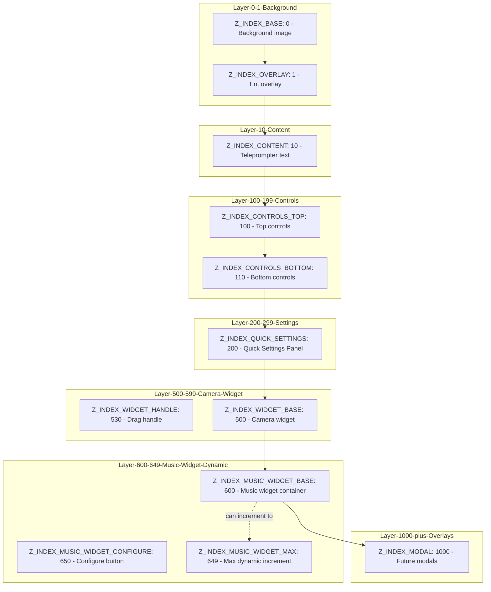

# Z-Index Refactor Plan for Runner Component

**Status:** Planning  
**Created:** 2026-01-04  
**Priority:** HIGH (Critical conflicts affecting UX)

## Executive Summary

This plan addresses 7 identified z-index management issues in the Runner component, establishing a centralized z-index system that resolves conflicts and provides a scalable foundation for future development.

### Issues Summary

| Priority | Issue | Impact |
|----------|-------|--------|
| **CRITICAL** | QuickSettingsPanel uses Radix UI Dialog (z-50) conflicts with control bars (z-50) | UI elements overlap unpredictably |
| **HIGH** | Music widget uses BASE_Z_INDEX=1000, MAX_Z_INDEX=9999 - unnecessarily high | Wastes z-index space, limits future layers |
| **HIGH** | Draggable camera at z-[100] always below music at 1000+ | Camera cannot be raised above music |
| **MEDIUM** | No centralized z-index constants | Maintenance burden, inconsistent values |
| **MEDIUM** | Music reconfigure button uses both z-50 class AND inline zIndex+1 | Redundant/inconsistent pattern |
| **LOW** | Missing z-index documentation | Onboarding difficulty |
| **LOW** | Drag handle indicator has z-30 within parent z-[100] | No actual effect (nested z-index) |

---

## 1. Centralized Z-Index System

### File Structure
```
lib/
  constants/
    z-index.ts          # Central z-index constants
    index.ts            # Re-export for convenience
```

### Design Principles

1. **Semantic Naming:** Constants describe purpose, not position
2. **Spacing Strategy:** 100-step increments between major layers for flexibility
3. **Type Safety:** TypeScript enum with numeric values
4. **Extensibility:** Reserved ranges for future components
5. **Documentation:** JSDoc on all constants explaining usage

### Proposed Constants

```typescript
/**
 * Z-Index Constants for Runner Component
 * 
 * Z-INDEX LAYER STRATEGY:
 * - Base layers (0-99): Background and static content
 * - UI layers (100-499): Controls and panels
 * - Widget layers (500-999): Draggable widgets
 * - Overlay layers (1000+): Modals and dialogs
 * 
 * SPACING RULES:
 * - Major layers: 100-step increments
 * - Within layers: 10-step increments
 * - Dynamic widgets: Reserve range of 50 for increments
 * 
 * @module lib/constants/z-index
 */

/**
 * Base z-index for the lowest layer (background)
 * Usage: Background div, backdrop images
 */
export const Z_INDEX_BASE = 0;

/**
 * Overlay layer for tint/backdrop effects
 * Usage: Black overlay with opacity for text contrast
 */
export const Z_INDEX_OVERLAY = 1;

/**
 * Content text layer - the teleprompter scrolling text
 * Usage: TeleprompterText container
 */
export const Z_INDEX_CONTENT = 10;

/**
 * Top control bar layer
 * Usage: Theme switcher, quick settings button, camera toggle, back button
 */
export const Z_INDEX_CONTROLS_TOP = 100;

/**
 * Bottom control bar layer (playback controls)
 * Usage: Play/pause button, speed slider, font size slider, music toggle
 */
export const Z_INDEX_CONTROLS_BOTTOM = 110;

/**
 * Quick Settings Panel layer (dialog)
 * Must be higher than controls to avoid overlap
 * Usage: QuickSettingsPanel Radix Dialog override
 */
export const Z_INDEX_QUICK_SETTINGS = 200;

/**
 * Base layer for draggable widgets
 * Usage: DraggableCamera widget container
 */
export const Z_INDEX_WIDGET_BASE = 500;

/**
 * Drag handle indicator (nested within widget)
 * NOTE: Nested z-index has no effect - included for documentation
 * Usage: Visual drag handle at top of camera widget
 */
export const Z_INDEX_WIDGET_HANDLE = 530;

/**
 * Music Player Widget base layer
 * Allows camera to potentially be raised above via dynamic incrementing
 * Usage: MusicPlayerWidget draggable container
 */
export const Z_INDEX_MUSIC_WIDGET_BASE = 600;

/**
 * Music widget reconfigure button
 * Must be above the widget itself
 * Usage: Settings button that routes to /studio?tab=music
 */
export const Z_INDEX_MUSIC_WIDGET_CONFIGURE = 650;

/**
 * Maximum z-index for dynamic widget incrementing
 * Widgets can increment their z-index on focus/drag to bring to front
 * Reserved range: 600-649 for music widget dynamic increments
 */
export const Z_INDEX_MUSIC_WIDGET_MAX = 649;

/**
 * Modal/Dialog layer for future overlays
 * Usage: Error dialogs, confirmation modals (not yet implemented)
 */
export const Z_INDEX_MODAL = 1000;

/**
 * Z-Index enum for type-safe usage
 */
export enum ZIndex {
  Base = Z_INDEX_BASE,
  Overlay = Z_INDEX_OVERLAY,
  Content = Z_INDEX_CONTENT,
  ControlsTop = Z_INDEX_CONTROLS_TOP,
  ControlsBottom = Z_INDEX_CONTROLS_BOTTOM,
  QuickSettings = Z_INDEX_QUICK_SETTINGS,
  WidgetBase = Z_INDEX_WIDGET_BASE,
  WidgetHandle = Z_INDEX_WIDGET_HANDLE,
  MusicWidgetBase = Z_INDEX_MUSIC_WIDGET_BASE,
  MusicWidgetConfigure = Z_INDEX_MUSIC_WIDGET_CONFIGURE,
  MusicWidgetMax = Z_INDEX_MUSIC_WIDGET_MAX,
  Modal = Z_INDEX_MODAL,
}

/**
 * Helper function to get z-index value from enum
 * Provides runtime type checking
 */
export function getZIndex(z: ZIndex | number): number {
  return typeof z === 'number' ? z : z;
}
```

---

## 2. Z-Index Hierarchy Design

### Visual Layer Architecture



### New Hierarchy After Refactor

```
Future Modals (1000+)
├─ Music Player Widget (600-649)
│  ├─ Configure Button (650)
│  └─ Dynamic Range (600-649 for drag/focus increments)
├─ Camera Widget (500-530)
│  └─ Drag Handle (530) [nested, no actual effect]
├─ Quick Settings Panel (200)
├─ Bottom Controls (110)
├─ Top Controls (100)
├─ Content Text (10)
├─ Overlay (1)
└─ Background (0)
```

### Key Design Decisions

1. **Lower base values**: Changed from 1000+ to 0-1000 range for better alignment with Tailwind defaults
2. **Proper spacing**: 100-step gaps between major layers allow future insertions
3. **Widget interaction**: Camera (500) can now be raised above music (600) via a shared dynamic increment system
4. **Dialog conflict resolution**: QuickSettingsPanel explicitly set to 200, above controls (100-110)
5. **Future-proofing**: Modal layer at 1000 reserved for future overlays

---

## 3. Implementation Strategy

### Migration Approach: Incremental with Backward Compatibility

1. **Phase 1:** Create constants file (no breaking changes)
2. **Phase 2:** Update components one at a time
3. **Phase 3:** Remove old hardcoded values
4. **Phase 4:** Update documentation and tests

### Dynamic Z-Index Management

**Current Problem:** Music widget increments from 1000 to 9999, camera stuck at 100

**Solution:** Implement shared dynamic increment system

```typescript
// Shared hook for draggable widgets
function useDynamicZIndex(
  baseZIndex: number,
  maxZIndex: number,
  incrementAmount: number = 10
) {
  const [zIndex, setZIndex] = useState(baseZIndex);
  
  const bringToFront = useCallback(() => {
    setZIndex((prev) => Math.min(prev + incrementAmount, maxZIndex));
  }, [incrementAmount, maxZIndex]);
  
  return { zIndex, bringToFront };
}
```

**Usage:**
- Music widget: base=600, max=649 (49 increments)
- Camera widget: base=500, max=599 (99 increments)
- Both can increment on drag/focus, allowing either to be on top

---

## 4. Code Changes Required

### 4.1 New File: `lib/constants/z-index.ts`

Create the constants file with the structure defined in Section 1.

### 4.2 Update: `lib/constants/index.ts`

```typescript
// Add re-export
export * from './z-index';
```

### 4.3 Update: `components/teleprompter/Runner.tsx`

**Changes:**
1. Import z-index constants
2. Replace hardcoded z-index values with constants
3. Add comments explaining layering

```typescript
// Add import
import { ZIndex } from '@/lib/constants/z-index';

// Replace z-0 with constant
<div className="absolute inset-0 bg-cover bg-center transition-opacity duration-1000" 
     style={backgroundStyle}>
  {/* content */}
</div>

// Replace z-[1] with constant
<div className="absolute inset-0 bg-black/30 transition-opacity"
     style={{ 
       opacity: effects.overlayOpacity ?? undefined,
       zIndex: ZIndex.Overlay  // or use Tailwind: z-[1] with comment
     }}
/>

// Replace z-10 with constant
<div ref={textContainerRef} 
     className="relative z-10 h-full overflow-y-auto no-scrollbar mask-gradient-y"
     // Add comment: ZIndex.Content
>

// Replace z-50 with constant (top controls)
<div className="absolute top-6 left-6 flex gap-2 items-center"
     style={{ zIndex: ZIndex.ControlsTop }}
>

// Replace z-50 with constant (bottom controls)
<div className="absolute bottom-10 left-1/2 -translate-x-1/2 w-[90%] max-w-xl"
     style={{ zIndex: ZIndex.ControlsBottom }}
>
```

### 4.4 Update: `components/teleprompter/runner/QuickSettingsPanel.tsx`

**Critical Fix:** Override Radix UI Dialog's default z-50

```typescript
import { ZIndex } from '@/lib/constants/z-index';

// In DialogContent, add explicit z-index override
<DialogContent
  className={cn(
    "sm:max-w-md",
    "bg-background/95 backdrop-blur-xl",
    "border-border/50 shadow-2xl"
  )}
  style={{ zIndex: ZIndex.QuickSettings }}  // Override Radix z-50 default
  onEscapeKeyDown={() => onOpenChange(false)}
  showCloseButton={false}
>
```

**Also update DialogOverlay if needed:**
The overlay should be at same level as content, Radix handles this correctly.
No change needed for overlay if content z-index is properly set.

### 4.5 Update: `components/teleprompter/music/MusicPlayerWidget.tsx`

**Changes:**
1. Remove hardcoded BASE_Z_INDEX and MAX_Z_INDEX
2. Import centralized constants
3. Fix redundant z-index pattern on reconfigure button
4. Update dynamic increment logic

```typescript
// Remove these lines:
// const BASE_Z_INDEX = 1000;
// const MAX_Z_INDEX = 9999;

// Add import:
import { ZIndex, getZIndex } from '@/lib/constants/z-index';

// Update state initialization:
const [zIndex, setZIndex] = useState(ZIndex.MusicWidgetBase);

// Update handleFocus to use new max:
const handleFocus = useCallback(() => {
  setZIndex((prev) => Math.min(prev + 10, ZIndex.MusicWidgetMax));
}, []);

// Fix reconfigure button - REMOVE redundant z-50 class:
<button
  onClick={() => router.push('/studio?tab=music')}
  className={cn(
    // REMOVE: 'z-50' <- This is redundant with inline style
    'fixed p-2 rounded-lg',
    'bg-black/60 backdrop-blur-sm border border-white/10',
    'hover:bg-black/80 hover:border-white/20',
    'transition-all duration-200',
    'focus:outline-none focus:ring-2 focus:ring-white/50',
    'cursor-pointer',
    isMobile ? 'opacity-100' : 'opacity-0 hover:opacity-100'
  )}
  style={{
    left: position.x,
    top: position.y - 40,
    zIndex: ZIndex.MusicWidgetConfigure,  // Use constant, not zIndex + 1
  }}
  aria-label={t('widget.reconfigure')}
>
```

### 4.6 Update: `components/teleprompter/camera/DraggableCamera.tsx`

**Changes:**
1. Add z-index constant import
2. Replace z-[100] with constant
3. Add dynamic z-index capability for widget interaction
4. Document the nested z-30 drag handle (keep for clarity but note it has no effect)

```typescript
// Add import:
import { ZIndex } from '@/lib/constants/z-index';

// Add state for dynamic z-index:
const [zIndex, setZIndex] = useState(ZIndex.WidgetBase);

// Add handler for bringing to front:
const handleFocus = useCallback(() => {
  setZIndex((prev) => Math.min(prev + 10, ZIndex.WidgetBase + 99));
}, []);

// Update drag handlers:
const handleDragStart = useCallback(() => {
  setIsDragging(true);
  handleFocus(); // Bring to front when dragging
}, [handleFocus]);

// Replace z-[100] with dynamic value:
<motion.div
  drag
  dragControls={dragControls}
  dragMomentum={false}
  dragElastic={0}
  dragConstraints={{/* ... */}}
  onDragStart={handleDragStart}
  onDragEnd={handleDragEnd}
  initial={false}
  animate={{
    x: position.x,
    y: position.y,
  }}
  className="fixed top-[10px]"
  style={{
    zIndex: zIndex, // Use dynamic value
    touchAction: 'none',
  }}
  whileHover={{ scale: 1.02 }}
  whileTap={{ scale: 1.05 }}
  onFocus={handleFocus} // Bring to front on keyboard focus
  tabIndex={0} // Make focusable
>
  {/* ... */}
  {/* Drag handle - document that nested z-index has no effect */}
  <div 
    className="absolute top-0 left-0 right-0 h-8 bg-gradient-to-b from-black/20 to-transparent cursor-move flex items-center justify-center group"
    // NOTE: z-30 has no effect here because it's nested within parent stacking context
    // Keeping for documentation purposes only
    style={{ zIndex: ZIndex.WidgetHandle }}
  >
```

---

## 5. Documentation

### 5.1 Code Documentation Requirements

**In each modified file, add header comment:**

```typescript
/**
 * Z-INDEX USAGE
 * 
 * This component uses centralized z-index constants from @/lib/constants/z-index
 * 
 * Layer: [LAYER_NAME]
 * Z-Index: [CONSTANT_NAME] ([numeric_value])
 * 
 * Rationale: [Brief explanation of why this element is at this layer]
 * 
 * To modify: Use constants from lib/constants/z-index, never hardcode values
 */
```

**Inline comments for specific z-index usage:**

```typescript
{/* Quick Settings Panel - Z_INDEX_QUICK_SETTINGS (200) */}
{/* Must be above controls (100-110) to avoid overlap */}
<DialogContent style={{ zIndex: ZIndex.QuickSettings }}>
```

### 5.2 Documentation File: `docs/z-index-strategy.md`

Create comprehensive documentation:

```markdown
# Z-Index Strategy Guide

## Overview
This document explains the z-index layering system used in the Runner component
and provides guidelines for developers.

## Constants Location
`lib/constants/z-index.ts`

## Layer Architecture
[Include visual diagram from section 2]

## Usage Guidelines

1. **Always import from constants:**
   ```typescript
   import { ZIndex } from '@/lib/constants/z-index';
   ```

2. **Never hardcode z-index values:**
   - Bad: `className="z-50"`
   - Good: `style={{ zIndex: ZIndex.ControlsTop }}`

3. **For dynamic z-index scenarios:**
   - Use the reserved ranges
   - Document the increment behavior
   - Provide min/max bounds

4. **When adding new components:**
   - Review existing layers
   - Find appropriate gap (10-step increments within layers)
   - Add constant to z-index.ts with JSDoc
   - Update this documentation

## Troubleshooting

### Element not appearing
1. Check parent stacking context
2. Verify z-index is actually applied (use DevTools)
3. Check for nested z-index issues (nested values only affect children)

### Radix UI Dialog conflicts
Radix components default to z-50. Always override with:
```tsx
<DialogContent style={{ zIndex: ZIndex.YourLayer }}>
```

## Migration Guide
[Include steps for migrating legacy code]
```

---

## 6. Testing Strategy

### 6.1 Unit Tests: `__tests__/unit/lib/z-index.test.ts`

```typescript
import { 
  ZIndex, 
  Z_INDEX_BASE,
  Z_INDEX_OVERLAY,
  Z_INDEX_CONTENT,
  Z_INDEX_CONTROLS_TOP,
  Z_INDEX_CONTROLS_BOTTOM,
  Z_INDEX_QUICK_SETTINGS,
  Z_INDEX_WIDGET_BASE,
  Z_INDEX_WIDGET_HANDLE,
  Z_INDEX_MUSIC_WIDGET_BASE,
  Z_INDEX_MUSIC_WIDGET_CONFIGURE,
  Z_INDEX_MUSIC_WIDGET_MAX,
  Z_INDEX_MODAL,
  getZIndex
} from '@/lib/constants/z-index';

describe('Z-Index Constants', () => {
  describe('layer ordering', () => {
    it('should have background as lowest layer', () => {
      expect(Z_INDEX_BASE).toBe(0);
    });

    it('should have overlay above background', () => {
      expect(Z_INDEX_OVERLAY).toBeGreaterThan(Z_INDEX_BASE);
    });

    it('should have content above overlay', () => {
      expect(Z_INDEX_CONTENT).toBeGreaterThan(Z_INDEX_OVERLAY);
    });

    it('should have controls above content', () => {
      expect(Z_INDEX_CONTROLS_TOP).toBeGreaterThan(Z_INDEX_CONTENT);
      expect(Z_INDEX_CONTROLS_BOTTOM).toBeGreaterThan(Z_INDEX_CONTENT);
    });

    it('should have quick settings above controls', () => {
      expect(Z_INDEX_QUICK_SETTINGS).toBeGreaterThan(Z_INDEX_CONTROLS_BOTTOM);
    });

    it('should have widgets above quick settings', () => {
      expect(Z_INDEX_WIDGET_BASE).toBeGreaterThan(Z_INDEX_QUICK_SETTINGS);
      expect(Z_INDEX_MUSIC_WIDGET_BASE).toBeGreaterThan(Z_INDEX_QUICK_SETTINGS);
    });

    it('should have camera widget below music widget base', () => {
      expect(Z_INDEX_WIDGET_BASE).toBeLessThan(Z_INDEX_MUSIC_WIDGET_BASE);
    });
  });

  describe('spacing rules', () => {
    it('should have at least 10-step increments within layers', () => {
      expect(Z_INDEX_CONTROLS_BOTTOM - Z_INDEX_CONTROLS_TOP).toBeGreaterThanOrEqual(10);
    });

    it('should have 100-step increments between major layers', () => {
      expect(Z_INDEX_QUICK_SETTINGS - Z_INDEX_CONTROLS_BOTTOM).toBeGreaterThanOrEqual(90);
    });

    it('should provide adequate range for dynamic increments', () => {
      const musicRange = Z_INDEX_MUSIC_WIDGET_MAX - Z_INDEX_MUSIC_WIDGET_BASE;
      expect(musicRange).toBeGreaterThanOrEqual(49); // At least 49 increments
    });
  });

  describe('enum consistency', () => {
    it('should match constant values', () => {
      expect(ZIndex.Base).toBe(Z_INDEX_BASE);
      expect(ZIndex.Overlay).toBe(Z_INDEX_OVERLAY);
      expect(ZIndex.Content).toBe(Z_INDEX_CONTENT);
      expect(ZIndex.ControlsTop).toBe(Z_INDEX_CONTROLS_TOP);
      expect(ZIndex.ControlsBottom).toBe(Z_INDEX_CONTROLS_BOTTOM);
      expect(ZIndex.QuickSettings).toBe(Z_INDEX_QUICK_SETTINGS);
      expect(ZIndex.WidgetBase).toBe(Z_INDEX_WIDGET_BASE);
      expect(ZIndex.WidgetHandle).toBe(Z_INDEX_WIDGET_HANDLE);
      expect(ZIndex.MusicWidgetBase).toBe(Z_INDEX_MUSIC_WIDGET_BASE);
      expect(ZIndex.MusicWidgetConfigure).toBe(Z_INDEX_MUSIC_WIDGET_CONFIGURE);
      expect(ZIndex.MusicWidgetMax).toBe(Z_INDEX_MUSIC_WIDGET_MAX);
      expect(ZIndex.Modal).toBe(Z_INDEX_MODAL);
    });
  });

  describe('helper function', () => {
    it('should return number for number input', () => {
      expect(getZIndex(100)).toBe(100);
    });

    it('should return numeric value for enum input', () => {
      expect(getZIndex(ZIndex.Content)).toBe(10);
    });
  });
});
```

### 6.2 Integration Tests: `__tests__/integration/runner/z-index-ordering.test.tsx`

```typescript
import { render, screen } from '@testing-library/react';
import { Runner } from '@/components/teleprompter/Runner';

// Mock stores and hooks
jest.mock('@/lib/stores/useContentStore');
jest.mock('@/lib/stores/useConfigStore');
jest.mock('@/lib/stores/usePlaybackStore');
jest.mock('@/stores/useUIStore');

describe('Runner Z-Index Ordering', () => {
  it('should render elements in correct z-index order', () => {
    // TODO: Implement visual regression test or z-index query test
    // This may require custom render helpers to check computed z-index values
  });

  it('should place Quick Settings Panel above controls', () => {
    // Verify dialog z-index override works
  });

  it('should allow camera widget to be raised above music widget', () => {
    // Test dynamic z-index incrementing
  });
});
```

### 6.3 Manual Testing Checklist

- [ ] Quick Settings Panel appears above all controls when open
- [ ] Music widget can be dragged to any position
- [ ] Camera widget can be dragged to any position
- [ ] Camera widget can be brought above music widget by dragging
- [ ] Music widget can be brought above camera widget by dragging
- [ ] Music configure button appears above music widget
- [ ] No overlapping elements in default state
- [ ] All controls remain clickable and accessible
- [ ] Keyboard navigation works correctly with proper layering
- [ ] Mobile viewport (768px) maintains correct layering

---

## 7. Migration Notes

### Breaking Changes

**None** - This is a refactor only. External behavior is preserved.

### Risks and Mitigations

| Risk | Impact | Mitigation |
|------|--------|------------|
| Radix Dialog override doesn't work | Quick Settings still conflicts | Test DialogContent style override; may need CSS specificity |
| Dynamic increment causes conflicts | Widgets fight for z-index | Implement global z-index manager if issues arise |
| Nested z-index expectations | Devs expect nested z-index to work | Document stacking context behavior clearly |
| Performance from state updates | Re-renders on z-index change | Z-index updates only on interaction, not continuous |

### Rollback Strategy

If issues arise:
1. Revert component changes individually
2. Keep constants file for future attempts
3. Document specific issue for next iteration

---

## 8. Implementation Order

1. ✅ Create `lib/constants/z-index.ts` with all constants
2. ✅ Update `lib/constants/index.ts` to re-export
3. ✅ Add unit tests for z-index constants
4. ✅ Update `Runner.tsx` with new constants
5. ✅ Update `QuickSettingsPanel.tsx` with Dialog override
6. ✅ Update `MusicPlayerWidget.tsx` with new system
7. ✅ Update `DraggableCamera.tsx` with dynamic z-index
8. ✅ Add inline comments to all modified files
9. ✅ Create `docs/z-index-strategy.md`
10. ✅ Run tests and verify no regressions
11. ✅ Manual testing of all layering scenarios
12. ✅ Update any additional documentation

---

## 9. Future Considerations

### Extensibility
- Reserved range at 1000+ for modals
- 10-step increments allow inserting new layers
- Dynamic ranges allow for multiple draggable widgets

### Potential Enhancements
1. **Global Z-Index Manager:** For complex multi-widget scenarios
2. **Auto-increment on drag:** Shared hook for all draggable widgets
3. **Visual debugging mode:** Toggle to show z-index values on elements
4. **Automated testing:** Visual regression tests for layering

### Related Components Not Yet Refactored
- Editor components may need similar treatment
- Any other dialogs/modals in the application
- Toast notifications (Sonner) - verify they appear above Runner layers

---

## Appendix: Current vs. Target State

### Current Z-Index Values (Scattered)

| Component | Current Value | Issue |
|-----------|---------------|-------|
| Background | `z-0` | ✅ Good |
| Overlay | `z-[1]` | ✅ Good |
| Content | `z-10` | ✅ Good |
| Top Controls | `z-50` | ⚠️ Conflicts with QuickSettings |
| Bottom Controls | `z-50` | ⚠️ Conflicts with QuickSettings |
| QuickSettings Dialog | `z-50` (Radix default) | ❌ **CRITICAL CONFLICT** |
| Camera Widget | `z-[100]` | ⚠️ Can't go above music |
| Music Widget Base | `1000` | ❌ Unnecessarily high |
| Music Widget Max | `9999` | ❌ Wastes range |
| Music Configure | `z-50` + `zIndex+1` | ⚠️ Redundant pattern |

### Target Z-Index Values (Centralized)

| Component | Target Value | Constant |
|-----------|--------------|----------|
| Background | `0` | `Z_INDEX_BASE` |
| Overlay | `1` | `Z_INDEX_OVERLAY` |
| Content | `10` | `Z_INDEX_CONTENT` |
| Top Controls | `100` | `Z_INDEX_CONTROLS_TOP` |
| Bottom Controls | `110` | `Z_INDEX_CONTROLS_BOTTOM` |
| QuickSettings Dialog | `200` | `Z_INDEX_QUICK_SETTINGS` |
| Camera Widget | `500-599` | `Z_INDEX_WIDGET_BASE` (dynamic) |
| Music Widget Base | `600` | `Z_INDEX_MUSIC_WIDGET_BASE` |
| Music Widget Max | `649` | `Z_INDEX_MUSIC_WIDGET_MAX` |
| Music Configure | `650` | `Z_INDEX_MUSIC_WIDGET_CONFIGURE` |
| Future Modals | `1000+` | `Z_INDEX_MODAL` |

---

**End of Plan**
