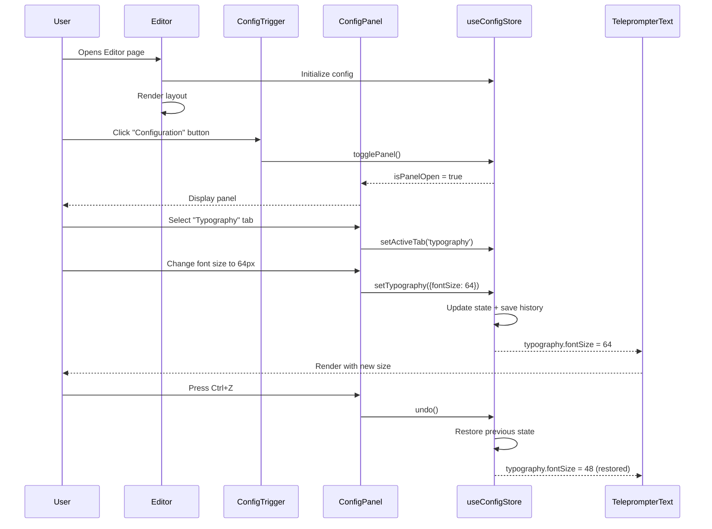
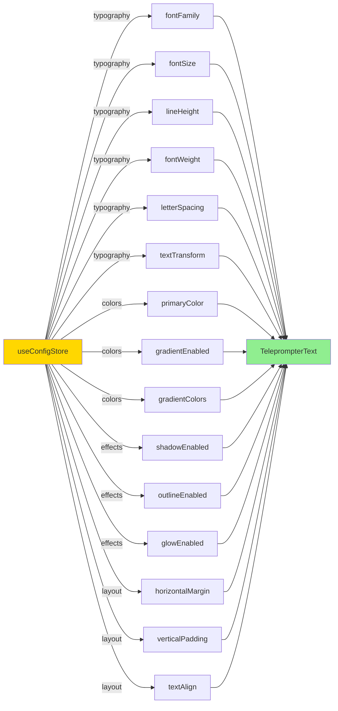

# Editor UI & ConfigPanel Integration Plan

## Executive Summary

This plan details the integration of the existing ConfigPanel system into the Editor UI, ensuring that config settings from `useConfigStore` completely override theme-based styling in the teleprompter preview area. The ConfigPanel system (with 6 tabs: Typography, Colors, Effects, Layout, Animations, Presets) will become the primary configuration interface for the Editor.

## Current State Analysis

### Dual-Store Architecture Issues

The codebase currently uses **two separate stores** for teleprompter configuration:

| Aspect | useTeleprompterStore (Legacy) | useConfigStore (New) |
|--------|------------------------------|----------------------|
| **Typography** | `font: FontStyle` (5 presets), `fontSize`, `lineHeight` | `fontFamily`, `fontWeight`, `fontSize`, `letterSpacing`, `lineHeight`, `textTransform` |
| **Colors** | `colorIndex: number` (0-5) | `primaryColor`, gradient system, effect colors |
| **Layout** | `margin: number`, `align: left\|center` | `horizontalMargin`, `verticalPadding`, `textAlign`, columns, text area controls |
| **Effects** | None | Shadow, outline, glow, backdrop filters |
| **Animations** | `speed: number` | Smooth scroll, entrance animations, word highlight, auto-scroll |
| **State Management** | Basic setters | Undo/redo, presets, persistence |
| **UI Controls** | FontSelector, ColorPicker, sliders | 6 comprehensive tabs with full control |

### Component Flow Issues

```
┌────────────────────────────────────────────────────────────────────┐
│                       CURRENT PROBLEMATIC FLOW                      │
├────────────────────────────────────────────────────────────────────┤
│                                                                      │
│  Editor.tsx                                                          │
│    │                                                                 │
│    ├──> useTeleprompterStore ──┐                                    │
│    │                           │                                    │
│    ├──> FontSelector ──────────┤──> Limited: 5 font presets        │
│    │                           │                                    │
│    ├──> ColorPicker ───────────┤──> Limited: 6 colors              │
│    │                           │                                    │
│    └──> TeleprompterText ──────┘──> Accepts BOTH legacy props      │
│                                       AND useConfigStore            │
│                                       (legacy props take precedence)│
│                                                                      │
│  ConfigPanel.tsx (COMPLETELY UNUSED in Editor)                      │
│    │                                                                 │
│    └──> useConfigStore ─────────> Full config system NOT accessible │
│                                                                      │
└────────────────────────────────────────────────────────────────────┘
```

### TeleprompterText Component Conflicts

The [`TeleprompterText.tsx`](../components/teleprompter/display/TeleprompterText.tsx:20-31) component has **dual prop sources**:

```typescript
// Legacy props - if provided, they OVERRIDE store defaults
fontName?: string;        // Overrides typography.fontFamily
colorIndex?: number;      // Used for conditional logic
fontSize?: number;        // Overrides typography.fontSize
lineHeight?: number;      // Overrides typography.lineHeight
margin?: number;          // Overrides layout.horizontalMargin
align?: 'left' | 'center' | 'right' | 'justify'; // Overrides layout.textAlign
```

**Lines 35-36, 46-48, 55, 58, 61 show legacy props take precedence** over store values.

## Target Architecture

### Component Hierarchy

```mermaid
graph TB
    subgraph Editor UI
        Editor[Editor Component]
        
        subgraph Left Panel
            Header[Editor Header]
            ContentArea[Text Area Input]
            QuickActions[Quick Actions - Save/Share/Preview]
            ConfigTrigger[Configuration Button]
        end
        
        subgraph Right Panel - ConfigPanel
            ConfigPanel[ConfigPanel]
            ConfigTabs[ConfigTabs]
            
            subgraph Tab Content
                TypographyTab[TypographyTab]
                ColorsTab[ColorsTab]
                EffectsTab[EffectsTab]
                LayoutTab[LayoutTab]
                AnimationsTab[AnimationsTab]
                PresetsTab[PresetsTab]
            end
        end
        
        subgraph Preview Area
            PreviewContainer[Preview Container]
            BackgroundLayer[Background Image]
            OverlayLayer[Overlay Layer]
            TeleprompterText[TeleprompterText]
        end
    end
    
    subgraph State Management
        useConfigStore[useConfigStore]
        useTeleprompterStore[useTeleprompterStore - Content Only]
        useAuthStore[useAuthStore]
        useDemoStore[useDemoStore]
    end
    
    Editor --> ContentArea
    Editor --> ConfigTrigger
    ConfigTrigger -->|togglePanel| useConfigStore
    ConfigPanel --> useConfigStore
    ConfigPanel --> ConfigTabs
    ConfigTabs --> TypographyTab
    ConfigTabs --> ColorsTab
    ConfigTabs --> EffectsTab
    ConfigTabs --> LayoutTab
    ConfigTabs --> AnimationsTab
    ConfigTabs --> PresetsTab
    
    Editor --> PreviewContainer
    PreviewContainer --> TeleprompterText
    useConfigStore -->|ONLY source of truth| TeleprompterText
    
    Editor --> useTeleprompterStore
    Editor --> useAuthStore
    Editor --> useDemoStore
    
    style TeleprompterText fill:#90EE90
    style useConfigStore fill:#FFD700
    style ConfigPanel fill:#87CEEB
```



### Data Flow Diagram



## UI Layout Design

### Editor Layout Structure

```
┌─────────────────────────────────────────────────────────────────────────┐
│ EDITOR COMPONENT                                                        │
├─────────────────────────────────────────────────────────────────────────┤
│                                                                          │
│ ┌─────────────────────┬───────────────────────────────────────────────┐ │
│ │                     │                                               │ │
│ │  LEFT PANEL         │         PREVIEW AREA                         │ │
│ │  (1/3 width)        │         (2/3 width)                          │ │
│ │                     │                                               │ │
│ │ ┌─────────────────┐ │ ┌───────────────────────────────────────────┐ │ │
│ │ │ Header + Auth   │ │ │                                           │ │ │
│ │ │ + Theme Switch  │ │ │   Background Image (store.bgUrl)          │ │ │
│ │ └─────────────────┘ │ │   + Overlay Layer (store.overlayOpacity)  │ │ │
│ │                     │ │                                           │ │ │
│ │ ┌─────────────────┐ │ │   ┌─────────────────────────────────────┐ │ │ │
│ │ │ Text Area       │ │ │   │                                     │ │ │ │
│ │ │ (textarea)      │ │ │   │   TELEPROMPTER TEXT                  │ │ │ │
│ │ └─────────────────┘ │ │ │   │   (Config ONLY - No theme CSS)     │ │ │ │
│ │                     │ │ │   │                                     │ │ │ │
│ │ ┌─────────────────┐ │ │ │   │   - Font from useConfigStore       │ │ │ │
│ │ │ [CONFIG]        │ │ │ │   │   - Color from useConfigStore      │ │ │ │
│ │ │ Configuration   │ │ │ │   │   - Effects from useConfigStore   │ │ │ │
│ │ │ Button          │ │ │ │   │   - Layout from useConfigStore    │ │ │ │
│ │ └─────────────────┘ │ │ │   │   - NO legacy props!              │ │ │ │
│ │                     │ │ │ │                                     │ │ │ │
│ │ ┌─────────────────┐ │ │ └─────────────────────────────────────┘ │ │ │
│ │ │ Quick Actions   │ │ │                                           │ │ │
│ │ │ [Preview]       │ │ │   Live preview updates instantly          │ │ │
│ │ │ [Save] [Share]  │ │ │   as user changes config                  │ │ │
│ │ └─────────────────┘ │ │                                           │ │ │
│ │                     │ └───────────────────────────────────────────┘ │ │
│ └─────────────────────┘                                               │ │
│                                                                          │
│ ┌─────────────────────────────────────────────────────────────────────┐ │
│ │                    CONFIG PANEL (Overlay/Sidebar)                    │ │
│ │  (slides in from right when [CONFIG] button clicked)                │ │
│ │                                                                       │ │
│ │  ┌────────────────────────────────────────────────────────────────┐ │ │
│ │  │ [Undo] [Redo] [X]                                              │ │ │
│ │  ├────────────────────────────────────────────────────────────────┤ │ │
│ │  │ [Typography] [Colors] [Effects] [Layout] [Animations] [Presets]│ │ │
│ │  ├────────────────────────────────────────────────────────────────┤ │ │
│ │  │                                                                  │ │ │
│ │  │  TAB CONTENT AREA                                               │ │ │
│ │  │  (scrollable)                                                    │ │ │
│ │  │                                                                  │ │ │
│ │  │  - Full controls for all config properties                      │ │ │
│ │  │  - Real-time preview updates                                    │ │ │
│ │  │  - Keyboard shortcuts (Ctrl+Z, Esc)                             │ │ │
│ │  │                                                                  │ │ │
│ │  └────────────────────────────────────────────────────────────────┘ │ │
│ └─────────────────────────────────────────────────────────────────────┘ │
│                                                                          │
└─────────────────────────────────────────────────────────────────────────┘
```

### Config Trigger Button Design

```typescript
// New button to add to Editor.tsx
<button
  onClick={() => useConfigStore.getState().togglePanel()}
  className="w-full py-3 bg-gradient-to-r from-pink-500 to-violet-500 
             text-white font-bold rounded-lg hover:from-pink-600 
             hover:to-violet-600 transition-all flex items-center 
             justify-center gap-2 shadow-lg"
>
  <Settings size={16} />
  Configuration
</button>
```

## Implementation Plan

### Phase 1: Prepare ConfigPanel Integration

#### 1.1 Add Config Trigger to Editor
- [ ] Import `ConfigPanel` component
- [ ] Import `Settings` icon from lucide-react
- [ ] Import `useConfigStore` hook
- [ ] Add Configuration button above Quick Actions
- [ ] Render `ConfigPanel` component (it handles its own visibility)

**File: [`components/teleprompter/Editor.tsx`](../components/teleprompter/Editor.tsx)**

```typescript
// Add imports
import { Settings } from 'lucide-react'
import { ConfigPanel } from './config/ConfigPanel'
import { useConfigStore } from '@/lib/stores/useConfigStore'

// In Editor component
const { togglePanel } = useConfigStore()

// In JSX - add Config button before existing Quick Actions
<button onClick={togglePanel} className="...">
  <Settings size={16} /> Configuration
</button>

// Add ConfigPanel at root level (outside main layout)
<ConfigPanel />
```

### Phase 2: Refactor TeleprompterText for Config-Only Styling

#### 2.1 Remove Legacy Props from TeleprompterText
- [ ] Remove legacy props interface (fontName, colorIndex, fontSize, lineHeight, margin, align)
- [ ] Remove conditional logic that checks for legacy props
- [ ] Use ONLY `useConfigStore` for all styling values
- [ ] Ensure inline styles have `!important` or proper specificity to override theme CSS

**File: [`components/teleprompter/display/TeleprompterText.tsx`](../components/teleprompter/display/TeleprompterText.tsx)**

**Before (Current):**
```typescript
interface TeleprompterTextProps {
  text: string;
  className?: string;
  style?: React.CSSProperties;
  // Legacy props - PROBLEMATIC!
  fontName?: string;
  colorIndex?: number;
  fontSize?: number;
  lineHeight?: number;
  margin?: number;
  align?: 'left' | 'center' | 'right' | 'justify';
}
```

**After (Target):**
```typescript
interface TeleprompterTextProps {
  text: string;
  className?: string; // Only for runner-specific effects (text shadow, etc.)
  style?: React.CSSProperties; // Only for runner-specific overrides
  // NO legacy props - useConfigStore is the ONLY source
}
```

#### 2.2 Ensure Inline Styles Override Theme CSS
- [ ] Add `!important` to critical inline styles if needed
- [ ] Use `data-config-*` attributes for debugging
- [ ] Document CSS specificity order
- [ ] Test with both light and dark themes

**Critical inline styles that MUST override theme:**
```typescript
// Text color - MUST override theme text colors
style={{ color: colors.primaryColor }}

// Font family - MUST override theme fonts
style={{ fontFamily: typography.fontFamily }}

// Font size - MUST override any theme base font size
style={{ fontSize: `${typography.fontSize}px` }}

// All effects (shadow, outline, glow) - MUST be inline, not theme CSS
style={{ 
  textShadow: ...,
  WebkitTextStroke: ...,
  ...
}}
```

### Phase 3: Update Editor Preview Area

#### 3.1 Remove Legacy Props from TeleprompterText Call
- [ ] Update TeleprompterText usage in Editor.tsx
- [ ] Remove all legacy prop passing
- [ ] Pass only `text` prop (useConfigStore handles the rest)

**File: [`components/teleprompter/Editor.tsx`](../components/teleprompter/Editor.tsx)** - Lines 185-195

**Before:**
```typescript
<TeleprompterText
     text={store.text}
     fontName={store.font}           // REMOVE
     colorIndex={store.colorIndex}   // REMOVE
     fontSize={store.fontSize}       // REMOVE
     lineHeight={store.lineHeight}   // REMOVE
     margin={store.margin}           // REMOVE
     align={store.align}             // REMOVE
     className="..."
/>
```

**After:**
```typescript
<TeleprompterText
     text={store.text}
     className="max-h-full overflow-hidden"
/>
```

### Phase 4: Deprecate Legacy Controls

#### 4.1 Remove/Deprecate Old Editor Controls
- [ ] Remove `FontSelector` from [`components/teleprompter/controls/FontSelector.tsx`](../components/teleprompter/controls/FontSelector.tsx)
- [ ] Remove `ColorPicker` from [`components/teleprompter/controls/ColorPicker.tsx`](../components/teleprompter/controls/ColorPicker.tsx)
- [ ] Remove line height and margin sliders from Editor
- [ ] Keep controls folder for potential reuse in other components

**File: [`components/teleprompter/Editor.tsx`](../components/teleprompter/Editor.tsx)**

Remove these sections:
- Lines 149-157: FontSelector and ColorPicker
- Lines 127-147: Advanced Text Options (line height, margin sliders)

#### 4.2 Update useTeleprompterStore Scope
- [ ] Keep `text`, `bgUrl`, `musicUrl` in useTeleprompterStore
- [ ] Mark `font`, `colorIndex`, `fontSize`, `lineHeight`, `margin`, `align` as deprecated
- [ ] Add migration helper to convert legacy to config format
- [ ] Document migration path

**Migration helper:**
```typescript
// Helper to migrate legacy settings to config
const migrateLegacyToConfig = (legacy: TeleprompterState) => {
  const { setTypography, setColors, setLayout } = useConfigStore.getState()
  
  // Map font style names to font families
  const fontMap = {
    'Classic': 'Inter',
    'Modern': 'Oswald',
    'Typewriter': 'Roboto Mono',
    'Novel': 'Merriweather',
    'Neon': 'Lobster',
  }
  
  setTypography({
    fontFamily: fontMap[legacy.font] || 'Inter',
    fontSize: legacy.fontSize,
    lineHeight: legacy.lineHeight,
  })
  
  setColors({
    primaryColor: TEXT_COLORS[legacy.colorIndex]?.value || '#ffffff',
  })
  
  setLayout({
    horizontalMargin: legacy.margin,
    textAlign: legacy.align === 'left' ? 'left' : 'center',
  })
}
```

### Phase 5: Update Save/Load Logic

#### 5.1 Save Script with Config Data
- [ ] Update `saveScriptAction` to include config snapshot
- [ ] Store both legacy (for backward compatibility) and config data
- [ ] Update API to handle config format

**File: [`actions/scripts.ts`](../actions/scripts.ts)**

```typescript
const result = await saveScriptAction({
    content: store.text,
    bg_url: store.bgUrl,
    music_url: store.musicUrl,
    
    // NEW: Include full config snapshot
    config: useConfigStore.getState(), // All typography, colors, effects, layout, animations
    
    // DEPRECATED: Keep for backward compatibility
    settings: {
        font: store.font,
        color: store.colorIndex,
        speed: store.speed,
        // ... other legacy settings
    },
    
    title: store.text.substring(0, 30) || "Untitled",
    description: "Created via Web Editor"
})
```

#### 5.2 Load Script with Config Data
- [ ] Check for config data first
- [ ] Fall back to legacy settings if config not present
- [ ] Apply loaded config to useConfigStore

```typescript
// On load
if (script.config) {
  // Use new config format
  useConfigStore.getState().setAll(script.config)
} else if (script.settings) {
  // Migrate from legacy format
  migrateLegacyToConfig(script.settings)
}
```

## Component Prop Flow

### TeleprompterText Config-Only Flow



## CSS Override Strategy

### Inline Style Precedence

To ensure config settings override theme CSS:

1. **Inline styles with `!important`** (highest priority)
2. **Inline styles without `!important`**
3. **Styles with `[data-config-*]` attributes**
4. **Tailwind utility classes**
5. **Theme CSS variables**

### Implementation Strategy

```typescript
// In TeleprompterText.tsx

// Option 1: Use !important for critical styles
const textStyle = {
  color: `${colors.primaryColor} !important`,
  fontFamily: `${typography.fontFamily} !important`,
  fontSize: `${typography.fontSize}px !important`,
}

// Option 2: Use data attributes for easier debugging
<div 
  data-config-font={typography.fontFamily}
  data-config-color={colors.primaryColor}
  data-config-size={typography.fontSize}
  style={{...}}
>
  <p style={{...textStyle}}>{text}</p>
</div>

// Option 3: Use CSS-in-JS with highest specificity
<div className="[&>p]:!text-current [&>p]:!font-current">
  <p style={textStyle}>{text}</p>
</div>
```

## Testing Checklist

### Functional Testing

- [ ] Config panel opens/closes when clicking Configuration button
- [ ] All 6 tabs are accessible and functional
- [ ] Changes in ConfigPanel immediately reflect in preview
- [ ] Undo/Redo works correctly (Ctrl+Z, Ctrl+Shift+Z)
- [ ] Escape key closes ConfigPanel
- [ ] Config persists across page reloads (localStorage)
- [ ] TeleprompterText uses ONLY config values (no legacy props)
- [ ] Config overrides both light and dark theme styles
- [ ] All effects (shadow, outline, glow, gradient) render correctly
- [ ] Presets can be saved and loaded
- [ ] Save script includes config data
- [ ] Load script restores config correctly

### Visual Testing

- [ ] Text color matches config in all themes
- [ ] Font family applies correctly
- [ ] Font size changes render immediately
- [ ] Effects (shadow, outline, glow) are visible
- [ ] Gradients render correctly
- [ ] Layout (margins, padding, alignment) works
- [ ] Preview area matches what ConfigPanel shows

### Regression Testing

- [ ] Existing scripts still load (legacy migration)
- [ ] Demo mode still works
- [ ] Auth/user state not affected
- [ ] Media input (background, music) still works
- [ ] Runner mode still functions
- [ ] No console errors

## Migration Strategy

### For Existing Users

1. **Automatic Migration on Load**
   - When loading an existing script
   - Check for `settings` (legacy format)
   - Convert to `config` format automatically
   - Save both formats temporarily

2. **Graceful Degradation**
   - If config fails to load, fall back to legacy
   - Show migration success toast to user
   - Log migration for analytics

3. **Backward Compatibility**
   - Keep legacy controls in code (commented out) for 1-2 versions
   - Remove completely after migration period

### For New Development

1. **All new features use useConfigStore**
2. **No new legacy props added to components**
3. **ConfigPanel is the only UI for configuration**

## Files to Modify

### Primary Changes

| File | Change Type | Description |
|------|-------------|-------------|
| [`components/teleprompter/Editor.tsx`](../components/teleprompter/Editor.tsx) | Major | Add ConfigPanel, remove legacy controls |
| [`components/teleprompter/display/TeleprompterText.tsx`](../components/teleprompter/display/TeleprompterText.tsx) | Major | Remove legacy props, config-only styling |
| [`actions/scripts.ts`](../actions/scripts.ts) | Medium | Add config to save/load logic |

### Potential Cleanup (Post-Implementation)

| File | Action | Reason |
|------|--------|--------|
| [`components/teleprompter/controls/FontSelector.tsx`](../components/teleprompter/controls/FontSelector.tsx) | Delete | Replaced by TypographyTab |
| [`components/teleprompter/controls/ColorPicker.tsx`](../components/teleprompter/controls/ColorPicker.tsx) | Delete | Replaced by ColorsTab |
| `stores/useTeleprompterStore.ts` | Refactor | Remove config-related state |

## Risk Mitigation

### Identified Risks

1. **Risk:** Breaking existing saved scripts
   - **Mitigation:** Automatic migration + backward compatibility

2. **Risk:** Performance issues with config updates
   - **Mitigation:** Config updates are already optimized in useConfigStore

3. **Risk:** User confusion with new UI
   - **Mitigation:** Clear labels, tooltips, help text

4. **Risk:** CSS specificity conflicts
   - **Mitigation:** Inline styles with !important where needed

## Success Criteria

✅ ConfigPanel is accessible from Editor UI
✅ TeleprompterText uses ONLY useConfigStore (no legacy props)
✅ Config settings override all theme CSS
✅ All 6 tabs (Typography, Colors, Effects, Layout, Animations, Presets) work
✅ Undo/Redo functionality works
✅ Changes reflect immediately in preview
✅ Save/load includes config data
✅ Legacy scripts migrate automatically
✅ No console errors
✅ Works in both light and dark themes

## Next Steps

Once this plan is approved, switch to **Code mode** to implement:

1. Add ConfigPanel trigger to Editor
2. Refactor TeleprompterText for config-only
3. Update preview area
4. Deprecate legacy controls
5. Update save/load logic
6. Test thoroughly

---

**Document Version:** 1.0  
**Last Updated:** 2025-12-31  
**Status:** Planning - Awaiting Approval
