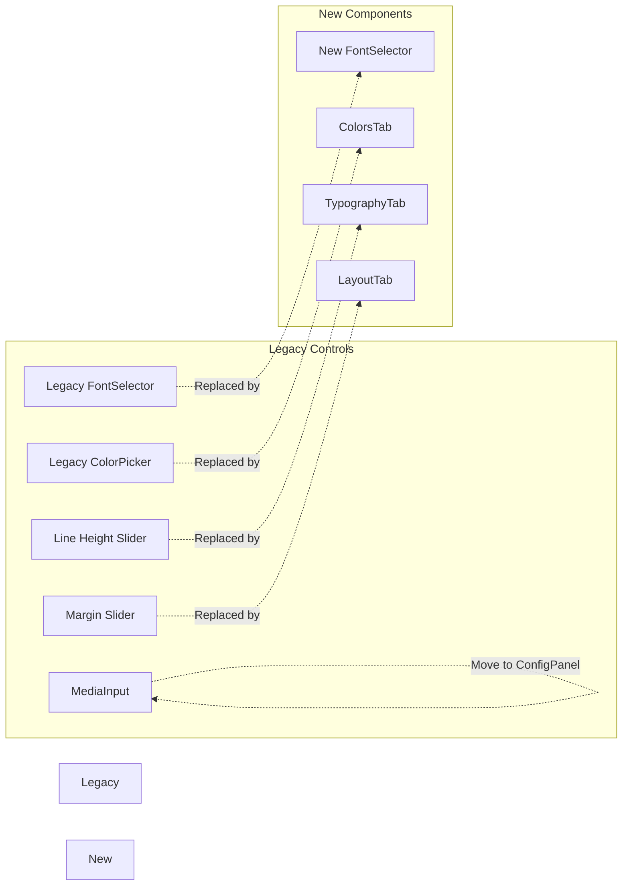
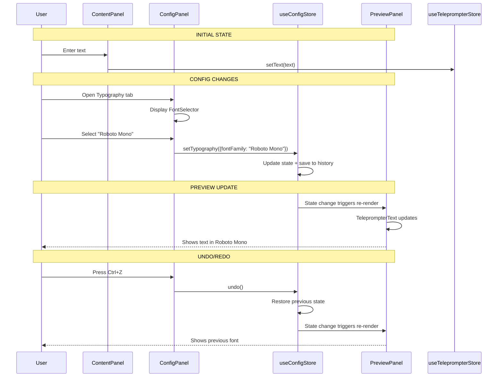

# Editor UI Redesign: ConfigPanel-First Architecture

## Executive Summary

This document outlines a complete architectural redesign of the Editor UI to replace all legacy controls with the new Configuration-integrated interface. The redesign makes ConfigPanel the primary and always-visible interface, creating a cleaner, more intuitive teleprompter editing experience.

## Table of Contents

1. [Current State Analysis](#current-state-analysis)
2. [Target Architecture](#target-architecture)
3. [Component Removal Plan](#component-removal-plan)
4. [New UI Layout Design](#new-ui-layout-design)
5. [Component Hierarchy](#component-hierarchy)
6. [Data Flow Architecture](#data-flow-architecture)
7. [Responsive Design Strategy](#responsive-design-strategy)
8. [UX Best Practices](#ux-best-practices)
9. [Implementation Guide](#implementation-guide)
10. [Testing Checklist](#testing-checklist)
11. [Migration Strategy](#migration-strategy)

---

## Current State Analysis

### Problem: Dual Control System

The current [`Editor.tsx`](../components/teleprompter/Editor.tsx) has a problematic duplication:

```
┌─────────────────────────────────────────────────────────────────────┐
│                    CURRENT EDITOR DUPLICATION                       │
├─────────────────────────────────────────────────────────────────────┤
│                                                                      │
│  LEFT PANEL (1/3 width)                                             │
│  ┌────────────────────────────────────────────────────────────┐    │
│  │ Header + Auth                                               │    │
│  ├────────────────────────────────────────────────────────────┤    │
│  │ Text Area Input                                             │    │
│  ├────────────────────────────────────────────────────────────┤    │
│  │ ❌ LEGACY CONTROLS (to be removed)                          │    │
│  │  - Line Height slider (1-3)                                 │    │
│  │  - Margin slider (0-30%)                                    │    │
│  │  - FontSelector (5 presets)                                 │    │
│  │  - ColorPicker (6 colors)                                   │    │
│  │  - MediaInput (background + music URLs)                     │    │
│  ├────────────────────────────────────────────────────────────┤    │
│  │ [Configuration] button → Opens ConfigPanel (hidden)         │    │
│  │ [Preview] [Save] [Share] buttons                            │    │
│  └────────────────────────────────────────────────────────────┘    │
│                                                                      │
│  RIGHT PANEL (2/3 width) - PREVIEW                                  │
│  ┌────────────────────────────────────────────────────────────┐    │
│  │ Background Image + TeleprompterText Preview                 │    │
│  └────────────────────────────────────────────────────────────┘    │
│                                                                      │
│  OVERLAY (hidden by default)                                        │
│  ┌────────────────────────────────────────────────────────────┐    │
│  │ ✅ ConfigPanel (slides in from right)                       │    │
│  │  - Typography, Colors, Effects, Layout, Animations, Presets │    │
│  └────────────────────────────────────────────────────────────┘    │
│                                                                      │
└─────────────────────────────────────────────────────────────────────┘
```

### Legacy Components Identified

| Component | File | Purpose | Replacement |
|-----------|------|---------|-------------|
| `FontSelector` | [`controls/FontSelector.tsx`](../components/teleprompter/controls/FontSelector.tsx) | 5 font presets | [`config/typography/FontSelector.tsx`](../components/teleprompter/config/typography/FontSelector.tsx) (Google Fonts, categories) |
| `ColorPicker` | [`controls/ColorPicker.tsx`](../components/teleprompter/controls/ColorPicker.tsx) | 6 color swatches | [`config/colors/ColorsTab.tsx`](../components/teleprompter/config/colors/ColorsTab.tsx) (full color + gradients) |
| Line Height Slider | [`Editor.tsx:152-157`](../components/teleprompter/Editor.tsx:152-157) | 1-3 range | [`TypographyTab`](../components/teleprompter/config/typography/TypographyTab.tsx) with `SliderInput` |
| Margin Slider | [`Editor.tsx:159-166`](../components/teleprompter/Editor.tsx:159-166) | 0-30% range | [`LayoutTab`](../components/teleprompter/config/layout/LayoutTab.tsx) horizontalMargin |
| `MediaInput` | [`controls/MediaInput.tsx`](../components/teleprompter/controls/MediaInput.tsx) | BG + Music URLs | Move to ConfigPanel as new tab or integrate |

### Dual Store Problems

| Store | Scope | Issues |
|-------|-------|--------|
| [`useTeleprompterStore`](../stores/useTeleprompterStore.ts) | Content + Config | Mixes concerns; has legacy config state |
| [`useConfigStore`](../lib/stores/useConfigStore.ts) | Full Config | Not fully integrated; hidden behind button |

---

## Target Architecture

### Vision Statement

> "ConfigPanel is the primary, always-visible interface for styling. The Editor focuses on content editing and preview, with ConfigPanel providing immediate access to all styling controls."

### New Editor Layout

```
┌────────────────────────────────────────────────────────────────────────────┐
│                         NEW EDITOR LAYOUT                                  │
├────────────────────────────────────────────────────────────────────────────┤
│                                                                            │
│  ┌────────────────────────┐  ┌──────────────────────────────────────────┐ │
│  │   CONTENT PANEL        │  │         CONFIG PANEL (Always Visible)     │ │
│  │   (30-40% width)       │  │         (30-35% width)                    │ │
│  │                        │  │                                          │ │
│  │ ┌────────────────────┐ │  │ ┌──────────────────────────────────────┐ │ │
│  │ │ Header + Auth      │ │  │ │ [Typography] [Colors] [Effects]...   │ │ │
│  │ │ + Theme Switch     │ │  │ ├──────────────────────────────────────┤ │ │
│  │ └────────────────────┘ │  │ │                                      │ │ │
│  │                        │  │ │  TAB CONTENT (scrollable)             │ │ │
│  │ ┌────────────────────┐ │  │ │                                      │ │ │
│  │ │                    │ │  │ │  Font: Inter                    ▼   │ │ │
│  │ │   TEXT AREA        │ │  │ │  Font Size: [48]                │   │ │ │
│  │ │                    │ │  │ │  Line Height: [1.5]             │   │ │ │
│  │ │   (multi-line      │ │  │ │  Letter Spacing: [0]            │   │ │ │
│  │ │    textarea)       │ │  │ │                                      │ │ │
│  │ │                    │ │  │ │  Primary Color: ○               │   │ │
│  │ │                    │ │  │ │  Gradient: ☐ Enable              │   │ │
│  │ └────────────────────┘ │  │ │                                      │ │ │
│  │                        │  │ │  Effects:                           │ │ │
│  │ ┌────────────────────┐ │  │ │  ☐ Shadow    ☐ Outline            │ │ │
│  │ │ QUICK ACTIONS      │ │  │ │  ☐ Glow      ☐ Backdrop           │ │ │
│  │ │                    │ │  │ │                                      │ │ │
│  │ │ [Preview] [Save]   │ │  │ │  Layout:                            │ │ │
│  │ │ [Share]            │ │  │ │  Align: ● Center ○ Left            │ │ │
│  │ └────────────────────┘ │  │ │  H-Margin: [0]                     │ │ │
│  └────────────────────────┘  │ └──────────────────────────────────────┘ │ │
│                              │                                          │ │
│                              │ ┌──────────────────────────────────────┐ │ │
│                              │ │ UNDO/REDO CONTROLS                   │ │ │
│                              │ │ [↶] [↷]                             │ │ │
│                              │ └──────────────────────────────────────┘ │ │
│                              └──────────────────────────────────────────┘ │
│                                                                            │
│  ┌──────────────────────────────────────────────────────────────────────┐│
│  │                    PREVIEW AREA (30-40% width)                        ││
│  │                                                                        ││
│  │   ┌────────────────────────────────────────────────────────────────┐ ││
│  │   │                                                                │ ││
│  │   │   Background Image                                              │ ││
│  │   │   + Overlay Layer                                               │ ││
│  │   │                                                                │ ││
│  │   │         TELEPROMPTER TEXT                                      │ ││
│  │   │         (Live preview of all config)                           │ ││
│  │   │                                                                │ ││
│  │   │         Styled by useConfigStore ONLY                          │ ││
│  │   │         No legacy props                                        │ ││
│  │   │                                                                │ ││
│  │   └────────────────────────────────────────────────────────────────┘ ││
│  │                                                                        ││
│  └──────────────────────────────────────────────────────────────────────┘│
│                                                                            │
└────────────────────────────────────────────────────────────────────────────┘
```

### Key Design Principles

1. **Content-Config-Preview**: Three distinct zones with clear purposes
2. **Always-Visible Config**: ConfigPanel is never hidden; users can always see controls
3. **Prominent Preview**: Preview area is large and centrally positioned
4. **Immediate Feedback**: Config changes reflect instantly in preview
5. **Clean Separation**: Content (text) vs Styling (config) vs Preview (result)

---

## Component Removal Plan

### Components to Remove



### Removal Details

#### 1. Legacy FontSelector

**File:** [`components/teleprompter/controls/FontSelector.tsx`](../components/teleprompter/controls/FontSelector.tsx)

**Reason:** Limited to 5 presets; new FontSelector has Google Fonts integration with categories

**Migration:** 
- Remove import from Editor.tsx (line 18)
- Remove component usage (lines 173-176)
- Delete file after confirmation

#### 2. Legacy ColorPicker

**File:** [`components/teleprompter/controls/ColorPicker.tsx`](../components/teleprompter/controls/ColorPicker.tsx)

**Reason:** Limited to 6 colors; new ColorsTab supports hex input, gradients, effects

**Migration:**
- Remove import from Editor.tsx (line 19)
- Remove component usage (line 177)
- Delete file after confirmation

#### 3. Inline Sliders (Line Height, Margin)

**Location:** [`Editor.tsx:149-167`](../components/teleprompter/Editor.tsx:149-167)

**Reason:** Duplicates functionality in TypographyTab and LayoutTab

**Migration:**
- Remove entire "Advanced Text Options" section
- Users will access these via TypographyTab and LayoutTab

#### 4. MediaInput

**File:** [`components/teleprompter/controls/MediaInput.tsx`](../components/teleprompter/controls/MediaInput.tsx)

**Action:** MOVE (not delete) - Integrate into ConfigPanel as new "Media" tab

**Rationale:** Background and music URLs are styling choices, belong in config

### State Migration

**From:** [`useTeleprompterStore`](../stores/useTeleprompterStore.ts)

**Properties to Deprecate:**
```typescript
// DEPRECATED - Use useConfigStore instead
font: FontStyle          // → typography.fontFamily
colorIndex: number       // → colors.primaryColor
fontSize: number         // → typography.fontSize
lineHeight: number       // → typography.lineHeight
margin: number           // → layout.horizontalMargin
align: TextAlign         // → layout.textAlign
```

**Properties to Keep:**
```typescript
// KEEP - These are content, not config
text: string             // Script content
bgUrl: string            // Background image URL
musicUrl: string         // Background music URL
isReadOnly: boolean      // Script state
mode: 'setup' | 'running' // Editor mode
```

---

## New UI Layout Design

### Layout Structure

The new Editor will use a three-column layout:

```mermaid
graph TB
    subgraph Editor Container
        direction LR
        
        subgraph Content Panel
            CPH[Content Panel Header]
            TA[Text Area]
            QA[Quick Actions]
        end
        
        subgraph Config Panel
            CPH[Config Panel Header]
            CT[Config Tabs]
            CCC[Config Content]
            URC[Undo/Redo Controls]
        end
        
        subgraph Preview Panel
            PP[Preview Area]
            BG[Background Layer]
            OL[Overlay Layer]
            TT[Teleprompter Text]
        end
    end
    
    Content Panel -->|30% width| Editor Container
    Config Panel -->|35% width| Editor Container
    Preview Panel -->|35% width| Editor Container
    
    style Content Panel fill:#e3f2fd
    style Config Panel fill:#f3e5f5
    style Preview Panel fill:#e8f5e9
```

### Responsive Behavior

| Breakpoint | Layout | Config Panel | Preview Area |
|------------|--------|--------------|--------------|
| **Desktop (≥1280px)** | 3-column side-by-side | Always visible, 35% width | 35% width |
| **Tablet (768-1279px)** | Tab-based | Tab next to Content | Toggle visibility |
| **Mobile (<768px)** | Stacked | Full-width below Content | Hidden until Preview |

### Component Layout Code Structure

```typescript
// NEW Editor.tsx structure
export function Editor() {
  return (
    <div className="h-screen flex flex-col lg:flex-row">
      
      {/* Content Panel - 30-35% */}
      <div className="w-full lg:w-[30%] bg-card border-r">
        <ContentPanelHeader />
        <TextArea />
        <QuickActions />
      </div>
      
      {/* Config Panel - 30-35% (always visible on desktop) */}
      <div className="w-full lg:w-[35%] bg-card border-r">
        <ConfigPanelHeader />
        <ConfigTabs />
        <ConfigContent />
        <UndoRedoControls />
      </div>
      
      {/* Preview Panel - 30-35% */}
      <div className="w-full lg:w-[35%] bg-black">
        <PreviewArea>
          <BackgroundLayer />
          <OverlayLayer />
          <TeleprompterText text={store.text} />
        </PreviewArea>
      </div>
      
    </div>
  )
}
```

---

## Component Hierarchy

### New Component Structure

```mermaid
graph TB
    subgraph Editor
        Editor[Editor Component]
        
        subgraph ContentPanel
            CPHeader[ContentPanelHeader]
            AuthSection[AuthSection]
            ThemeSwitcher[ThemeSwitcher]
            TextArea[TextArea]
            QuickActions[QuickActions]
        end
        
        subgraph ConfigPanel
            CfgPanelHeader[ConfigPanelHeader]
            TabNavigation[TabNavigation]
            TabContent[TabContent]
            UndoRedoBar[UndoRedoBar]
            
            subgraph Tabs
                TypographyTab[TypographyTab]
                ColorsTab[ColorsTab]
                EffectsTab[EffectsTab]
                LayoutTab[LayoutTab]
                AnimationsTab[AnimationsTab]
                MediaTab[MediaTab]
                PresetsTab[PresetsTab]
            end
        end
        
        subgraph PreviewPanel
            PreviewContainer[PreviewContainer]
            BackgroundLayer[BackgroundLayer]
            OverlayLayer[OverlayLayer]
            TeleprompterText[TeleprompterText]
        end
    end
    
    Editor --> ContentPanel
    Editor --> ConfigPanel
    Editor --> PreviewPanel
    
    ContentPanel --> CPHeader
    ContentPanel --> TextArea
    ContentPanel --> QuickActions
    
    ConfigPanel --> CfgPanelHeader
    ConfigPanel --> TabNavigation
    ConfigPanel --> TabContent
    ConfigPanel --> UndoRedoBar
    
    TabNavigation --> Tabs
    TabContent --> Tabs
    
    PreviewPanel --> PreviewContainer
    PreviewPanel --> TeleprompterText
    
    style ConfigPanel fill:#f3e5f5
    style PreviewPanel fill:#e8f5e9
    style ContentPanel fill:#e3f2fd
```

### Component Responsibilities

| Component | Responsibility | Store Usage |
|-----------|---------------|-------------|
| **ContentPanel** | Text input, auth, actions | `useTeleprompterStore`, `useAuthStore` |
| **ConfigPanel** | All styling controls | `useConfigStore` ONLY |
| **PreviewPanel** | Live preview display | `useConfigStore` for styling, `useTeleprompterStore` for content |

---

## Data Flow Architecture

### Unidirectional Data Flow



### State Source of Truth

```
┌─────────────────────────────────────────────────────────────────────────┐
│                        STATE SOURCE OF TRUTH                             │
├─────────────────────────────────────────────────────────────────────────┤
│                                                                          │
│  CONTENT (useTeleprompterStore)          STYLING (useConfigStore)        │
│  ┌─────────────────────────────┐        ┌─────────────────────────────┐ │
│  │ • text: string              │        │ • typography: Typography     │ │
│  │ • bgUrl: string             │        │ • colors: Color             │ │
│  │ • musicUrl: string          │        │ • effects: Effect           │ │
│  │ • mode: setup|running       │        │ • layout: Layout            │ │
│  │ • isReadOnly: boolean       │        │ • animations: Animation      │ │
│  │                             │        │                             │ │
│  │ DEPRECATED:                 │        │ • activeTab: string          │ │
│  │ ✗ font                      │        │ • pastStates: []            │ │
│  │ ✗ colorIndex                │        │ • futureStates: []          │ │
│  │ ✗ fontSize                  │        │                             │ │
│  │ ✗ lineHeight                │        │                             │ │
│  │ ✗ margin                    │        │                             │ │
│  │ ✗ align                     │        │                             │ │
│  └─────────────────────────────┘        └─────────────────────────────┘ │
│                                                                           │
│  Accessed by:                          Accessed by:                      │
│  • ContentPanel                        • ConfigPanel (writes)           │
│  • PreviewPanel (for content only)     • PreviewPanel (reads)           │
│                                        • ConfigTabs (all tabs)          │
│                                                                          │
└─────────────────────────────────────────────────────────────────────────┘
```

---

## Responsive Design Strategy

### Breakpoint-Based Layouts

#### Desktop (≥1280px) - Full Editor

```
┌──────────┬──────────────┬──────────────┐
│ Content  │   Config     │   Preview    │
│  30%     │    35%       │     35%      │
│          │              │              │
│          │ Always Viz   │ Always Viz   │
└──────────┴──────────────┴──────────────┘
```

#### Tablet (768-1279px) - Tabbed Interface

```
┌──────────────────┬──────────────────────┐
│     Content      │      Config/Preview  │
│      40%         │         60%          │
│                  │                      │
│                  │ [Config] [Preview]   │
└──────────────────┴──────────────────────┘
```

#### Mobile (<768px) - Stacked

```
┌──────────────────────────────────────────┐
│           Content                        │
│           100%                           │
├──────────────────────────────────────────┤
│           Config                         │
│           100%                           │
├──────────────────────────────────────────┤
│      [Preview Button] → Full Screen      │
└──────────────────────────────────────────┘
```

### ConfigPanel Adaptation

| Screen Size | ConfigPanel Behavior |
|-------------|---------------------|
| **Desktop** | Always visible, 35% width, all tabs accessible |
| **Tablet** | Full width, tab navigation at top |
| **Mobile** | Full width, collapsible sections, simplified controls |

---

## UX Best Practices

### Teleprompter Editor UX Principles

1. **Preview Prominence**
   - Preview area should be largest visible element
   - Changes must reflect immediately (no "apply" button)
   - Preview should use actual background image/media

2. **Progressive Disclosure**
   - Basic controls visible first
   - Advanced controls in expandable sections
   - Tooltips for complex controls

3. **Keyboard Shortcuts**
   - `Ctrl/Cmd + Z`: Undo
   - `Ctrl/Cmd + Shift + Z` or `Ctrl/Cmd + Y`: Redo
   - `Ctrl/Cmd + S`: Save
   - `Escape`: Close panel (mobile/tablet)
   - `Tab`: Next config section

4. **Visual Hierarchy**
   - Text area: Primary focus
   - Config: Secondary (always accessible)
   - Preview: Validation of choices

5. **Error Prevention**
   - Validation for font loading
   - Contrast warnings for colors
   - Range limits for sliders

### Accessibility Considerations

- **ARIA Labels**: All config controls
- **Keyboard Navigation**: Full tab through all controls
- **Screen Reader**: Announce config changes
- **Focus Management**: Return focus after panel toggle
- **Color Contrast**: WCAG AA compliance for UI

---

## Implementation Guide

### Phase 1: Prepare New Layout Structure

**Step 1.1: Create ContentPanel Component**

Create new file: [`components/teleprompter/editor/ContentPanel.tsx`](../components/teleprompter/editor/ContentPanel.tsx)

```typescript
export function ContentPanel() {
  return (
    <div className="w-full lg:w-[30%] bg-card border-r border-border flex flex-col h-full">
      <ContentPanelHeader />
      <TextArea />
      <QuickActions />
    </div>
  )
}
```

**Step 1.2: Refactor ConfigPanel for Always-Visible**

Modify: [`components/teleprompter/config/ConfigPanel.tsx`](../components/teleprompter/config/ConfigPanel.tsx)

- Remove `isPanelOpen` state check (no longer needed)
- Remove backdrop (no longer an overlay)
- Keep as inline panel, not fixed sidebar

**Step 1.3: Create PreviewPanel Component**

Create new file: [`components/teleprompter/editor/PreviewPanel.tsx`](../components/teleprompter/editor/PreviewPanel.tsx)

```typescript
export function PreviewPanel() {
  return (
    <div className="w-full lg:w-[35%] bg-black relative">
      <BackgroundLayer />
      <OverlayLayer />
      <TeleprompterText text={store.text} />
    </div>
  )
}
```

### Phase 2: Remove Legacy Controls

**Step 2.1: Remove from Editor.tsx**

Lines to remove from [`Editor.tsx`](../components/teleprompter/Editor.tsx):

```typescript
// REMOVE these imports (lines 18-20)
import { FontSelector } from '@/components/teleprompter/controls/FontSelector'
import { ColorPicker } from '@/components/teleprompter/controls/ColorPicker'
import { MediaInput } from '@/components/teleprompter/controls/MediaInput'

// REMOVE this section (lines 149-167)
<div className="space-y-4">
  <div className="grid grid-cols-2 gap-4">
    {/* Line Height Slider */}
    {/* Margin Slider */}
  </div>
</div>

// REMOVE these usages (lines 173-181)
<FontSelector ... />
<ColorPicker ... />
<MediaInput />
```

**Step 2.2: Move MediaInput to ConfigPanel**

Create new tab: [`components/teleprompter/config/media/MediaTab.tsx`](../components/teleprompter/config/media/MediaTab.tsx)

- Move background and music URL inputs
- Keep upload functionality
- Integrate with Pro features

**Step 2.3: Delete Legacy Files**

After confirmation:
- `components/teleprompter/controls/FontSelector.tsx`
- `components/teleprompter/controls/ColorPicker.tsx`

### Phase 3: Update Store Usage

**Step 3.1: Deprecate Legacy State in useTeleprompterStore**

Mark properties as deprecated:

```typescript
// In stores/useTeleprompterStore.ts
interface TeleprompterState {
  text: string;
  bgUrl: string;
  musicUrl: string;
  
  // @deprecated Use useConfigStore typography.fontFamily instead
  font?: FontStyle;
  
  // @deprecated Use useConfigStore colors.primaryColor instead
  colorIndex?: number;
  
  // ... other deprecated props
}
```

**Step 3.2: Update TeleprompterText**

Already completed - [`TeleprompterText.tsx`](../components/teleprompter/display/TeleprompterText.tsx) uses ONLY useConfigStore

### Phase 4: Implement New Layout

**Step 4.1: Rewrite Editor.tsx**

Complete rewrite of [`Editor.tsx`](../components/teleprompter/Editor.tsx):

```typescript
export function Editor() {
  return (
    <motion.div 
      initial={{ opacity: 0 }} 
      animate={{ opacity: 1 }}
      className="h-screen flex flex-col lg:flex-row"
    >
      <ContentPanel />
      <ConfigPanel />
      <PreviewPanel />
    </motion.div>
  )
}
```

**Step 4.2: Update Responsive Classes**

Ensure proper responsive behavior:
- `flex-col` on mobile
- `flex-row` on desktop
- Proper width percentages

### Phase 5: Create MediaTab

**Step 5.1: New MediaTab Component**

File: [`components/teleprompter/config/media/MediaTab.tsx`](../components/teleprompter/config/media/MediaTab.tsx)

```typescript
export function MediaTab() {
  const { bgUrl, musicUrl, setBgUrl, setMusicUrl } = useTeleprompterStore()
  
  return (
    <div className="space-y-6">
      <h3 className="text-lg font-semibold">Media</h3>
      
      <BackgroundInput />
      <MusicInput />
    </div>
  )
}
```

**Step 5.2: Add to Tab Navigation**

Update [`ConfigTabs.tsx`](../components/teleprompter/config/ConfigTabs.tsx) to include Media tab

### Phase 6: Testing & Refinement

**Step 6.1: Functional Testing**
- All config tabs work
- Preview updates immediately
- Undo/redo works
- Save/load works

**Step 6.2: Responsive Testing**
- Desktop layout
- Tablet layout
- Mobile layout

**Step 6.3: Cross-browser Testing**
- Chrome, Firefox, Safari
- Light/dark theme

---

## Testing Checklist

### Component Removal

- [ ] Legacy FontSelector removed from Editor
- [ ] Legacy ColorPicker removed from Editor
- [ ] Inline sliders removed from Editor
- [ ] MediaInput moved to ConfigPanel
- [ ] Legacy files deleted after confirmation

### New Layout

- [ ] ContentPanel renders correctly
- [ ] ConfigPanel always visible on desktop
- [ ] PreviewPanel shows live updates
- [ ] Three-column layout on desktop
- [ ] Proper responsive behavior

### Functionality

- [ ] All 7 tabs work (Typography, Colors, Effects, Layout, Animations, Media, Presets)
- [ ] Changes reflect immediately in preview
- [ ] Undo/redo works (Ctrl+Z, Ctrl+Shift+Z)
- [ ] Keyboard shortcuts work
- [ ] Save script includes config data
- [ ] Load script restores config

### Store Migration

- [ ] useTeleprompterStore deprecated props marked
- [ ] TeleprompterText uses ONLY useConfigStore
- [ ] No legacy prop passing in Editor

### Responsive

- [ ] Desktop (≥1280px): 3-column layout
- [ ] Tablet (768-1279px): Tab-based layout
- [ ] Mobile (<768px): Stacked layout

### Accessibility

- [ ] All controls have ARIA labels
- [ ] Keyboard navigation works
- [ ] Focus management correct
- [ ] Screen reader announcements work

---

## Migration Strategy

### For Existing Users

**1. Automatic Migration**
```typescript
// On app load, check for legacy state
if (store.font || store.colorIndex) {
  migrateLegacyToConfig(store)
}
```

**2. Data Persistence**
- Keep both legacy and config in saved scripts temporarily
- Phase out legacy data after 2-3 versions

**3. User Communication**
- Toast notification on first load: "Using improved configuration system"
- Help tooltip explaining new layout

### Breaking Changes

| Change | Impact | Mitigation |
|--------|--------|------------|
| ConfigPanel always visible | Users may find it takes space | Add collapse button |
| Legacy controls removed | Muscle memory | Clear toast notification |
| Three-column layout | Smaller preview area | Optimized for 1280px+ screens |

### Rollback Plan

If critical issues found:
1. Revert Editor.tsx to previous version
2. Hide ConfigPanel button (keep existing functionality)
3. Fix issues in feature branch
4. Re-deploy

---

## File Structure Changes

### New Files

```
components/teleprompter/
├── editor/
│   ├── ContentPanel.tsx          # NEW
│   ├── PreviewPanel.tsx          # NEW
│   └── ConfigPanelHeader.tsx     # NEW (header for always-visible panel)
└── config/
    └── media/
        └── MediaTab.tsx          # NEW
```

### Modified Files

```
components/teleprompter/
├── Editor.tsx                    # MAJOR REWRITE
└── config/
    ├── ConfigPanel.tsx           # Remove overlay behavior
    └── ConfigTabs.tsx            # Add Media tab

stores/
└── useTeleprompterStore.ts       # Add deprecation comments
```

### Deleted Files

```
components/teleprompter/controls/
├── FontSelector.tsx              # DELETE (after confirmation)
└── ColorPicker.tsx               # DELETE (after confirmation)
```

---

## Success Criteria

✅ **Layout**
- ConfigPanel is always visible on desktop
- Three-column layout (Content, Config, Preview)
- Clean separation of concerns

✅ **Functionality**
- All legacy controls removed
- ConfigPanel provides all styling
- Preview updates immediately

✅ **Code Quality**
- No duplicate controls
- Single source of truth for config
- Clear component responsibilities

✅ **User Experience**
- Intuitive layout
- Responsive design
- Accessible controls

✅ **Data**
- Legacy state migration works
- Save/load includes config
- Undo/redo functional

---

## Next Steps

1. **Review & Approve** - Stakeholder approval of this plan
2. **Create Feature Branch** - `feature/editor-configpanel-redesign`
3. **Implement** - Follow phased implementation guide
4. **Test** - Comprehensive testing at each phase
5. **Deploy** - Gradual rollout with monitoring

---

**Document Version:** 1.0  
**Last Updated:** 2025-12-31  
**Status:** Awaiting Review & Approval  
**Estimated Complexity:** High (complete UI redesign)
