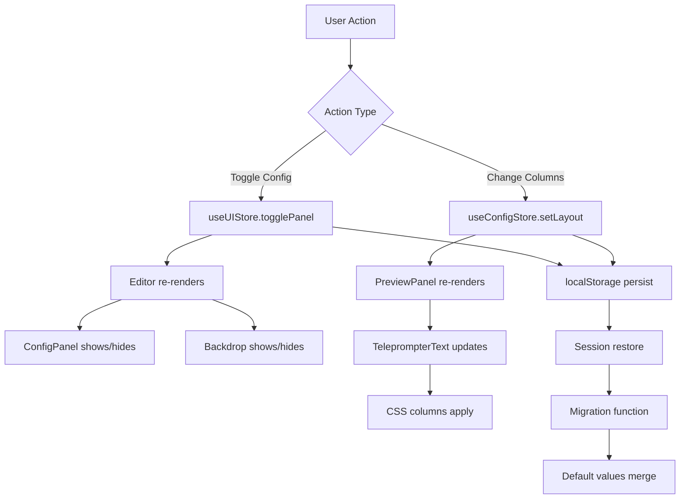

# Data Model: Studio Layout Improvements

**Feature**: 008-studio-layout-improvements
**Date**: 2026-01-01
**Status**: Complete

## Overview

This document describes the data model changes for implementing two-column preview layout and floating ConfigPanel overlay. The changes primarily affect configuration state management and component props interfaces.

---

## State Management Changes

### ConfigStore Extensions

**File**: [`lib/stores/useConfigStore.ts`](../../lib/stores/useConfigStore.ts)

#### LayoutConfig Interface Extension

```typescript
interface LayoutConfig {
  // Existing properties
  textAlign: 'left' | 'center';
  horizontalMargin: number;
  verticalPadding: number;

  // NEW: Column layout support
  columnCount: 1 | 2;      // FR-001.1, FR-001.5
  columnGap: number;       // FR-001.2, FR-001.6
}
```

#### Default Values

```typescript
const defaultLayout: LayoutConfig = {
  textAlign: 'left',
  horizontalMargin: 48,
  verticalPadding: 32,
  
  // NEW: Default values
  columnCount: 2,      // Default to 2 columns
  columnGap: 32,       // 32px gap between columns
};
```

#### Migration Function

```typescript
/**
 * Migrates existing config objects to include new column properties
 * Runtime migration - additive change, no schema version needed
 */
function migrateLayoutConfig(config: Partial<LayoutConfig>): LayoutConfig {
  return {
    ...config,
    columnCount: config.columnCount ?? 2,
    columnGap: config.columnGap ?? 32,
  } as LayoutConfig;
}
```

#### State Structure

```typescript
interface ConfigState {
  layout: LayoutConfig;
  typography: TypographyConfig;
  effects: EffectsConfig;
  // ... other config sections
  
  // Actions
  setLayout: (layout: Partial<LayoutConfig>) => void;
  resetLayout: () => void;
}
```

---

### UIStore Extensions

**File**: [`stores/useUIStore.ts`](../../stores/useUIStore.ts)

#### PanelState Interface Extension

```typescript
interface PanelState {
  visible: boolean;
  isAnimating: boolean;
  lastToggled: number | null;
  
  // NEW: Overlay mode flag
  isOverlay: boolean;    // Always true for new behavior
}
```

#### Default Values

```typescript
const defaultPanelState: PanelState = {
  visible: false,
  isAnimating: false,
  lastToggled: null,
  isOverlay: true,       // Fixed: always overlay mode
};
```

#### State Structure

```typescript
interface UIState {
  panel: PanelState;
  
  // Actions
  togglePanel: () => void;
  setPanelVisible: (visible: boolean) => void;
}
```

---

## Component Interfaces

### TeleprompterText Props

**File**: [`components/teleprompter/display/TeleprompterText.tsx`](../../components/teleprompter/display/TeleprompterText.tsx)

```typescript
interface TeleprompterTextProps {
  text: string;
  className?: string;
  
  // NEW: Column layout props
  columnCount?: 1 | 2;    // Number of text columns (default: 1)
  columnGap?: number;     // Gap between columns in pixels (default: 32)
}
```

#### Props Validation

```typescript
const propTypes = {
  text: PropTypes.string.isRequired,
  className: PropTypes.string,
  columnCount: PropTypes.oneOf([1, 2]),
  columnGap: PropTypes.number,
};
```

#### Default Props

```typescript
const defaultProps: Partial<TeleprompterTextProps> = {
  columnCount: 1,
  columnGap: 32,
};
```

---

### ConfigPanel Component

**File**: [`components/teleprompter/config/ConfigPanel.tsx`](../../components/teleprompter/config/ConfigPanel.tsx)

```typescript
interface ConfigPanelProps {
  // No props - uses useUIStore for state management
  // Component manages its own overlay rendering
}
```

#### Internal State

```typescript
interface ConfigPanelState {
  isOverlay: boolean;           // Always true
  triggerRef: RefObject<HTMLButtonElement>;  // For focus restoration
}
```

---

### PreviewPanel Component

**File**: [`components/teleprompter/editor/PreviewPanel.tsx`](../../components/teleprompter/editor/PreviewPanel.tsx)

```typescript
interface PreviewPanelProps {
  // Existing props (no changes)
  className?: string;
}
```

#### Connected State (via useConfigStore)

```typescript
// Extracts from useConfigStore
interface PreviewPanelConfig {
  layout: {
    columnCount: 1 | 2;
    columnGap: number;
    // ... other layout props
  };
}
```

---

### Editor Component

**File**: [`components/teleprompter/Editor.tsx`](../../components/teleprompter/Editor.tsx)

```typescript
interface EditorProps {
  // Existing props (no changes)
}
```

#### Layout State

```typescript
interface EditorLayoutState {
  panelVisible: boolean;      // From useUIStore
  isDesktop: boolean;         // From useMediaQuery
  shouldShowOverlay: boolean; // Computed: isDesktop && panelVisible
}
```

---

## Data Flow Diagram



---

## State Transitions

### ConfigPanel Visibility States

```typescript
type PanelVisibilityState = 
  | 'hidden'      // panelState.visible = false
  | 'opening'     // panelState.visible = true, isAnimating = true
  | 'visible'     // panelState.visible = true, isAnimating = false
  | 'closing'     // panelState.visible = false, isAnimating = true
  ;

// State machine
const transitions = {
  hidden: ['opening'],
  opening: ['visible'],
  visible: ['closing'],
  closing: ['hidden'],
};
```

### Column Count States

```typescript
type ColumnCountState = 1 | 2;

// Transitions triggered by user action
function setColumnCount(count: ColumnCountState): void {
  configStore.setLayout({ columnCount: count });
  // Persist to localStorage
  // Trigger TeleprompterText re-render
}
```

---

## Storage Schema

### localStorage Keys

```typescript
// Key: 'glean-teleprompter-config'
interface ConfigStorage {
  version?: number;           // Optional: for future migrations
  layout: {
    textAlign: 'left' | 'center';
    horizontalMargin: number;
    verticalPadding: number;
    columnCount: 1 | 2;       // NEW
    columnGap: number;        // NEW
  };
  typography: { ... };
  effects: { ... };
  // ... other sections
}
```

### Migration Strategy

```typescript
// On app load
const loadConfig = (): ConfigStorage => {
  const stored = localStorage.getItem('glean-teleprompter-config');
  if (!stored) return defaultConfig;
  
  const parsed = JSON.parse(stored);
  
  // Additive migration - merge with defaults
  return {
    ...defaultConfig,
    ...parsed,
    layout: {
      ...defaultConfig.layout,
      ...parsed.layout,
      // Ensure new properties exist
      columnCount: parsed.layout?.columnCount ?? 2,
      columnGap: parsed.layout?.columnGap ?? 32,
    },
  };
};
```

---

## Validation Rules

### LayoutConfig Validation

```typescript
const validateLayoutConfig = (config: Partial<LayoutConfig>): void => {
  if (config.columnCount !== undefined) {
    if (config.columnCount !== 1 && config.columnCount !== 2) {
      throw new Error('columnCount must be 1 or 2');
    }
  }
  
  if (config.columnGap !== undefined) {
    if (config.columnGap < 0 || config.columnGap > 100) {
      throw new Error('columnGap must be between 0 and 100 pixels');
    }
  }
};
```

### TeleprompterText Props Validation

```typescript
const validateTeleprompterTextProps = (props: TeleprompterTextProps): void => {
  if (props.columnCount !== undefined) {
    if (props.columnCount !== 1 && props.columnCount !== 2) {
      console.warn('Invalid columnCount, defaulting to 1');
    }
  }
  
  if (props.columnGap !== undefined) {
    if (props.columnGap < 0) {
      console.warn('columnGap must be positive, defaulting to 32');
    }
  }
};
```

---

## Type Safety

### TypeScript Strict Mode Compliance

All interfaces use TypeScript 5.3+ strict mode:

```typescript
// No implicit any
"use strict";

// Explicit return types
function getLayoutConfig(): LayoutConfig { ... }

// Null checks
const columnCount = config.layout?.columnCount ?? 2;

// Readonly where appropriate
interface ReadonlyLayoutConfig {
  readonly columnCount: 1 | 2;
  readonly columnGap: number;
}
```

---

## Data Relationships

```
┌─────────────────────────────────────────────────────────────────┐
│                        Editor Component                         │
├─────────────────────────────────────────────────────────────────┤
│                                                                 │
│  ┌─────────────────────┐    ┌─────────────────────┐           │
│  │   useConfigStore    │    │    useUIStore       │           │
│  ├─────────────────────┤    ├─────────────────────┤           │
│  │ layout.columnCount  │────┤ panel.visible       │           │
│  │ layout.columnGap    │    │ panel.isOverlay     │           │
│  └─────────────────────┘    └─────────────────────┘           │
│           │                           │                        │
│           ▼                           ▼                        │
│  ┌─────────────────────────────────────────────────────────┐   │
│  │                   PreviewPanel                           │   │
│  │  ┌─────────────────────────────────────────────────┐    │   │
│  │  │            TeleprompterText                      │    │   │
│  │  │  columnCount={layout.columnCount}                │    │   │
│  │  │  columnGap={layout.columnGap}                    │    │   │
│  │  └─────────────────────────────────────────────────┘    │   │
│  └─────────────────────────────────────────────────────────┘   │
│                                                                 │
│  ┌─────────────────────────────────────────────────────────┐   │
│  │                   ConfigPanel (Overlay)                  │   │
│  │  Uses useUIStore.panel.visible for render                │   │
│  └─────────────────────────────────────────────────────────┘   │
└─────────────────────────────────────────────────────────────────┘
```

---

## Summary

### New Interfaces
1. **LayoutConfig** - Extended with `columnCount` and `columnGap`
2. **PanelState** - Extended with `isOverlay` flag
3. **TeleprompterTextProps** - Extended with column layout props

### New Functions
1. `migrateLayoutConfig()` - Runtime migration for existing configs
2. `validateLayoutConfig()` - Config validation
3. `validateTeleprompterTextProps()` - Props validation

### Storage Changes
- **Additive migration**: No schema version needed
- **Default values**: `columnCount: 2`, `columnGap: 32`
- **Backward compatible**: Existing configs auto-migrate

---

**Data Model Completed**: 2026-01-01
**Type Safety**: TypeScript 5.3+ strict mode ✅
**Validation Rules**: Defined ✅
**Storage Schema**: Backward compatible ✅
