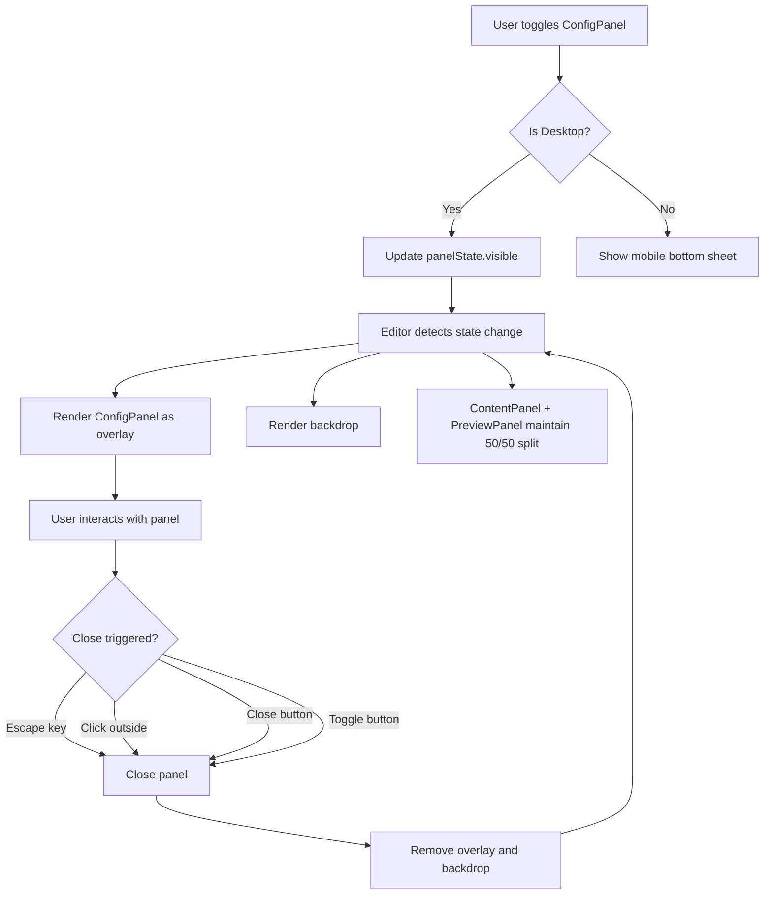
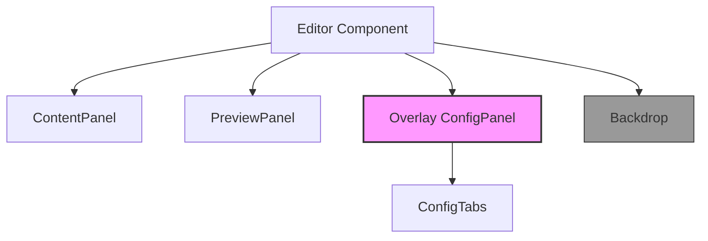

# Studio Page Layout Improvements - Feature Specification

**Specification ID**: 008-studio-layout-improvements  
**Status**: Draft  
**Created**: 2025-12-31  
**Author**: Architect Mode  

## Overview

This specification defines improvements to the `/studio` page layout focusing on two primary goals:

1. **2-Column Text Layout**: Change the preview text display from single-column to a 2-column newspaper-style layout
2. **Floating ConfigPanel**: Convert the ConfigPanel from an inline panel to a floating overlay that doesn't cause layout shift

## Table of Contents

- [Current State Analysis](#current-state-analysis)
- [Proposed Changes](#proposed-changes)
- [User Stories](#user-stories)
- [Functional Requirements](#functional-requirements)
- [Technical Architecture](#technical-architecture)
- [Component API Changes](#component-api-changes)
- [Accessibility Requirements](#accessibility-requirements)
- [Success Criteria](#success-criteria)
- [Implementation Tasks](#implementation-tasks)

---

## Current State Analysis

### Layout Structure

The current Editor layout ([`Editor.tsx:66-67`](../components/teleprompter/Editor.tsx:66-67)) uses a 3-column flexbox layout:

```
┌─────────────────────────────────────────────────────────────────┐
│                    Studio Page Layout                            │
├──────────────┬─────────────────┬────────────────────────────────┤
│ ContentPanel │   ConfigPanel   │       PreviewPanel             │
│   (30%)      │     (35%)       │          (35%)                │
│              │                 │                                │
│ • Header     │ • Header        │  • Background Image Layer     │
│ • Textarea   │ • History Bar   │  • Overlay Layer              │
│ • Actions    │ • Tabs          │  • TeleprompterText (1 col)   │
│              │ • Tab Content   │                                │
└──────────────┴─────────────────┴────────────────────────────────┘
```

### Current Behavior

#### Preview Text Layout
- **File**: [`PreviewPanel.tsx:226-230`](../components/teleprompter/editor/PreviewPanel.tsx:226-230)
- **Current**: Single-column text display
- **Component**: [`TeleprompterText`](../components/teleprompter/display/TeleprompterText.tsx) renders text in a single column

```typescript
// Current PreviewPanel structure (simplified)
<div className="absolute inset-0 flex items-center justify-center p-12 overflow-hidden">
  <TeleprompterText text={text} className="max-h-full overflow-hidden" />
</div>
```

#### ConfigPanel Layout Behavior
- **File**: [`ConfigPanel.tsx:110-119`](../components/teleprompter/config/ConfigPanel.tsx:110-119)
- **Current**: Inline flexbox panel that occupies 35% width
- **Issue**: Uses Framer Motion's `x` animation for visibility, but the element remains in the DOM when hidden
- **Problem**: When toggling visibility, the layout shifts because the panel takes up space even when "hidden"

```typescript
// Current ConfigPanel structure (simplified)
<motion.div
  className="w-full lg:w-[35%] bg-card border-r border-border flex flex-col h-full"
  initial="visible"
  animate={panelState.visible ? "visible" : "hidden"}
  variants={panelVariants}
  style={{
    display: panelState.visible || !prefersReducedMotion ? 'flex' : 'none',
  }}
>
```

#### Editor Layout Management
- **File**: [`Editor.tsx:73-75`](../components/teleprompter/Editor.tsx:73-75)
- **Control**: `shouldShowPanel` determines visibility
- **Issue**: Conditional rendering still causes layout recalculation

```typescript
const shouldShowPanel = isDesktop && panelState.visible;
<AnimatePresence mode="wait">
  {shouldShowPanel && <ConfigPanel key="config-panel" />}
</AnimatePresence>
```

---

## Proposed Changes

### 1. Two-Column Text Layout for Preview

Change the [`TeleprompterText`](../components/teleprompter/display/TeleprompterText.tsx) component to support 2-column newspaper-style layout.

#### Visual Design

```
┌─────────────────────────────────────────────────────────────────┐
│                     PreviewPanel (Desktop)                      │
│                              (35% width)                        │
├─────────────────────────────────────────────────────────────────┤
│                                                                 │
│  ┌──────────────┬──────────────┐                               │
│  │  Column 1    │  Column 2    │                               │
│  │              │              │                               │
│  │  Lorem ipsum │  dolor sit   │                               │
│  │  dolor sit   │  amet,       │                               │
│  │  amet,       │  consectetur │                               │
│  │  consectetur │  adipiscing  │                               │
│  │  adipiscing  │  elit.       │                               │
│  │  elit.       │              │                               │
│  │              │              │                               │
│  └──────────────┴──────────────┘                               │
│                                                                 │
└─────────────────────────────────────────────────────────────────┘
```

#### Column Layout Details

| Property | Value | Description |
|----------|-------|-------------|
| Columns | 2 | Fixed 2-column layout for desktop |
| Gap | `2rem` (32px) | Space between columns |
| Text Alignment | Left | Left-aligned text for readability |
| Responsive | Single column on mobile | Fallback to 1 column on small screens |

### 2. Floating Overlay ConfigPanel

Convert the ConfigPanel to a floating overlay that appears on top of the ContentPanel and PreviewPanel without shifting their positions.

#### Visual Design

```
┌─────────────────────────────────────────────────────────────────┐
│                    Studio Page (Config Hidden)                  │
├──────────────┬──────────────────────────────────────────────────┤
│ ContentPanel │               PreviewPanel                       │
│    (50%)     │                  (50%)                          │
└──────────────┴──────────────────────────────────────────────────┘
                        ↓ Toggle Config ────────────┐
                                                         ↓
┌─────────────────────────────────────────────────────────────────┐
│                    Studio Page (Config Visible)                 │
│  ┌─────────────────────────────────────────────────────┐       │
│  │              ConfigPanel Overlay                     │       │
│  │  ┌──────────┬──────────┬──────────┬──────────┐     │       │
│  │  │ Typography │ Colors │ Effects │ Layout   │... │     │       │
│  │  └──────────┴──────────┴──────────┴──────────┘     │       │
│  │  ┌──────────────────────────────────────────────┐  │       │
│  │  │           Active Tab Content                 │  │       │
│  │  └──────────────────────────────────────────────┘  │       │
│  └─────────────────────────────────────────────────────┘       │
│                                                                  │
│  ══════════ Backdrop (semi-transparent) ══════════════════     │
│                                                                  │
│  ┌──────────────┬──────────────────────────────────────┐       │
│  │ ContentPanel │           PreviewPanel                │       │
│  │    (50%)     │              (50%)                    │       │
│  └──────────────┴──────────────────────────────────────┘       │
└─────────────────────────────────────────────────────────────────┘
```

#### Overlay Behavior

| Property | Value | Description |
|----------|-------|-------------|
| Position | Fixed | `fixed` positioning to overlay content |
| Z-Index | `z-50` | Above other panels |
| Width | `400px` (min) | Minimum 400px, max 600px |
| Height | `80vh` | 80% of viewport height |
| Centered | Yes | Horizontally and vertically centered |
| Backdrop | Semi-transparent | `bg-black/50 backdrop-blur-sm` |
| Animation | Fade + Scale | Smooth fade-in with scale effect |
| Dismissible | Yes | Escape key, click outside, close button |

---

## User Stories

### US-001: Two-Column Preview Layout

**As** a content creator using the teleprompter  
**I want** my script to display in a 2-column newspaper-style layout in the preview  
**So that** I can better estimate how my content will look when formatted for print or multi-column displays

**Acceptance Criteria:**
- Preview displays text in 2 equal-width columns
- Columns are separated by a consistent gap (32px)
- Text flows naturally from the bottom of column 1 to the top of column 2
- Layout remains readable at all configured font sizes
- Mobile view falls back to single-column layout

### US-002: Floating Configuration Panel

**As** a content creator  
**I want** the configuration panel to appear as a floating overlay  
**So that** toggling it doesn't shift my text editing area and preview

**Acceptance Criteria:**
- Opening ConfigPanel doesn't change the position of ContentPanel or PreviewPanel
- ConfigPanel appears centered over the content
- A semi-transparent backdrop dims the underlying content
- Pressing Escape closes the panel
- Clicking outside the panel closes it
- A close button (X) is visible in the panel header
- The panel animates smoothly when opening and closing

### US-003: Accessible Configuration Interface

**As** a keyboard-only user  
**I want** to be able to open, navigate, and close the ConfigPanel using only my keyboard  
**So that** I can configure the teleprompter without using a mouse

**Acceptance Criteria:**
- Ctrl/Cmd + , toggles the ConfigPanel
- Tab key focuses through all interactive elements in order
- Escape key closes the panel
- Focus returns to the trigger button when closed
- Panel content is accessible via screen reader
- Trap focus within the panel when open

---

## Functional Requirements

### FR-001: Two-Column Preview Layout

**Priority**: High  
**Dependencies**: None

| ID | Requirement | Details |
|----|-------------|---------|
| FR-001.1 | Column Layout | Display preview text in 2 equal-width columns |
| FR-001.2 | Column Gap | Maintain 32px gap between columns |
| FR-001.3 | Text Flow | Enable natural text flow from column 1 to column 2 |
| FR-001.4 | Responsive Fallback | Single column on screens < 1024px |
| FR-001.5 | Config Property | Add `columnCount` to `layout` config in [`useConfigStore`](../lib/stores/useConfigStore.ts) |
| FR-001.6 | Default Value | Default to 2 columns for new sessions |
| FR-001.7 | Legacy Migration | Migrate existing configs to include `columnCount: 2` |

### FR-002: Floating ConfigPanel

**Priority**: High  
**Dependencies**: None

| ID | Requirement | Details |
|----|-------------|---------|
| FR-002.1 | Fixed Positioning | Use `fixed` positioning for overlay |
| FR-002.2 | Centered Layout | Center horizontally and vertically |
| FR-002.3 | Backdrop | Semi-transparent backdrop (`bg-black/50`) |
| FR-002.4 | Backdrop Blur | Apply `backdrop-blur-sm` to backdrop |
| FR-002.5 | Close on Escape | Escape key closes the panel |
| FR-002.6 | Close on Click Outside | Clicking backdrop closes the panel |
| FR-002.7 | Close Button | Visible X button in panel header |
| FR-002.8 | Z-Index Management | `z-50` for panel, `z-40` for backdrop |
| FR-002.9 | Animation | Fade + scale animation (300ms duration) |
| FR-002.10 | No Layout Shift | ContentPanel and PreviewPanel maintain positions |

### FR-003: Editor Layout Adjustment

**Priority**: Medium  
**Dependencies**: FR-002

| ID | Requirement | Details |
|----|-------------|---------|
| FR-003.1 | 50/50 Split | When ConfigPanel is visible, ContentPanel and PreviewPanel split space 50/50 |
| FR-003.2 | Responsive Widths | Maintain responsive behavior on different screen sizes |
| FR-003.3 | Smooth Transitions | Animate width changes when ConfigPanel toggles |

---

## Technical Architecture

### Component Structure Updates

```
components/teleprompter/
├── Editor.tsx                    (Update: 2-column layout logic)
├── editor/
│   ├── PreviewPanel.tsx          (Update: 2-column text container)
│   └── ContentPanel.tsx          (Update: Width calculations)
├── config/
│   ├── ConfigPanel.tsx           (Update: Overlay rendering)
│   └── ConfigTabs.tsx            (No change)
└── display/
    └── TeleprompterText.tsx      (Update: Column layout support)
```

### State Management

#### useConfigStore Updates

```typescript
// lib/stores/useConfigStore.ts
interface LayoutConfig {
  // Existing properties...
  textAlign: 'left' | 'center';
  horizontalMargin: number;
  verticalPadding: number;
  
  // NEW: Column layout support
  columnCount: 1 | 2;           // FR-001.5
  columnGap: number;            // FR-001.2 (default: 32)
}
```

#### useUIStore Updates

```typescript
// stores/useUIStore.ts
interface PanelState {
  visible: boolean;
  isAnimating: boolean;
  lastToggled: number | null;
  
  // NEW: Overlay mode flag
  isOverlay: boolean;           // Always true for new behavior
}
```

### Layout Flow Diagram



### Component Hierarchy



---

## Component API Changes

### ConfigPanel Component

**File**: [`components/teleprompter/config/ConfigPanel.tsx`](../components/teleprompter/config/ConfigPanel.tsx)

#### Current Signature
```typescript
export function ConfigPanel() {
  // No props, uses useUIStore for state
}
```

#### Proposed Signature
```typescript
export function ConfigPanel() {
  // No props change needed
  // Internal implementation changes to overlay rendering
}
```

#### Implementation Changes

1. **Remove inline width constraints**
   - Current: `className="w-full lg:w-[35%]"`
   - Proposed: `className="fixed overlay-config-panel"`

2. **Add backdrop component**
   ```typescript
   <>
     <AnimatePresence>
       {panelState.visible && (
         <motion.div
           className="fixed inset-0 bg-black/50 backdrop-blur-sm z-40"
           onClick={togglePanel}
           initial={{ opacity: 0 }}
           animate={{ opacity: 1 }}
           exit={{ opacity: 0 }}
         />
       )}
     </AnimatePresence>
     
     <motion.div
       className="fixed left-1/2 top-1/2 -translate-x-1/2 -translate-y-1/2 w-[400px] max-w-[90vw] h-[80vh] bg-card rounded-lg shadow-2xl z-50 flex flex-col"
       initial={{ opacity: 0, scale: 0.95 }}
       animate={{ opacity: 1, scale: 1 }}
       exit={{ opacity: 0, scale: 0.95 }}
       // Rest of panel content...
     />
   </>
   ```

### PreviewPanel Component

**File**: [`components/teleprompter/editor/PreviewPanel.tsx`](../components/teleprompter/editor/PreviewPanel.tsx)

#### Changes Required

1. **Update TeleprompterText container to support 2-column layout**
   ```typescript
   // Current
   <div className="absolute inset-0 flex items-center justify-center p-12 overflow-hidden">
     <TeleprompterText text={text} className="max-h-full overflow-hidden" />
   </div>
   
   // Proposed
   <div className="absolute inset-0 flex items-center justify-center p-12 overflow-hidden">
     <TeleprompterText 
       text={text}
       className="max-h-full overflow-hidden"
       columnCount={layout.columnCount}  // NEW
       columnGap={layout.columnGap}       // NEW
     />
   </div>
   ```

### TeleprompterText Component

**File**: [`components/teleprompter/display/TeleprompterText.tsx`](../components/teleprompter/display/TeleprompterText.tsx)

#### Current Signature
```typescript
interface TeleprompterTextProps {
  text: string;
  className?: string;
}
```

#### Proposed Signature
```typescript
interface TeleprompterTextProps {
  text: string;
  className?: string;
  columnCount?: 1 | 2;  // NEW: FR-001.5
  columnGap?: number;   // NEW: FR-001.2
}
```

#### Implementation Changes

1. **Add column layout support using CSS columns**
   ```typescript
   const columnStyle = useMemo(() => ({
     columnCount: columnCount || 1,
     columnGap: columnGap ? `${columnGap}px` : 'normal',
   }), [columnCount, columnGap]);
   
   return (
     <div 
       className="teleprompter-text overflow-y-auto"
       style={columnStyle}
       // ... rest of implementation
     >
       {processedText}
     </div>
   );
   ```

### Editor Component

**File**: [`components/teleprompter/Editor.tsx`](../components/teleprompter/Editor.tsx)

#### Changes Required

1. **Update width calculations for 2-column layout**
   - ContentPanel: `lg:w-[50%]` (when ConfigPanel visible)
   - PreviewPanel: `lg:w-[50%]` (when ConfigPanel visible)

2. **Remove AnimatePresence wrapper for ConfigPanel**
   - ConfigPanel now handles its own animations
   - Always render ConfigPanel, manage visibility internally

```typescript
// Current
<AnimatePresence mode="wait">
  {shouldShowPanel && <ConfigPanel key="config-panel" />}
</AnimatePresence>

// Proposed
<ConfigPanel />  // Always rendered, manages own visibility
```

---

## Accessibility Requirements

### WCAG 2.1 AA Compliance

#### A11y-001: Focus Management

| Requirement | Implementation |
|-------------|----------------|
| Focus Trap | Trap focus within ConfigPanel when open |
| Focus Return | Return focus to toggle button when closed |
| Tab Order | Logical tab order through panel content |
| Skip Links | Allow skipping to main content |

**Implementation:**
```typescript
// Use Radix UI Dialog primitive or custom focus trap
import { useFocusTrap } from '@radix-ui/react-dialog';

// Or implement custom focus trap
useEffect(() => {
  if (panelState.visible) {
    const focusableElements = panelRef.current?.querySelectorAll(
      'button, [href], input, select, textarea, [tabindex]:not([tabindex="-1"])'
    );
    const firstElement = focusableElements?.[0] as HTMLElement;
    firstElement?.focus();
  }
}, [panelState.visible]);
```

#### A11y-002: Keyboard Navigation

| Interaction | Keyboard Shortcut |
|-------------|-------------------|
| Toggle Panel | Ctrl/Cmd + , |
| Close Panel | Escape |
| Next Control | Tab |
| Previous Control | Shift + Tab |
| Navigate Tabs | Arrow keys (when tab list focused) |

#### A11y-003: Screen Reader Support

| Element | ARIA Requirement |
|---------|------------------|
| ConfigPanel | `role="dialog"`, `aria-modal="true"` |
| Backdrop | `aria-hidden="true"` |
| Close Button | `aria-label="Close configuration panel"` |
| Tab List | `role="tablist"` |
| Tab | `role="tab"`, `aria-selected`, `aria-controls` |
| Tab Panel | `role="tabpanel"`, `aria-labelledby` |

#### A11y-004: Visual Accessibility

| Requirement | Specification |
|-------------|----------------|
| Color Contrast | Minimum 4.5:1 for normal text, 3:1 for large text |
| Focus Indicators | Visible focus ring on all interactive elements |
| Text Scaling | Support 200% text zoom without layout break |
| Motion Control | Respect `prefers-reduced-motion` |

---

## Success Criteria

### SC-001: Layout Metrics

| Metric | Target | Measurement Method |
|--------|--------|-------------------|
| Layout Shift Score | < 0.1 | Chrome DevTools Performance |
| Toggle Animation Time | ≤ 300ms | Performance.now() measurements |
| Column Rendering FPS | ≥ 60 FPS | Chrome DevTools Performance |
| Panel Open Time | ≤ 100ms | Performance API |

### SC-002: User Experience

| Criterion | Target | Validation Method |
|-----------|--------|-------------------|
| No visible layout shift | Zero shift when toggling ConfigPanel | Visual regression tests |
| Smooth column flow | Text flows naturally between columns | Manual testing |
| Panel dismissibility | All 3 dismiss methods work | Manual + automated tests |
| Keyboard accessibility | Full keyboard navigation possible | Accessibility audit |

### SC-001: Code Quality

| Criterion | Target | Validation Method |
|-----------|--------|-------------------|
| TypeScript strict mode | 100% | TypeScript compiler |
| Test coverage | >80% | Jest coverage reports |
| ESLint warnings | 0 | npm run lint |
| Storybook stories | All variants documented | Storybook |

---

## Implementation Tasks

### Task 1: Add Column Layout Support to Config Store

**File**: [`lib/stores/useConfigStore.ts`](../lib/stores/useConfigStore.ts)

- [ ] Add `columnCount: 1 | 2` to `layout` interface
- [ ] Add `columnGap: number` to `layout` interface
- [ ] Update default layout values
- [ ] Add migration logic for existing configs

### Task 2: Update TeleprompterText Component

**File**: [`components/teleprompter/display/TeleprompterText.tsx`](../components/teleprompter/display/TeleprompterText.tsx)

- [ ] Add `columnCount` and `columnGap` props
- [ ] Implement CSS column layout
- [ ] Add responsive breakpoint for mobile fallback
- [ ] Test with various text lengths and font sizes

### Task 3: Convert ConfigPanel to Overlay

**File**: [`components/teleprompter/config/ConfigPanel.tsx`](../components/teleprompter/config/ConfigPanel.tsx)

- [ ] Add backdrop component
- [ ] Change positioning to fixed/centered
- [ ] Update animation variants (fade + scale)
- [ ] Add click-outside handler
- [ ] Add close button to header
- [ ] Update z-index management

### Task 4: Update Editor Component

**File**: [`components/teleprompter/Editor.tsx`](../components/teleprompter/Editor.tsx)

- [ ] Remove AnimatePresence wrapper around ConfigPanel
- [ ] Update ContentPanel width to 50%
- [ ] Update PreviewPanel width to 50%
- [ ] Ensure ConfigPanel renders unconditionally

### Task 5: Implement Focus Trap

**File**: [`components/teleprompter/config/ConfigPanel.tsx`](../components/teleprompter/config/ConfigPanel.tsx)

- [ ] Add focus trap logic
- [ ] Implement focus return on close
- [ ] Add Escape key handler
- [ ] Test keyboard navigation

### Task 6: Add ARIA Attributes

**File**: [`components/teleprompter/config/ConfigPanel.tsx`](../components/teleprompter/config/ConfigPanel.tsx)

- [ ] Add `role="dialog"` to panel
- [ ] Add `aria-modal="true"` to panel
- [ ] Add `aria-label` to close button
- [ ] Update tab ARIA attributes
- [ ] Add `aria-hidden` to backdrop

### Task 7: Update PreviewPanel

**File**: [`components/teleprompter/editor/PreviewPanel.tsx`](../components/teleprompter/editor/PreviewPanel.tsx)

- [ ] Pass `columnCount` and `columnGap` to TeleprompterText
- [ ] Extract values from `useConfigStore`
- [ ] Test rendering with 1 and 2 column modes

### Task 8: Write Tests

**Files**: `__tests__/integration/studio/`, `__tests__/unit/`

- [ ] Test column layout rendering
- [ ] Test ConfigPanel overlay behavior
- [ ] Test focus trap functionality
- [ ] Test keyboard navigation
- [ ] Test accessibility attributes
- [ ] Visual regression tests
- [ ] Performance tests

### Task 9: Update Documentation

**Files**: [`components/teleprompter/config/ConfigPanel.md`](../components/teleprompter/config/ConfigPanel.md)

- [ ] Document overlay behavior
- [ ] Update component examples
- [ ] Document new config properties
- [ ] Update accessibility notes

---

## Open Questions

1. **Column Layout Settings**: Should `columnCount` be user-configurable or fixed at 2?
2. **Panel Size**: Is 400px width appropriate, or should it be responsive?
3. **Mobile Behavior**: Should ConfigPanel remain a bottom sheet on mobile, or also become an overlay?
4. **Persistence**: Should the column count preference persist across sessions?

---

## References

- [`Editor.tsx`](../components/teleprompter/Editor.tsx) - Main editor layout
- [`ConfigPanel.tsx`](../components/teleprompter/config/ConfigPanel.tsx) - Configuration panel
- [`PreviewPanel.tsx`](../components/teleprompter/editor/PreviewPanel.tsx) - Preview display
- [`useConfigStore.ts`](../lib/stores/useConfigStore.ts) - Config state management
- [`useUIStore.ts`](../stores/useUIStore.ts) - UI state management
- [WCAG 2.1 AA Guidelines](https://www.w3.org/WAI/WCAG21/quickref/?currentsidebar=%23col_customize&levels=aaa)
- [Radix UI Dialog](https://www.radix-ui.com/primitives/docs/components/dialog) - Reference for overlay patterns
