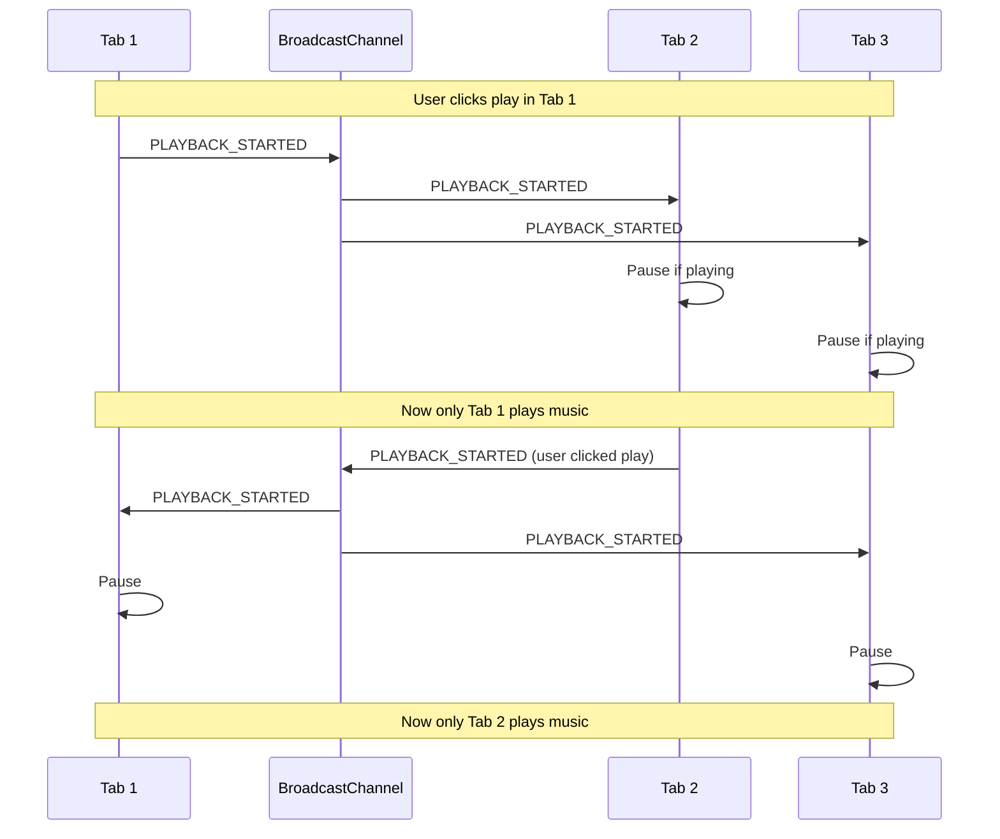

# BroadcastChannel - Tab Communication Protocol

**Feature**: 011-music-player-widget  
**Contract Type**: Cross-Tab Synchronization  
**Status**: Draft  
**Created**: 2026-01-03  
**Implementation Location**: `lib/music/broadcastChannel.ts`

---

## Overview

This contract defines the BroadcastChannel API protocol for synchronizing music playback state across multiple browser tabs. This prevents audio conflicts when users have multiple teleprompter sessions open simultaneously.

---

## Channel Configuration

```typescript
/**
 * Broadcast channel name for music sync
 */
export const MUSIC_SYNC_CHANNEL = 'teleprompter-music-sync';

/**
 * Message types that can be sent over the channel
 */
export type MessageType = 'PLAYBACK_STARTED' | 'PLAYBACK_STOPPED' | 'SOURCE_CHANGED';
```

---

## Message Types

### Base Message Interface

```typescript
/**
 * Base broadcast message structure
 */
export interface BaseBroadcastMessage {
  type: MessageType;
  senderTabId: string;
  timestamp: number;
}
```

### Playback Started Message

Sent when a tab starts playing music. Other tabs should pause their playback.

```typescript
/**
 * Message sent when playback starts in a tab
 */
export interface PlaybackStartedMessage extends BaseBroadcastMessage {
  type: 'PLAYBACK_STARTED';
  // No additional payload needed
}

/**
 * Create a PLAYBACK_STARTED message
 */
export function createPlaybackStartedMessage(tabId: string): PlaybackStartedMessage {
  return {
    type: 'PLAYBACK_STARTED',
    senderTabId: tabId,
    timestamp: Date.now(),
  };
}
```

### Playback Stopped Message

Sent when a tab pauses or stops music. Other tabs may optionally resume if they were the original tab.

```typescript
/**
 * Message sent when playback stops in a tab
 */
export interface PlaybackStoppedMessage extends BaseBroadcastMessage {
  type: 'PLAYBACK_STOPPED';
  // No additional payload needed
}

/**
 * Create a PLAYBACK_STOPPED message
 */
export function createPlaybackStoppedMessage(tabId: string): PlaybackStoppedMessage {
  return {
    type: 'PLAYBACK_STOPPED',
    senderTabId: tabId,
    timestamp: Date.now(),
  };
}
```

### Source Changed Message

Sent when a tab changes the music source (YouTube URL or uploaded file). Other tabs should update their source reference.

```typescript
/**
 * Message sent when music source changes
 */
export interface SourceChangedMessage extends BaseBroadcastMessage {
  type: 'SOURCE_CHANGED';
  payload: {
    sourceType: 'youtube' | 'upload';
    sourceUrl?: string;
  };
}

/**
 * Create a SOURCE_CHANGED message
 */
export function createSourceChangedMessage(
  tabId: string,
  sourceType: 'youtube' | 'upload',
  sourceUrl?: string
): SourceChangedMessage {
  return {
    type: 'SOURCE_CHANGED',
    senderTabId: tabId,
    timestamp: Date.now(),
    payload: {
      sourceType,
      sourceUrl,
    },
  };
}
```

### Union Message Type

```typescript
/**
 * Union type of all possible broadcast messages
 */
export type BroadcastMessage = 
  | PlaybackStartedMessage 
  | PlaybackStoppedMessage 
  | SourceChangedMessage;

/**
 * Type guard for PLAYBACK_STARTED
 */
export function isPlaybackStartedMessage(msg: BroadcastMessage): msg is PlaybackStartedMessage {
  return msg.type === 'PLAYBACK_STARTED';
}

/**
 * Type guard for PLAYBACK_STOPPED
 */
export function isPlaybackStoppedMessage(msg: BroadcastMessage): msg is PlaybackStoppedMessage {
  return msg.type === 'PLAYBACK_STOPPED';
}

/**
 * Type guard for SOURCE_CHANGED
 */
export function isSourceChangedMessage(msg: BroadcastMessage): msg is SourceChangedMessage {
  return msg.type === 'SOURCE_CHANGED';
}
```

---

## Channel Manager Interface

```typescript
/**
 * BroadcastChannel manager for music sync
 */
export interface MusicSyncChannel {
  /** The underlying BroadcastChannel instance */
  channel: BroadcastChannel | null;

  /** Whether the channel is supported in current browser */
  isSupported: boolean;

  /** Initialize the channel (creates if not exists) */
  init: () => void;

  /** Send a message over the channel */
  send: (message: BroadcastMessage) => void;

  /** Register a message handler */
  onMessage: (handler: (message: BroadcastMessage) => void) => void;

  /** Close the channel and cleanup */
  close: () => void;
}
```

---

## Implementation Template

```typescript
/**
 * BroadcastChannel Manager Implementation
 * 
 * This template shows the expected structure when implementing
 * the actual channel manager in lib/music/broadcastChannel.ts
 */

import type { BroadcastMessage, MusicSyncChannel } from '@/specs/011-music-player-widget/contracts/broadcast-channel';
import { MUSIC_SYNC_CHANNEL } from '@/specs/011-music-player-widget/contracts/broadcast-channel';

/**
 * Create a music sync channel manager
 */
export function createMusicSyncChannel(tabId: string): MusicSyncChannel {
  let channel: BroadcastChannel | null = null;
  let messageHandlers: ((message: BroadcastMessage) => void)[] = [];
  const isSupported = typeof BroadcastChannel !== 'undefined';

  const init = () => {
    if (!isSupported) {
      console.warn('[MusicSyncChannel] BroadcastChannel not supported in this browser');
      return;
    }

    if (channel) return; // Already initialized

    channel = new BroadcastChannel(MUSIC_SYNC_CHANNEL);

    channel.onmessage = (event: MessageEvent<BroadcastMessage>) => {
      const message = event.data;

      // Ignore messages from this tab
      if (message.senderTabId === tabId) {
        return;
      }

      // Log message for debugging
      console.log('[MusicSyncChannel] Received message:', message);

      // Notify all registered handlers
      messageHandlers.forEach((handler) => {
        try {
          handler(message);
        } catch (error) {
          console.error('[MusicSyncChannel] Handler error:', error);
        }
      });
    };

    channel.onmessageerror = (error) => {
      console.error('[MusicSyncChannel] Message error:', error);
    };

    console.log('[MusicSyncChannel] Initialized for tab:', tabId);
  };

  const send = (message: BroadcastMessage) => {
    if (!channel) {
      console.warn('[MusicSyncChannel] Cannot send message: channel not initialized');
      return;
    }

    try {
      channel.postMessage(message);
      console.log('[MusicSyncChannel] Sent message:', message);
    } catch (error) {
      console.error('[MusicSyncChannel] Send error:', error);
    }
  };

  const onMessage = (handler: (message: BroadcastMessage) => void) => {
    messageHandlers.push(handler);

    // Return cleanup function
    return () => {
      messageHandlers = messageHandlers.filter((h) => h !== handler);
    };
  };

  const close = () => {
    if (channel) {
      channel.close();
      channel = null;
      console.log('[MusicSyncChannel] Closed for tab:', tabId);
    }

    // Clear all handlers
    messageHandlers = [];
  };

  return {
    channel,
    isSupported,
    init,
    send,
    onMessage,
    close,
  };
}

/**
 * Singleton instance for the application
 */
let syncChannel: MusicSyncChannel | null = null;

/**
 * Get or create the music sync channel singleton
 */
export function getMusicSyncChannel(tabId: string): MusicSyncChannel {
  if (!syncChannel) {
    syncChannel = createMusicSyncChannel(tabId);
    syncChannel.init();
  }

  return syncChannel;
}

/**
 * Cleanup the music sync channel (call on page unmount)
 */
export function cleanupMusicSyncChannel(): void {
  if (syncChannel) {
    syncChannel.close();
    syncChannel = null;
  }
}
```

---

## Store Integration

```typescript
/**
 * Integration with Zustand store
 * 
 * This shows how to integrate BroadcastChannel with useMusicPlayerStore
 */

import { create } from 'zustand';
import { persist } from 'zustand/middleware';
import type { BroadcastMessage } from '@/specs/011-music-player-widget/contracts/broadcast-channel';
import { 
  getMusicSyncChannel, 
  cleanupMusicSyncChannel,
  createPlaybackStartedMessage,
  createPlaybackStoppedMessage,
  createSourceChangedMessage,
} from '@/lib/music/broadcastChannel';

export const useMusicPlayerStore = create<MusicPlayerStore>()(
  persist(
    (set, get) => {
      // Generate unique tab ID on mount
      const tabId = typeof crypto !== 'undefined' ? crypto.randomUUID() : '';
      
      // Initialize BroadcastChannel
      let syncChannel = getMusicSyncChannel(tabId);
      
      // Register message handler
      const unsubscribe = syncChannel.onMessage((message: BroadcastMessage) => {
        const state = get();
        
        switch (message.type) {
          case 'PLAYBACK_STARTED':
            // Pause playback in this tab if playing
            if (state.playbackState === 'playing') {
              console.log('[MusicStore] Pausing due to playback in another tab');
              set({ playbackState: 'paused' });
            }
            break;
            
          case 'PLAYBACK_STOPPED':
            // Optional: Could resume if this was the original tab
            // For now, just keep state synced
            break;
            
          case 'SOURCE_CHANGED':
            // Update source reference
            if (message.payload) {
              set({
                sourceType: message.payload.sourceType,
              });
            }
            break;
        }
      });

      return {
        // Initial state
        tabId,
        // ... other state

        // Actions that send messages
        play: () => {
          set({ playbackState: 'playing' });
          
          // Notify other tabs
          const channel = getMusicSyncChannel(get().tabId);
          channel.send(createPlaybackStartedMessage(get().tabId));
        },

        pause: () => {
          set({ playbackState: 'paused' });
          
          // Notify other tabs
          const channel = getMusicSyncChannel(get().tabId);
          channel.send(createPlaybackStoppedMessage(get().tabId));
        },

        setSourceType: (type) => {
          set({ sourceType: type, lastModified: Date.now() });
          
          // Notify other tabs
          const channel = getMusicSyncChannel(get().tabId);
          const url = type === 'youtube' ? get().youtubeUrl : undefined;
          channel.send(createSourceChangedMessage(get().tabId, type, url));
        },

        // ... other actions
      };
    },
    {
      name: 'teleprompter-music',
      // ... persist config
    }
  )
);

// Cleanup on page unload
if (typeof window !== 'undefined') {
  window.addEventListener('beforeunload', () => {
    cleanupMusicSyncChannel();
  });
}
```

---

## Browser Compatibility

### Support Matrix

| Browser | Version | Support | Notes |
|---------|---------|---------|-------|
| Chrome | 54+ | ✅ Full | Native support |
| Firefox | 38+ | ✅ Full | Native support |
| Safari | 15.4+ | ✅ Full | Native support |
| Edge | 79+ | ✅ Full | Native support |
| Safari (iOS) | 15.4+ | ✅ Full | Native support |
| Older Safari | < 15.4 | ❌ No support | Graceful degradation |

### Graceful Degradation

```typescript
/**
 * Feature detection and fallback
 */
export function checkBroadcastChannelSupport(): boolean {
  if (typeof BroadcastChannel === 'undefined') {
    console.warn('[MusicSyncChannel] BroadcastChannel not supported. Cross-tab sync disabled.');
    console.warn('[MusicSyncChannel] Music playback will still work, but multiple tabs may play simultaneously.');
    return false;
  }
  return true;
}

/**
 * Usage with fallback
 */
const syncChannel = getMusicSyncChannel(tabId);

if (!syncChannel.isSupported) {
  // Music still works, just without cross-tab coordination
  console.info('[MusicSyncChannel] Running in single-tab mode');
}
```

---

## Testing

### Unit Test Example

```typescript
import { describe, it, expect, vi, beforeEach, afterEach } from 'vitest';
import { createMusicSyncChannel } from '@/lib/music/broadcastChannel';

describe('MusicSyncChannel', () => {
  let mockChannel: {
    postMessage: ReturnType<typeof vi.fn>;
    close: ReturnType<typeof vi.fn>;
    onmessage: ((event: MessageEvent) => void) | null;
  };

  beforeEach(() => {
    // Mock BroadcastChannel
    mockChannel = {
      postMessage: vi.fn(),
      close: vi.fn(),
      onmessage: null,
    };

    global.BroadcastChannel = vi.fn().mockImplementation(() => mockChannel) as any;
  });

  afterEach(() => {
    vi.clearAllMocks();
  });

  it('should send PLAYBACK_STARTED message', () => {
    const tabId = 'test-tab-123';
    const channel = createMusicSyncChannel(tabId);
    
    channel.init();
    channel.send({
      type: 'PLAYBACK_STARTED',
      senderTabId: tabId,
      timestamp: Date.now(),
    });

    expect(mockChannel.postMessage).toHaveBeenCalledWith({
      type: 'PLAYBACK_STARTED',
      senderTabId: tabId,
      timestamp: expect.any(Number),
    });
  });

  it('should ignore messages from same tab', () => {
    const tabId = 'test-tab-123';
    const channel = createMusicSyncChannel(tabId);
    const handler = vi.fn();
    
    channel.init();
    channel.onMessage(handler);

    // Simulate message from same tab
    const message = {
      type: 'PLAYBACK_STARTED' as const,
      senderTabId: tabId,
      timestamp: Date.now(),
    };

    if (mockChannel.onmessage) {
      mockChannel.onmessage({ data: message } as MessageEvent);
    }

    expect(handler).not.toHaveBeenCalled();
  });

  it('should handle messages from other tabs', () => {
    const tabId = 'test-tab-123';
    const channel = createMusicSyncChannel(tabId);
    const handler = vi.fn();
    
    channel.init();
    channel.onMessage(handler);

    // Simulate message from different tab
    const message = {
      type: 'PLAYBACK_STARTED' as const,
      senderTabId: 'other-tab-456',
      timestamp: Date.now(),
    };

    if (mockChannel.onmessage) {
      mockChannel.onmessage({ data: message } as MessageEvent);
    }

    expect(handler).toHaveBeenCalledWith(message);
  });
});
```

---

## Message Flow Diagram



---

## Security Considerations

1. **Same-Origin Policy**: BroadcastChannel only works between tabs on the same origin (domain + protocol + port)
2. **Message Validation**: Always validate message structure before processing
3. **Tab ID Spoofing**: Use cryptographically secure UUIDs to prevent spoofing
4. **No Sensitive Data**: Never send sensitive data (passwords, tokens) through BroadcastChannel

```typescript
/**
 * Validate incoming message structure
 */
export function isValidBroadcastMessage(data: unknown): data is BroadcastMessage {
  if (typeof data !== 'object' || data === null) return false;

  const msg = data as Record<string, unknown>;

  return (
    typeof msg.type === 'string' &&
    ['PLAYBACK_STARTED', 'PLAYBACK_STOPPED', 'SOURCE_CHANGED'].includes(msg.type) &&
    typeof msg.senderTabId === 'string' &&
    typeof msg.timestamp === 'number'
  );
}
```

---

## Related Documents

- **Data Model**: [`specs/011-music-player-widget/data-model.md`](../data-model.md)
- **Store Contract**: [`specs/011-music-player-widget/contracts/music-player-store.md`](./music-player-store.md)
- **Widget Component Contract**: [`specs/011-music-player-widget/contracts/music-player-widget.md`](./music-player-widget.md)

---

**Document Status**: ✅ Complete  
**Next Step**: Implement in `lib/music/broadcastChannel.ts`
