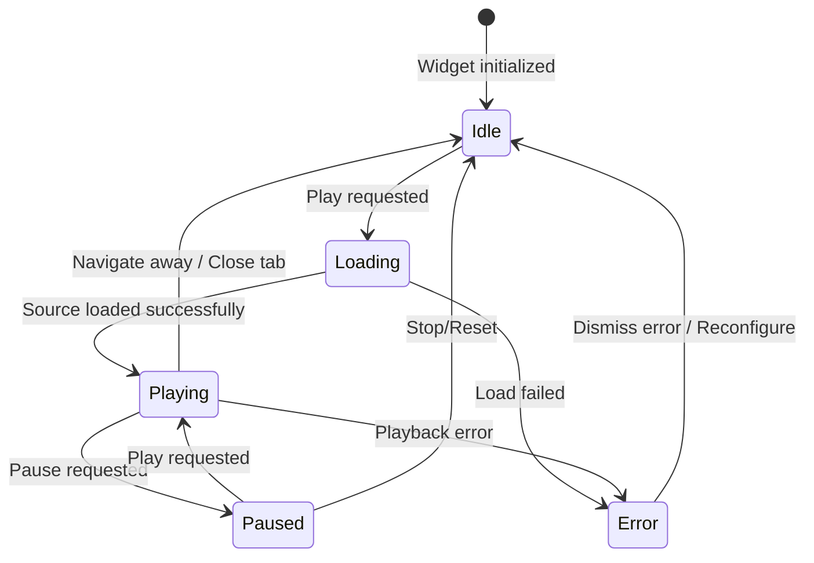
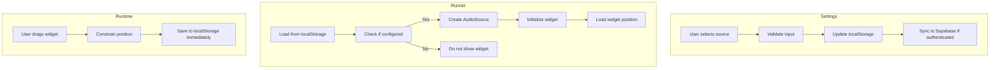

# Data Model: Music Player Widget

**Feature**: 011-music-player-widget  
**Document Type**: Data Model Specification  
**Status**: Draft  
**Created**: 2026-01-03

---

## Overview

This document defines the data structures, relationships, validation rules, and persistence strategy for the floating music player widget feature. The widget enables background music playback in Runner mode with three visual styles: Capsule, Vinyl, and Spectrum.

---

## Entities

### MusicPlayerConfig

Stores user's music configuration preferences. This is persisted to localStorage and optionally synced to Supabase cloud storage.

**Type**: Configuration Entity  
**Storage**: localStorage (primary), Supabase (cloud backup)

```typescript
interface MusicPlayerConfig {
  /** Type of music source selected by user */
  sourceType: 'youtube' | 'upload';

  /** YouTube video URL (when sourceType is 'youtube') */
  youtubeUrl?: string;

  /** Unique identifier for uploaded audio file (when sourceType is 'upload') */
  uploadedFileId?: string;

  /** Selected widget visual style */
  widgetStyle: 'capsule' | 'vinyl' | 'spectrum';

  /** Vinyl rotation speed preset (only used when widgetStyle is 'vinyl') */
  vinylSpeed?: VinylSpeed;

  /** Custom BPM value when vinylSpeed is 'custom' (60-200 range) */
  vinylCustomBPM?: number;

  /** Timestamp of last configuration change */
  lastModified: number;

  /** Whether music has been configured (true if any source is set) */
  isConfigured: boolean;
}
```

### VinylSpeed

Vinyl record rotation speed preset options.

```typescript
type VinylSpeed = '33-1/3' | '45' | '78' | 'custom';
```

---

### MusicPlayerState

Represents the runtime state of the music player widget. This is NOT persisted across sessions except for position.

**Type**: Runtime State Entity  
**Storage**: Runtime (in-memory) + localStorage (position only)

```typescript
interface MusicPlayerState {
  /** Current playback state */
  playbackState: PlaybackState;

  /** Current position of the widget on screen */
  position: WidgetPosition;

  /** Whether the widget is currently visible (only shown when music is configured) */
  isVisible: boolean;

  /** Current active source for playback (derived from config) */
  activeSource: AudioSource | null;

  /** Playback progress (0-1) - currently unused but reserved for future seek functionality */
  playbackProgress: number;

  /** Current error state (null when no error) */
  error: MusicError | null;

  /** Whether the widget is currently being dragged */
  isDragging: boolean;

  /** Unique tab identifier for BroadcastChannel synchronization */
  tabId: string;
}
```

### PlaybackState

Music playback state machine.

```typescript
type PlaybackState = 'idle' | 'loading' | 'playing' | 'paused' | 'error';
```

---

### WidgetPosition

Screen position of the floating widget. Constrained to keep at least 50% of widget visible.

```typescript
interface WidgetPosition {
  /** X coordinate in pixels relative to viewport */
  x: number;

  /** Y coordinate in pixels relative to viewport */
  y: number;
}
```

**Default Position**: Bottom-right corner with 16px margin  
**Constraints**: See Validation Rules below

---

### AudioSource

Represents an active audio source for playback.

```typescript
interface AudioSource {
  /** Source type */
  type: 'youtube' | 'upload';

  /** URL for playback (YouTube URL or Supabase storage URL) */
  url: string;

  /** File metadata (only for uploads) */
  metadata?: AudioFileMetadata;
}
```

### AudioFileMetadata

Metadata for uploaded audio files.

```typescript
interface AudioFileMetadata {
  /** Original filename */
  fileName: string;

  /** File size in bytes */
  fileSize: number;

  /** MIME type */
  mimeType: string;

  /** File format (extension) */
  format: string;

  /** Upload timestamp */
  uploadedAt: number;

  /** Storage path in Supabase */
  storagePath: string;
}
```

---

### MusicError

Error states for music playback.

```typescript
type MusicError =
  | { type: 'youtube_unavailable'; url: string }
  | { type: 'youtube_invalid_url'; url: string }
  | { type: 'file_not_found'; fileId: string }
  | { type: 'file_unsupported'; format: string }
  | { type: 'file_too_large'; fileSize: number; maxSize: number }
  | { type: 'storage_quota_exceeded'; currentUsage: number; quota: number }
  | { type: 'network_error'; message: string }
  | { type: 'unknown_error'; message: string };
```

---

### WidgetStyleConfig

Visual configuration for each widget style.

```typescript
interface WidgetStyleConfig {
  /** Style identifier */
  id: 'capsule' | 'vinyl' | 'spectrum';

  /** Display name */
  name: string;

  /** Widget dimensions in pixels */
  dimensions: WidgetDimensions;

  /** Whether this style supports tempo adjustment (vinyl only) */
  supportsTempo: boolean;

  /** Animation type for playing state */
  playAnimation: 'pulse' | 'rotate' | 'spectrum';

  /** CSS class name prefix */
  className: string;
}
```

### WidgetDimensions

Size constraints for a widget style.

```typescript
interface WidgetDimensions {
  /** Default width in pixels */
  width: number;

  /** Default height in pixels */
  height: number;

  /** Minimum width */
  minWidth?: number;

  /** Minimum height */
  minHeight?: number;

  /** Maximum width */
  maxWidth?: number;

  /** Maximum height */
  maxHeight?: number;
}
```

---

## Relationships

### Entity Relationship Diagram

```mermaid
erDiagram
    MusicPlayerConfig ||--o| AudioSource : "derives"
    MusicPlayerState ||--|| PlaybackState : "has"
    MusicPlayerState ||--|| WidgetPosition : "has"
    MusicPlayerState o--o| AudioSource : "uses"
    AudioSource ||--o| AudioFileMetadata : "may include"
    MusicPlayerConfig ||--|| WidgetStyleConfig : "references"
    WidgetStyleConfig ||--|| WidgetDimensions : "defines"
    MusicPlayerState o--o| MusicError : "may have"
```

### Relationship Descriptions

1. **MusicPlayerConfig → AudioSource**: The config contains source information that is transformed into an AudioSource for runtime use
2. **MusicPlayerState → PlaybackState**: The state machine tracks the current playback status
3. **MusicPlayerState → WidgetPosition**: Position is part of state and is persisted separately
4. **MusicPlayerState → AudioSource**: Runtime active source derived from config
5. **AudioSource → AudioFileMetadata**: Upload sources include file metadata
6. **MusicPlayerConfig → WidgetStyleConfig**: Config references the selected style
7. **MusicPlayerState → MusicError**: Error state is optional (null when no error)

---

## Validation Rules

### Configuration Validation

| Field | Rule | Error Type |
|-------|------|------------|
| `sourceType` | Must be either `'youtube'` or `'upload'` | Validation error |
| `youtubeUrl` | Required when `sourceType === 'youtube'`. Must match YouTube URL regex pattern | `youtube_invalid_url` |
| `uploadedFileId` | Required when `sourceType === 'upload'`. Must be valid UUID | Validation error |
| `widgetStyle` | Must be one of: `'capsule'`, `'vinyl'`, `'spectrum'` | Validation error |
| `vinylSpeed` | Optional. If provided, must be valid `VinylSpeed` type | Validation error |
| `vinylCustomBPM` | Required only when `vinylSpeed === 'custom'`. Must be 60-200 | Validation error |

### YouTube URL Validation

```typescript
// Regex pattern for YouTube URL validation
const YOUTUBE_URL_REGEX = /^(https?:\/\/)?(www\.)?(youtube\.com\/(watch\?v=|embed\/|v\/)|youtu\.be\/)([a-zA-Z0-9_-]{11})(\?.*)?$/;

// Valid examples:
// - https://www.youtube.com/watch?v=dQw4w9WgXcQ
// - https://youtu.be/dQw4w9WgXcQ
// - https://www.youtube.com/embed/dQw4w9WgXcQ
```

### Audio File Validation

| Rule | Value | Error Type |
|------|-------|------------|
| Max file size | 50MB (52,428,800 bytes) | `file_too_large` |
| Total user quota | 500MB (524,288,000 bytes) | `storage_quota_exceeded` |
| Supported formats | MP3, WAV, M4A, OGG | `file_unsupported` |
| MIME types | `audio/mpeg`, `audio/wav`, `audio/mp4`, `audio/ogg` | `file_unsupported` |

### Position Constraints

```typescript
// Widget must keep at least 50% visible within viewport
const constrainPosition = (
  x: number,
  y: number,
  widgetWidth: number,
  widgetHeight: number,
  viewportWidth: number,
  viewportHeight: number
): { x: number; y: number } => {
  const minX = -widgetWidth / 2;
  const maxX = viewportWidth - widgetWidth / 2;
  const minY = -widgetHeight / 2;
  const maxY = viewportHeight - widgetHeight / 2;
  
  return {
    x: Math.max(minX, Math.min(maxX, x)),
    y: Math.max(minY, Math.min(maxY, y)),
  };
};
```

---

## State Transitions

### Playback State Machine



### Transition Rules

| From | To | Trigger | Side Effects |
|------|-----|----------|--------------|
| `idle` | `loading` | User clicks play or presses M key | Send PLAYBACK_STARTED via BroadcastChannel |
| `loading` | `playing` | Audio source ready | Start animations, show playing indicator |
| `loading` | `error` | Network error, invalid URL, file not found | Show error toast, display inline error |
| `playing` | `paused` | User clicks pause or presses M key | Pause audio, decelerate animations |
| `paused` | `playing` | User clicks play or presses M key | Resume audio, accelerate animations |
| `playing` | `error` | Playback error during play | Stop audio, show error toast |
| `playing` | `idle` | Navigate away from Runner mode | Stop audio, clean up resources |
| `error` | `idle` | User dismisses error or reconfigures | Clear error state, reset to idle |
| `paused` | `idle` | Widget closed or navigation | Stop audio, reset position |

---

## Persistence Strategy

### localStorage Structure

All configuration data is stored under the key `teleprompter-music`.

```typescript
interface PersistedMusicData {
  // Config (always persisted)
  sourceType: 'youtube' | 'upload';
  youtubeUrl?: string;
  uploadedFileId?: string;
  widgetStyle: 'capsule' | 'vinyl' | 'spectrum';
  vinylSpeed?: VinylSpeed;
  vinylCustomBPM?: number;
  lastModified: number;

  // Widget position (always persisted)
  widgetPosition: WidgetPosition;

  // NOT persisted (runtime only):
  // - isPlaying
  // - playbackProgress
  // - error
  // - tabId
}
```

**Storage Key**: `teleprompter-music`  
**Middleware**: Zustand persist middleware with partialize function

### Supabase Cloud Sync

When user is authenticated, configuration is synced to Supabase for cross-device access.

**Storage Location**: User profile data (existing patterns)  
**Sync Strategy**: Manual sync on save + load on page load

```typescript
// Sync pattern (similar to draft storage)
interface CloudMusicConfig {
  userId: string;
  config: MusicPlayerConfig;
  updatedAt: string;
}
```

### Supabase Storage for Audio Files

Uploaded audio files are stored in a dedicated Supabase Storage bucket.

**Bucket Name**: `user-audio-files`  
**Path Pattern**: `{userId}/{fileId}.{ext}`  
**Quota**: 50MB per file, 500MB total per user

```typescript
// Example storage path
const storagePath = `user_abc123/550e8400-e29b-41d4-a716-446655440000.mp3`;
```

### Data Flow



---

## Default Values

### Default Configuration

```typescript
const DEFAULT_CONFIG: MusicPlayerConfig = {
  sourceType: 'youtube',
  youtubeUrl: undefined,
  uploadedFileId: undefined,
  widgetStyle: 'capsule',
  vinylSpeed: '45', // Most common vinyl speed
  vinylCustomBPM: undefined,
  lastModified: Date.now(),
  isConfigured: false,
};
```

### Default Widget Position

```typescript
const DEFAULT_POSITION: WidgetPosition = {
  // Bottom-right corner with 16px margin
  x: window.innerWidth - 280 - 16,  // Assuming capsule width
  y: window.innerHeight - 80 - 16,  // Assuming capsule height
};
```

### Widget Style Dimensions

```typescript
const WIDGET_DIMENSIONS: Record<MusicPlayerConfig['widgetStyle'], WidgetDimensions> = {
  capsule: {
    width: 280,
    height: 80,
    minWidth: 240,
    minHeight: 72,
    maxWidth: 400,
    maxHeight: 96,
  },
  vinyl: {
    width: 200,
    height: 200,
    minWidth: 160,
    minHeight: 160,
    maxWidth: 280,
    maxHeight: 280,
  },
  spectrum: {
    width: 320,
    height: 120,
    minWidth: 280,
    minHeight: 100,
    maxWidth: 480,
    maxHeight: 160,
  },
};
```

---

## Cross-Tab Synchronization

### BroadcastChannel Protocol

Tab communication uses the BroadcastChannel API to prevent multiple tabs from playing audio simultaneously.

**Channel Name**: `teleprompter-music-sync`

**Message Types**:

```typescript
type BroadcastMessage =
  | { type: 'PLAYBACK_STARTED'; senderTabId: string; timestamp: number }
  | { type: 'PLAYBACK_STOPPED'; senderTabId: string; timestamp: number }
  | { type: 'SOURCE_CHANGED'; senderTabId: string; timestamp: number; payload: { sourceType: 'youtube' | 'upload'; sourceUrl: string } };
```

**Behavior**:
- When a tab starts playback, all other tabs pause their audio
- Source changes are synchronized across all tabs
- Each tab has a unique `tabId` (UUID) to ignore its own messages

---

## Browser Compatibility Notes

### BroadcastChannel Fallback

For browsers without BroadcastChannel support (Safari < 15.4), the feature gracefully degrades:
- Music playback still works
- Cross-tab synchronization is disabled
- Warning logged to console

### localStorage Quota

The music configuration data is very small (< 1KB), so it will never exceed localStorage quota limits independently. However, the application should handle quota errors gracefully if the total localStorage usage exceeds browser limits.

### iOS Safari Background Playback

iOS Safari may pause hidden iframes when the tab is backgrounded. This is a platform limitation and cannot be bypassed. The widget will resume playback when the tab is foregrounded again.

---

## Migration Strategy

### Version 1 → Future Versions

If the data model needs to change in the future, implement a migration function similar to the existing draft storage migration pattern:

```typescript
function migrateMusicConfig(data: any): MusicPlayerConfig {
  // Handle version 1 → version 2 migration
  if (data.version === 1) {
    // Transform old structure to new structure
  }
  return data;
}
```

Add a `version` field to the persisted data structure for future-proofing.

---

## Related Documents

- **Feature Specification**: [`specs/011-music-player-widget/spec.md`](specs/011-music-player-widget/spec.md)
- **Technical Research**: [`specs/011-music-player-widget/research.md`](specs/011-music-player-widget/research.md)
- **Quick Start Guide**: [`specs/011-music-player-widget/quickstart.md`](specs/011-music-player-widget/quickstart.md)

---

**Document Status**: ✅ Complete  
**Next Step**: Generate TypeScript contracts in [`specs/011-music-player-widget/contracts/`](specs/011-music-player-widget/contracts/)
