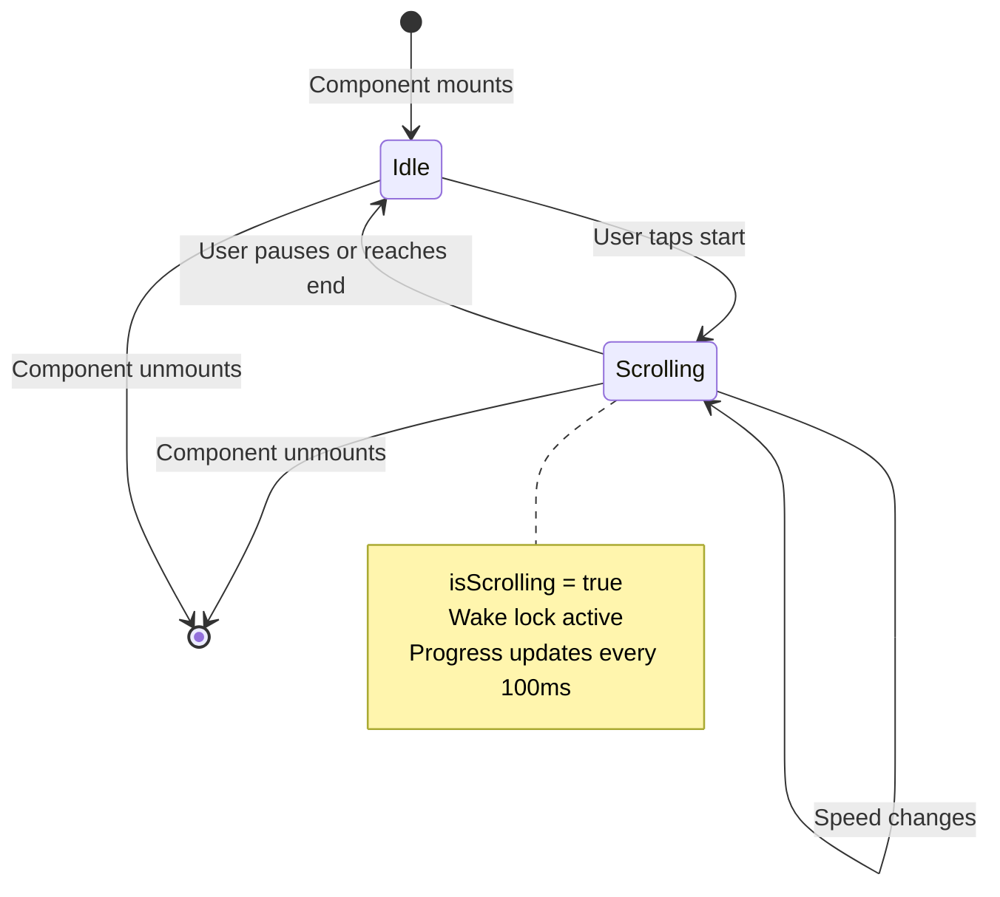
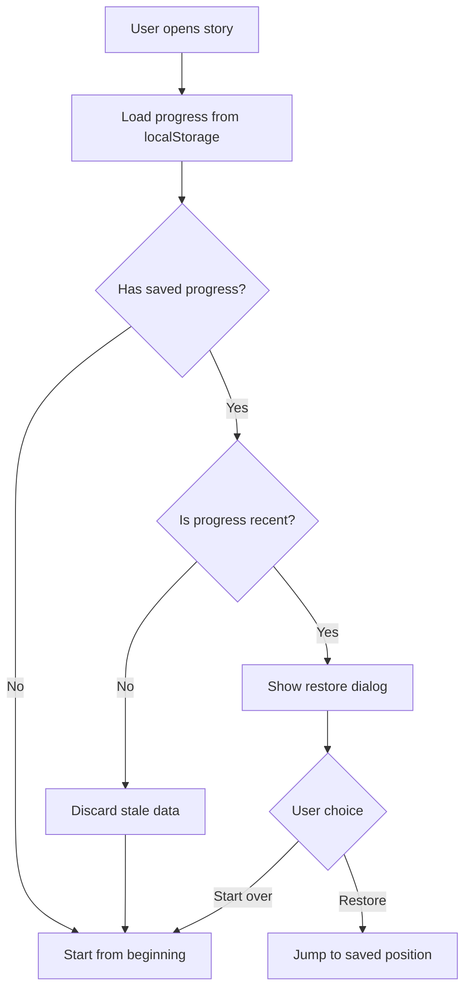

# API Contracts: Standalone Story with Teleprompter

**Feature**: 012-standalone-story
**Date**: 2026-01-05
**Status**: Final

## Overview

This document defines the contracts for the standalone story feature. Since this is a frontend-only feature with no backend API, contracts focus on:
1. JSON Schema for story data validation
2. Teleprompter runtime state contract
3. localStorage data contract

---

## 1. Story JSON Schema Contract

### Schema Version: 1.0

**Purpose**: Validate story data loaded from URL parameters before rendering.

**Implementation Note**: This schema should be converted to a JSON Schema file (`story-schema.json`) during implementation and used with a validation library like `ajv`.

### Root Object: StoryScript

```typescript
interface StoryScript {
  id: string;              // UUID v4 format
  title: string;           // Max 200 characters
  slides: Slide[];         // 1-50 slides
  autoAdvance: boolean;    // Default: true
  showProgress: boolean;   // Default: true
  createdAt?: number;      // Unix timestamp (optional)
  version: "1.0";          // Must be exactly "1.0"
}
```

**Validation Rules**:
- `id`: Must match UUID v4 pattern: `^[0-9a-f]{8}-[0-9a-f]{4}-[0-9a-f]{4}-[0-9a-f]{4}-[0-9a-f]{12}$`
- `title`: Min length 1, max length 200
- `slides`: Min 1 slide, max 50 slides
- `version`: Must equal "1.0"

### Slide Types

All slides share base properties:

```typescript
interface BaseSlide {
  id: string;              // UUID v4
  type: SlideType;         // Discriminator
  duration: number | 'manual';  // 1000-60000ms or 'manual'
  animation?: AnimationEffect;
  effects?: SlideEffects;
}
```

**Slide Types**:

1. **text-highlight**
```typescript
interface TextHighlightSlide extends BaseSlide {
  type: 'text-highlight';
  content: string;         // Main text content
  highlights: TextHighlight[];  // Max 20 highlights
}
```

2. **widget-chart**
```typescript
interface WidgetChartSlide extends BaseSlide {
  type: 'widget-chart';
  data: WidgetData;
}
```

3. **image**
```typescript
interface ImageSlide extends BaseSlide {
  type: 'image';
  content: string;         // Image URL (https:// or data:)
  alt?: string;           // Alt text, max 200 chars
}
```

4. **poll**
```typescript
interface PollSlide extends BaseSlide {
  type: 'poll';
  question: string;       // Max 200 chars
  options: PollOption[];  // 2-10 options
}
```

5. **teleprompter**
```typescript
interface TeleprompterSlide extends BaseSlide {
  type: 'teleprompter';
  content: string;         // Script text
  duration: 'manual';     // Always 'manual'
}
```

### Validation Summary Table

| Field | Type | Required | Constraints |
|-------|------|----------|-------------|
| `slides[].id` | string | ✅ | UUID v4 format |
| `slides[].type` | string | ✅ | Must be valid slide type |
| `slides[].duration` | number\|string | ✅ | 1000-60000ms or 'manual' |
| `slides[].content` | string | ✅ (text/image/teleprompter) | Min length 1 |
| `slides[].highlights` | array | ❌ | Max 20 items |
| `slides[].options` | array | ✅ (poll) | 2-10 items |
| `slides[].question` | string | ✅ (poll) | Max 200 chars |
| `slides[].alt` | string | ❌ (image) | Max 200 chars |

### Error Responses

When validation fails, the viewer must display an error screen:

```typescript
interface ValidationError {
  type: 'invalid-json' | 'malformed-data' | 'schema-violation';
  message: string;
  details?: {
    field?: string;
    constraint?: string;
    value?: unknown;
  }[];
}
```

**Error Messages**:
- `invalid-json`: "Invalid story data - please check the URL or contact the story creator"
- `malformed-data`: "Story data is malformed - unable to parse"
- `schema-violation`: "Story data violates schema requirements"

---

## 2. Teleprompter State Contract

### Runtime State Interface

```typescript
interface TeleprompterState {
  // Read-only state
  slideId: string;
  scrollPosition: number;      // Current pixel position
  scrollDepth: number;         // 0.0 - 1.0 percentage
  totalScrollHeight: number;   // Total scrollable pixels
  wpm: number;                 // Words per minute (speed × 150)

  // Mutable state
  scrollSpeed: number;         // 0.0 - 5.0
  fontSize: number;            // 16 - 48
  isScrolling: boolean;
  isMirrored: boolean;
}
```

### State Transitions



### Constraints

| Property | Min | Max | Default |
|----------|-----|-----|---------|
| `scrollSpeed` | 0.0 | 5.0 | 1.5 |
| `fontSize` | 16 | 48 | 28 |
| `scrollDepth` | 0.0 | 1.0 | 0.0 |
| `scrollPosition` | 0 | `totalScrollHeight` | 0 |

### Invariants

1. **Scroll Depth Invariant**: `scrollDepth` must always equal `scrollPosition / totalScrollHeight`
2. **Speed Invariant**: `wpm` must always equal `scrollSpeed × 150`
3. **Teleprompter Only**: State only applies when `slide.type === 'teleprompter'`
4. **Manual Duration**: Teleprompter slides must always have `duration === 'manual'`

---

## 3. localStorage Contract

### Storage Keys

| Key Pattern | Value Type | Purpose | TTL |
|-------------|------------|---------|-----|
| `story-progress-${slideId}` | `ReadingProgress` | Save scroll position | 30 days |

### ReadingProgress Interface

```typescript
interface ReadingProgress {
  slideId: string;       // Associated slide ID
  scrollRatio: number;   // 0.0 - 1.0
  timestamp: number;     // Unix timestamp
  storyId: string;       // Story identifier
}
```

### Save Contract

**When**: Every 2 seconds during active scrolling

**Operation**:
```typescript
try {
  const data: ReadingProgress = {
    slideId: currentSlide.id,
    scrollRatio: currentScrollDepth,
    timestamp: Date.now(),
    storyId: story.id
  };
  localStorage.setItem(`story-progress-${slideId}`, JSON.stringify(data));
} catch (error) {
  // Quota exceeded or private browsing mode
  console.warn('Failed to save progress:', error);
  // Continue without saving - functionality still works
}
```

**Error Handling**:
- **Quota Exceeded**: Log warning, continue without saving
- **Private Browsing**: Log warning, continue without saving
- **Invalid Data**: Log error, abort save attempt

### Load Contract

**When**: Component mounts (user opens story)

**Operation**:
```typescript
try {
  const key = `story-progress-${slideId}`;
  const data = localStorage.getItem(key);
  if (data) {
    const progress: ReadingProgress = JSON.parse(data);
    
    // Validate timestamp (within 30 days)
    const thirtyDaysMs = 30 * 24 * 60 * 60 * 1000;
    if (Date.now() - progress.timestamp > thirtyDaysMs) {
      // Stale data, discard
      localStorage.removeItem(key);
      return null;
    }
    
    return progress;
  }
  return null;
} catch (error) {
  console.warn('Failed to load progress:', error);
  return null;
}
```

**Validation Rules**:
1. `scrollRatio` must be between 0.0 and 1.0
2. `timestamp` must be within last 30 days
3. `slideId` must match current slide
4. Malformed JSON returns `null`

### Recovery Flow



---

## 4. URL Data Contract

### URL Format

```
/story/{encodedStoryData}
```

Where `encodedStoryData` is:
1. Story JSON stringified
2. Compressed with gzip
3. Base64 encoded (URL-safe)

### Encoding Process

```typescript
import { encode } from 'js-base64';
import pako from 'pako';

export const generateStoryUrl = (story: StoryScript): string => {
  // Step 1: Stringify
  const json = JSON.stringify(story);
  
  // Step 2: Compress
  const compressed = pako.gzip(json);
  
  // Step 3: Encode
  const encoded = encode(compressed);
  
  return `/story/${encoded}`;
};
```

### Decoding Process

```typescript
import { decode } from 'js-base64';
import pako from 'pako';

export const loadStoryFromUrl = (encoded: string): StoryScript => {
  try {
    // Step 1: Decode
    const compressed = decode(encoded);
    
    // Step 2: Decompress
    const json = pako.ungzip(compressed, { to: 'string' });
    
    // Step 3: Parse
    const story = JSON.parse(json);
    
    // Step 4: Validate
    return validateStorySchema(story);
  } catch (error) {
    throw new Error('Invalid story data');
  }
};
```

### URL Length Limits

| Browser | Max URL Length | Practical Limit |
|---------|----------------|-----------------|
| Chrome | 2MB | ~50KB JSON (compressed) |
| Firefox | Unlimited | ~50KB JSON (compressed) |
| Safari | 80KB | ~30KB JSON (compressed) |
| Edge | 2MB | ~50KB JSON (compressed) |

**Recommendation**: Document ~30KB limit for story data to ensure cross-browser compatibility.

---

## 5. Component Props Contracts

### StoryViewer Props

```typescript
interface StoryViewerProps {
  story: StoryScript;
  initialSlide?: number;     // Default: 0
  autoPlay?: boolean;        // Default: false
  onSlideChange?: (index: number) => void;
  onComplete?: () => void;
}
```

### TeleprompterSlide Props

```typescript
interface TeleprompterSlideProps {
  slide: TeleprompterSlide;
  slideIndex: number;
  totalSlides: number;
  onProgress: (ratio: number) => void;
  onComplete: () => void;
  initialProgress?: ReadingProgress;
}
```

### TeleprompterControls Props

```typescript
interface TeleprompterControlsProps {
  speed: number;
  fontSize: number;
  isScrolling: boolean;
  isMirrored: boolean;
  onSpeedChange: (speed: number) => void;
  onFontSizeChange: (size: number) => void;
  onTogglePlay: () => void;
  onToggleMirror: () => void;
  onNextSlide: () => void;
  wpm: number;
  isVisible: boolean;
}
```

### StoryProgressBar Props

```typescript
interface StoryProgressBarProps {
  slides: Slide[];
  currentIndex: number;
  progress: number[];  // Progress per slide (0.0 - 1.0)
  visible: boolean;
}
```

---

## 6. Hook Contracts

### useTeleprompterScroll Contract

```typescript
interface UseTeleprompterScrollReturn {
  // State
  scrollPosition: number;
  scrollDepth: number;
  isScrolling: boolean;
  
  // Actions
  startScrolling: () => void;
  stopScrolling: () => void;
  setScrollSpeed: (speed: number) => void;
  reset: () => void;
  
  // Computed
  wpm: number;
}

interface UseTeleprompterScrollParams {
  content: string;
  containerRef: RefObject<HTMLElement>;
  initialSpeed?: number;
  onProgress?: (ratio: number) => void;
}
```

**Behavior Contract**:
- `startScrolling()`: Begins auto-scroll, requests wake lock
- `stopScrolling()`: Pauses scrolling with deceleration, releases wake lock
- `setScrollSpeed(speed)`: Updates speed immediately (0.0 - 5.0)
- `reset()`: Returns to top of content (scrollDepth = 0)

### useWakeLock Contract

```typescript
interface UseWakeLockReturn {
  isLocked: boolean;
  error: WakeLockError | null;
  request: () => Promise<boolean>;
  release: () => void;
}

type WakeLockError = 
  | { type: 'not-supported' }
  | { type: 'cdn-failed' }
  | { type: 'permission-denied' }
  | { type: 'system-restriction' };
```

**Behavior Contract**:
- `request()`: Attempts wake lock, returns `true` if successful
- `release()`: Releases wake lock if active
- `error`: Set if wake lock unavailable or failed

### useProgressPersistence Contract

```typescript
interface UseProgressPersistenceReturn {
  saveProgress: (ratio: number) => void;
  loadProgress: () => ReadingProgress | null;
  clearProgress: () => void;
  hasProgress: boolean;
}
```

**Behavior Contract**:
- `saveProgress(ratio)`: Saves to localStorage every 2 seconds
- `loadProgress()`: Returns saved progress or `null`
- `clearProgress()`: Removes saved progress from localStorage
- `hasProgress`: Indicates if progress exists for current slide

---

## 7. Event Contracts

### Story Navigation Events

```typescript
interface NavigationEvent {
  type: 'next' | 'previous' | 'jump';
  fromIndex: number;
  toIndex: number;
  timestamp: number;
}
```

### Progress Update Events

```typescript
interface ProgressUpdateEvent {
  slideId: string;
  scrollDepth: number;  // 0.0 - 1.0
  timestamp: number;
}
```

**Throttle Contract**: Progress events must be throttled to maximum once per 100ms.

### Teleprompter State Events

```typescript
interface TeleprompterStateEvent {
  type: 'scroll-start' | 'scroll-stop' | 'speed-change' | 'font-change';
  slideId: string;
  value: number | boolean;
  timestamp: number;
}
```

---

## 8. Error Contract

### Error Types

```typescript
type StoryError =
  | ValidationError
  | WakeLockError
  | StorageError
  | NetworkError;

interface ValidationError {
  type: 'validation';
  field: string;
  message: string;
}

interface WakeLockError {
  type: 'wake-lock';
  variant: 'not-supported' | 'cdn-failed' | 'permission-denied';
  message: string;
}

interface StorageError {
  type: 'storage';
  variant: 'quota-exceeded' | 'access-denied';
  message: string;
}

interface NetworkError {
  type: 'network';
  url: string;
  message: string;
}
```

### Error Handling Contract

All errors must be handled gracefully:
1. **Validation Errors**: Show error screen, block viewing
2. **Wake Lock Errors**: Show warning, block teleprompter mode
3. **Storage Errors**: Log warning, continue without saving
4. **Network Errors**: Show error screen, offer retry

---

## 9. Accessibility Contract

### ARIA Labels

```typescript
interface AriaLabels {
  storyViewer: string;
  slide: (index: number, total: number) => string;
  teleprompter: string;
  teleprompterControls: string;
  playButton: string;
  pauseButton: string;
  speedSlider: string;
  fontSizeControl: string;
  mirrorToggle: string;
  nextSlideButton: string;
}
```

### Keyboard Shortcuts

```typescript
interface KeyboardShortcut {
  key: string;
  action: string;
  description: string;
}

const shortcuts: KeyboardShortcut[] = [
  { key: 'Space', action: 'togglePlay', description: 'Toggle play/pause' },
  { key: 'ArrowUp', action: 'increaseSpeed', description: 'Increase scroll speed' },
  { key: 'ArrowDown', action: 'decreaseSpeed', description: 'Decrease scroll speed' },
  { key: 'r', action: 'reset', description: 'Reset to top' }
];
```

### Screen Reader Contracts

**Live Region**: Teleprompter content must have `aria-live="polite"` and `role="region"`.

**Announcements**:
- Scroll start: "Teleprompter started"
- Scroll stop: "Teleprompter paused"
- Speed change: "Speed changed to {speed}, {wpm} words per minute"
- Font size change: "Font size changed to {size} pixels"

---

## Implementation Checklist

During implementation, ensure:

- [ ] Convert JSON Schema contract to `story-schema.json` file
- [ ] Install and configure `ajv` for validation
- [ ] Implement URL encoding/decoding with `js-base64` and `pako`
- [ ] Create TypeScript interfaces matching contracts
- [ ] Implement localStorage save/load with error handling
- [ ] Add wake lock hook with NoSleep.js fallback
- [ ] Implement progress throttling (100ms max)
- [ ] Add ARIA labels to all interactive elements
- [ ] Test keyboard shortcuts on desktop browsers
- [ ] Validate URL length limits across browsers
- [ ] Test localStorage quota exceeded scenarios
- [ ] Implement error screens for all error types
- [ ] Add screen reader announcements

---

## References

- [JSON Schema Specification](https://json-schema.org/)
- [ajv Documentation](https://ajv.js.org/)
- [js-base64 Documentation](https://www.npmjs.com/package/js-base64)
- [pako Documentation](https://www.npmjs.com/package/pako)
- [WCAG 2.1 AA Guidelines](https://www.w3.org/WAI/WCAG21/quickref/)
