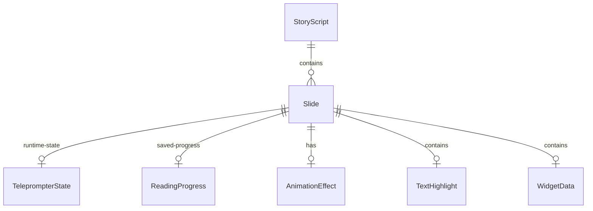
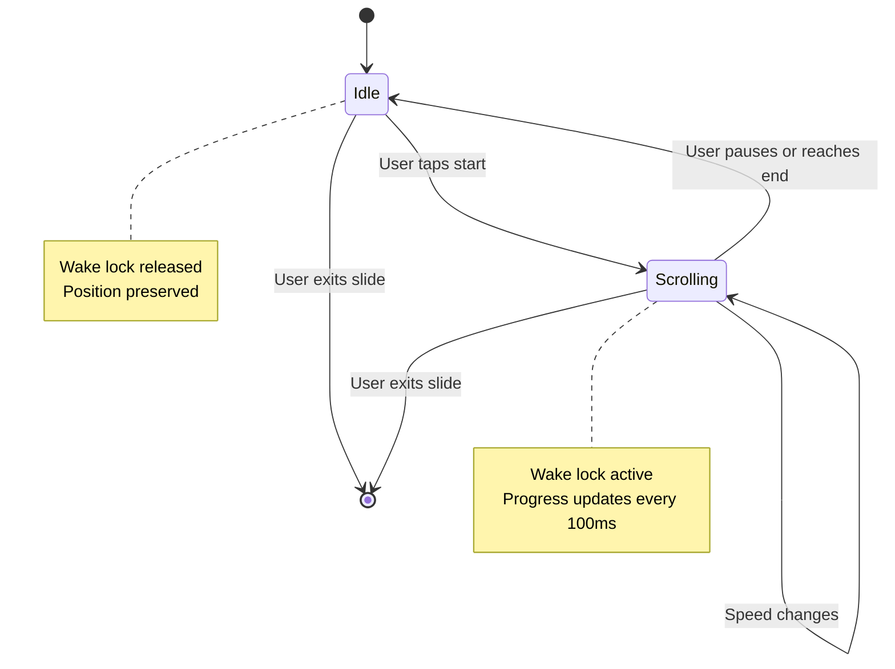
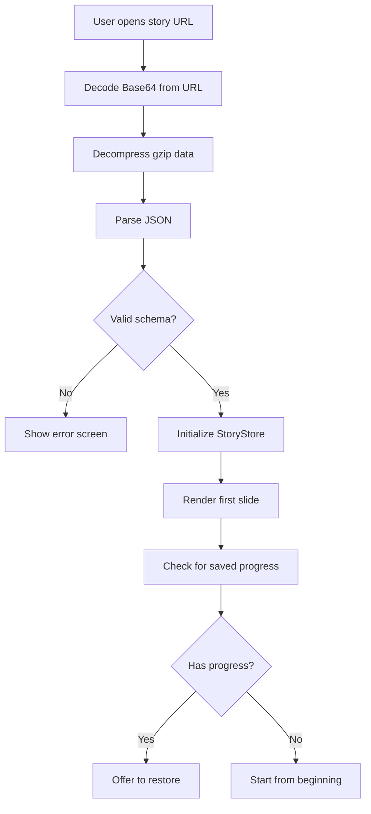
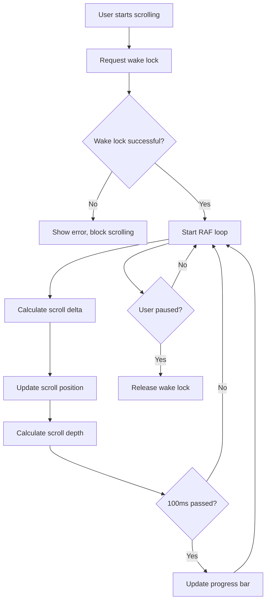

# Data Model: Standalone Story with Teleprompter

**Feature**: 012-standalone-story
**Date**: 2026-01-05
**Status**: Final

## Entity Relationship Overview



---

## Entities

### 1. StoryScript

Represents a complete story with multiple slides that users can view and navigate.

**Type Definition**:
```typescript
interface StoryScript {
  id: string;
  title: string;
  slides: Slide[];
  autoAdvance: boolean;
  showProgress: boolean;
  createdAt?: number;
  version: '1.0';
}
```

**Fields**:
| Field | Type | Required | Description | Validation |
|-------|------|----------|-------------|------------|
| `id` | `string` | ✅ Yes | Unique story identifier | UUID v4 format |
| `title` | `string` | ✅ Yes | Display title for the story | Max 200 characters |
| `slides` | `Slide[]` | ✅ Yes | Array of slides in sequence | Min 1 slide, max 50 slides |
| `autoAdvance` | `boolean` | ✅ Yes | Whether slides auto-advance after duration | Default: true |
| `showProgress` | `boolean` | ✅ Yes | Whether to show progress bars at top | Default: true |
| `createdAt` | `number` | ❌ No | Unix timestamp when story was created | Optional, for metadata only |
| `version` | `string` | ✅ Yes | Story schema version | Must be "1.0" |

**Relationships**:
- **Has Many**: `Slide[]` - Contains 1-50 slides in sequence

**State Transitions**: None (immutable once loaded)

**Example**:
```json
{
  "id": "550e8400-e29b-41d4-a716-446655440000",
  "title": "Product Launch Script",
  "slides": [/* ... */],
  "autoAdvance": true,
  "showProgress": true,
  "createdAt": 1704451200000,
  "version": "1.0"
}
```

---

### 2. Slide

Represents a single piece of content in the story. Different slide types have different content structures.

**Type Definition**:
```typescript
type SlideType = 'text-highlight' | 'widget-chart' | 'image' | 'poll' | 'teleprompter';

type SlideDuration = number | 'manual';

interface Slide {
  id: string;
  type: SlideType;
  duration: SlideDuration;
  animation?: AnimationEffect;
  effects?: SlideEffects;
}

// Type-specific content structures
interface TextHighlightSlide extends Slide {
  type: 'text-highlight';
  content: string;
  highlights: TextHighlight[];
}

interface WidgetChartSlide extends Slide {
  type: 'widget-chart';
  data: WidgetData;
}

interface ImageSlide extends Slide {
  type: 'image';
  content: string; // Image URL
  alt?: string;
}

interface PollSlide extends Slide {
  type: 'poll';
  question: string;
  options: PollOption[];
}

interface TeleprompterSlide extends Slide {
  type: 'teleprompter';
  content: string;
  duration: 'manual'; // Always manual for teleprompter
}
```

**Base Fields**:
| Field | Type | Required | Description | Validation |
|-------|------|----------|-------------|------------|
| `id` | `string` | ✅ Yes | Unique slide identifier | UUID v4 format |
| `type` | `SlideType` | ✅ Yes | Slide type discriminator | Must be valid type |
| `duration` | `SlideDuration` | ✅ Yes | Duration in ms or 'manual' | Min 1000ms, max 60000ms if number |
| `animation` | `AnimationEffect` | ❌ No | Slide transition effect | Optional |
| `effects` | `SlideEffects` | ❌ No | Visual effects (glow, shadow) | Optional |

**Type-Specific Fields**:

**TextHighlightSlide**:
| Field | Type | Required | Description |
|-------|------|----------|-------------|
| `content` | `string` | ✅ Yes | Main text content |
| `highlights` | `TextHighlight[]` | ❌ No | Highlighted text ranges |

**WidgetChartSlide**:
| Field | Type | Required | Description |
|-------|------|----------|-------------|
| `data` | `WidgetData` | ✅ Yes | Chart widget configuration |

**ImageSlide**:
| Field | Type | Required | Description |
|-------|------|----------|-------------|
| `content` | `string` | ✅ Yes | Image URL (https:// or data:) |
| `alt` | `string` | ❌ No | Alt text for accessibility |

**PollSlide**:
| Field | Type | Required | Description |
|-------|------|----------|-------------|
| `question` | `string` | ✅ Yes | Poll question text |
| `options` | `PollOption[]` | ✅ Yes | Poll options (2-10) |

**TeleprompterSlide**:
| Field | Type | Required | Description |
|-------|------|----------|-------------|
| `content` | `string` | ✅ Yes | Teleprompter script text |
| `duration` | `'manual'` | ✅ Yes | Always 'manual' for teleprompter |

**Relationships**:
- **Belongs To**: `StoryScript` - One story contains multiple slides
- **Has One**: `TeleprompterState` - Runtime state for teleprompter slides only
- **Has Many**: `ReadingProgress` - Multiple saved progress entries per slide

**State Transitions**: None (immutable once loaded)

**Example**:
```json
{
  "id": "slide-001",
  "type": "teleprompter",
  "content": "Welcome to our product launch. Today we're announcing...",
  "duration": "manual",
  "animation": {
    "type": "slide-in",
    "direction": "left",
    "duration": 300
  }
}
```

---

### 3. TeleprompterState

Represents the runtime state of an active teleprompter slide. This state is ephemeral and not persisted.

**Type Definition**:
```typescript
interface TeleprompterState {
  slideId: string;
  scrollSpeed: number;
  fontSize: number;
  isScrolling: boolean;
  isMirrored: boolean;
  scrollPosition: number;
  scrollDepth: number;
  totalScrollHeight: number;
  wpm: number;
}
```

**Fields**:
| Field | Type | Required | Description | Range/Constraints |
|-------|------|----------|-------------|-------------------|
| `slideId` | `string` | ✅ Yes | Associated slide ID | Must match active slide |
| `scrollSpeed` | `number` | ✅ Yes | Scrolling speed multiplier | 0.0 - 5.0, step 0.1 |
| `fontSize` | `number` | ✅ Yes | Current font size in pixels | 16 - 48, default 28 |
| `isScrolling` | `boolean` | ✅ Yes | Whether auto-scroll is active | true/false |
| `isMirrored` | `boolean` | ✅ Yes | Whether mirror mode is enabled | true/false |
| `scrollPosition` | `number` | ✅ Yes | Current scroll position in pixels | 0 - totalScrollHeight |
| `scrollDepth` | `number` | ✅ Yes | Scroll depth percentage | 0.0 - 1.0 |
| `totalScrollHeight` | `number` | ✅ Yes | Total scrollable height in pixels | Calculated from content |
| `wpm` | `number` | ✅ Yes | Words per minute display | Calculated: speed × 150 |

**State Transitions**:


**Relationships**:
- **Belongs To**: `Slide` - One-to-one with active teleprompter slide

**Example**:
```typescript
{
  slideId: "slide-001",
  scrollSpeed: 2.5,
  fontSize: 32,
  isScrolling: true,
  isMirrored: false,
  scrollPosition: 450,
  scrollDepth: 0.35,
  totalScrollHeight: 2500,
  wpm: 375
}
```

---

### 4. ReadingProgress

Represents saved user progress through a teleprompter script. Stored in localStorage for recovery after browser closure.

**Type Definition**:
```typescript
interface ReadingProgress {
  slideId: string;
  scrollRatio: number;
  timestamp: number;
  storyId: string;
}
```

**Fields**:
| Field | Type | Required | Description | Validation |
|-------|------|----------|-------------|------------|
| `slideId` | `string` | ✅ Yes | Slide identifier for progress | Must be valid slide ID |
| `scrollRatio` | `number` | ✅ Yes | Scroll position ratio | 0.0 - 1.0 |
| `timestamp` | `number` | ✅ Yes | Unix timestamp of save | Used for staleness check |
| `storyId` | `string` | ✅ Yes | Story identifier | For grouping progress by story |

**Validation Rules**:
- `scrollRatio` must be between 0.0 and 1.0 inclusive
- `timestamp` must be within last 30 days to be considered valid
- Progress saved every 2 seconds during active scrolling
- Only one progress entry per slide ID (overwrites previous)

**State Transitions**: None (immutable once saved, new entries overwrite)

**Relationships**:
- **Belongs To**: `Slide` - Links to one slide for restoration

**Storage Format** (localStorage):
```json
// Key: `story-progress-${slideId}`
{
  "slideId": "slide-001",
  "scrollRatio": 0.65,
  "timestamp": 1704451200000,
  "storyId": "story-abc123"
}
```

---

### 5. AnimationEffect

Defines slide transition animations.

**Type Definition**:
```typescript
type AnimationType = 'slide-in' | 'fade' | 'zoom';
type AnimationDirection = 'left' | 'right' | 'up' | 'down';

interface AnimationEffect {
  type: AnimationType;
  direction?: AnimationDirection;
  duration: number;
  easing?: string;
}
```

**Fields**:
| Field | Type | Required | Description | Default |
|-------|------|----------|-------------|---------|
| `type` | `AnimationType` | ✅ Yes | Animation type | Required |
| `direction` | `AnimationDirection` | ❌ No | Direction for slide-in | 'left' |
| `duration` | `number` | ✅ Yes | Animation duration in ms | 300ms |
| `easing` | `string` | ❌ No | CSS easing function | 'ease-out' |

**Constraints**:
- `duration`: Min 100ms, max 1000ms
- `direction` only applies to `slide-in` type

**Example**:
```json
{
  "type": "slide-in",
  "direction": "left",
  "duration": 300,
  "easing": "ease-out"
}
```

---

### 6. TextHighlight

Defines highlighted text ranges for text-highlight slides.

**Type Definition**:
```typescript
interface TextHighlight {
  startIndex: number;
  endIndex: number;
  color: string;
  fontWeight?: 'normal' | 'bold';
}
```

**Fields**:
| Field | Type | Required | Description | Validation |
|-------|------|----------|-------------|------------|
| `startIndex` | `number` | ✅ Yes | Start index in content string | Must be >= 0 |
| `endIndex` | `number` | ✅ Yes | End index in content string | Must be > startIndex |
| `color` | `string` | ✅ Yes | Highlight color | Hex or named color |
| `fontWeight` | `'normal' \| 'bold'` | ❌ No | Font weight | Default: 'normal' |

**Validation**:
- `startIndex` and `endIndex` must be within content length
- Ranges cannot overlap with other highlights
- Max 20 highlights per slide

**Example**:
```json
{
  "startIndex": 10,
  "endIndex": 25,
  "color": "#FFD700",
  "fontWeight": "bold"
}
```

---

### 7. WidgetData

Defines chart widget data for widget-chart slides.

**Type Definition**:
```typescript
type WidgetChartType = 'bar' | 'line' | 'pie' | 'doughnut';

interface WidgetData {
  type: WidgetChartType;
  title?: string;
  labels: string[];
  values: number[];
  colors?: string[];
}
```

**Fields**:
| Field | Type | Required | Description | Validation |
|-------|------|----------|-------------|------------|
| `type` | `WidgetChartType` | ✅ Yes | Chart type | Must be valid type |
| `title` | `string` | ❌ No | Chart title | Max 100 chars |
| `labels` | `string[]` | ✅ Yes | Data labels | 2-20 items |
| `values` | `number[]` | ✅ Yes | Data values | Same length as labels |
| `colors` | `string[]` | ❌ No | Bar/segment colors | Hex colors, optional |

**Validation**:
- `labels` and `values` must have same length
- Min 2 items, max 20 items
- All `values` must be non-negative numbers

**Example**:
```json
{
  "type": "bar",
  "title": "Q4 Sales",
  "labels": ["Jan", "Feb", "Mar", "Apr"],
  "values": [120, 150, 180, 200],
  "colors": ["#FF6384", "#36A2EB", "#FFCE56", "#4BC0C0"]
}
```

---

### 8. PollOption

Defines poll options for poll slides.

**Type Definition**:
```typescript
interface PollOption {
  id: string;
  text: string;
  votes?: number;
}
```

**Fields**:
| Field | Type | Required | Description | Validation |
|-------|------|----------|-------------|------------|
| `id` | `string` | ✅ Yes | Option identifier | Unique within poll |
| `text` | `string` | ✅ Yes | Option text | Max 100 chars |
| `votes` | `number` | ❌ No | Vote count (for results) | Non-negative integer |

**Validation**:
- Min 2 options, max 10 options per poll
- `text` cannot be empty

**Example**:
```json
{
  "id": "opt-1",
  "text": "Yes, I agree",
  "votes": 42
}
```

---

### 9. SlideEffects

Defines visual effects applied to slides.

**Type Definition**:
```typescript
interface SlideEffects {
  glow?: GlowEffect;
  shadow?: ShadowEffect;
  backdrop?: BackdropEffect;
}

interface GlowEffect {
  color: string;
  intensity: number;
  blur: number;
}

interface ShadowEffect {
  color: string;
  offsetX: number;
  offsetY: number;
  blur: number;
}

interface BackdropEffect {
  type: 'blur' | 'gradient' | 'solid';
  value: string;
  opacity: number;
}
```

**GlowEffect Fields**:
| Field | Type | Required | Description | Range |
|-------|------|----------|-------------|-------|
| `color` | `string` | ✅ Yes | Glow color | Hex format |
| `intensity` | `number` | ✅ Yes | Opacity/intensity | 0.0 - 1.0 |
| `blur` | `number` | ✅ Yes | Blur radius in px | 0 - 50 |

**ShadowEffect Fields**:
| Field | Type | Required | Description | Range |
|-------|------|----------|-------------|-------|
| `color` | `string` | ✅ Yes | Shadow color | Hex format |
| `offsetX` | `number` | ✅ Yes | X offset in px | -50 to 50 |
| `offsetY` | `number` | ✅ Yes | Y offset in px | -50 to 50 |
| `blur` | `number` | ✅ Yes | Blur radius in px | 0 - 50 |

**BackdropEffect Fields**:
| Field | Type | Required | Description | Range |
|-------|------|----------|-------------|-------|
| `type` | `string` | ✅ Yes | Effect type | 'blur', 'gradient', 'solid' |
| `value` | `string` | ✅ Yes | Effect value | px for blur, color for others |
| `opacity` | `number` | ✅ Yes | Opacity | 0.0 - 1.0 |

**Example**:
```json
{
  "glow": {
    "color": "#FFD700",
    "intensity": 0.8,
    "blur": 20
  },
  "shadow": {
    "color": "#000000",
    "offsetX": 0,
    "offsetY": 10,
    "blur": 30
  }
}
```

---

## State Management

### Zustand Store Structure

**Story Store** (`lib/stores/useStoryStore.ts`):
```typescript
interface StoryState {
  // Navigation state
  currentSlideIndex: number;
  direction: number; // 1 for forward, -1 for backward
  isPaused: boolean;

  // Actions
  nextSlide: () => void;
  previousSlide: () => void;
  goToSlide: (index: number) => void;
  togglePause: () => void;
  reset: () => void;
}
```

**Teleprompter Store** (`lib/stores/useTeleprompterStore.ts`):
```typescript
interface TeleprompterState {
  // Scroll state
  scrollSpeed: number;
  fontSize: number;
  isScrolling: boolean;
  isMirrored: boolean;
  scrollPosition: number;
  scrollDepth: number;

  // Actions
  setScrollSpeed: (speed: number) => void;
  setFontSize: (size: number) => void;
  startScrolling: () => void;
  stopScrolling: () => void;
  toggleMirror: () => void;
  updateScrollPosition: (position: number, depth: number) => void;
  reset: () => void;
}
```

---

## Data Flow Diagrams

### Story Loading Flow



### Teleprompter Scroll Flow



---

## Validation Rules Summary

### StoryScript
- ✅ Min 1 slide, max 50 slides
- ✅ Title max 200 characters
- ✅ Version must be "1.0"

### Slide
- ✅ Duration min 1000ms, max 60000ms (if number)
- ✅ Teleprompter slides must have duration = "manual"
- ✅ Poll slides must have 2-10 options
- ✅ Text highlights max 20 per slide

### TeleprompterState
- ✅ Scroll speed 0.0 - 5.0
- ✅ Font size 16 - 48px
- ✅ Scroll depth 0.0 - 1.0

### ReadingProgress
- ✅ Scroll ratio 0.0 - 1.0
- ✅ Timestamp within last 30 days
- ✅ One entry per slide ID

---

## TypeScript Type Exports

```typescript
// lib/story/types.ts
export type {
  StoryScript,
  Slide,
  SlideType,
  SlideDuration,
  TextHighlightSlide,
  WidgetChartSlide,
  ImageSlide,
  PollSlide,
  TeleprompterSlide,
  TeleprompterState,
  ReadingProgress,
  AnimationEffect,
  AnimationType,
  AnimationDirection,
  TextHighlight,
  WidgetData,
  WidgetChartType,
  PollOption,
  SlideEffects,
  GlowEffect,
  ShadowEffect,
  BackdropEffect
};
```

---

## Database Schema

**Note**: This feature uses localStorage only, no database. The schema below represents the localStorage key structure.

### localStorage Keys

| Key Pattern | Value Type | Example |
|-------------|------------|---------|
| `story-progress-${slideId}` | `ReadingProgress` (JSON) | `story-progress-slide-001` |
| `story-settings` | `StorySettings` (JSON) | User preferences (optional) |

### StorySettings (Optional Future Enhancement)

```typescript
interface StorySettings {
  defaultSpeed: number;
  defaultFontSize: number;
  autoHideControls: boolean;
  highContrastMode: boolean;
}
```

---

## Migration Notes

**No migrations required** - This is a new feature with no existing data to migrate.

localStorage keys use the `story-` prefix to avoid conflicts with existing application data (e.g., `config-`, `draft-`, `playback-`).
