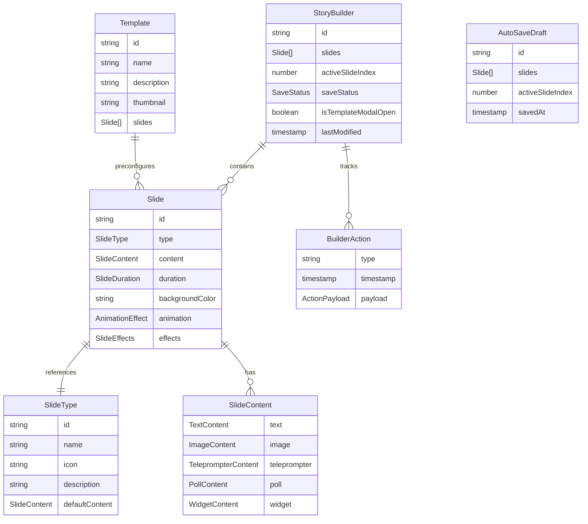

# Data Model: Visual Drag-and-Drop Story Builder

**Feature**: 013-visual-story-builder
**Branch**: `013-visual-story-builder`
**Date**: 2026-01-06
**Related**: [spec.md](./spec.md), [plan.md](./plan.md)

---

## Overview

This document defines the data entities and their relationships for the Visual Story Builder feature. The builder extends the existing StoryScript type system from [`lib/story/types.ts`](../../lib/story/types.ts) with builder-specific state and UI management.

## Entity Relationships



---

## Core Entities

### StoryBuilder

The main state container for the story builder interface.

```typescript
interface StoryBuilder {
  id: string;                      // Unique builder instance ID
  slides: AnySlide[];              // Ordered array of slides (max 20)
  activeSlideIndex: number;        // Currently selected slide (0-based)
  saveStatus: SaveStatus;          // Auto-save state
  isTemplateModalOpen: boolean;    // Template gallery visibility
  lastModified: number;            // Unix timestamp (ms)
  
  // Derived state
  slideCount: number;              // slides.length (readonly)
  hasUnsavedChanges: boolean;      // saveStatus !== 'saved'
  canAddSlide: boolean;            // slideCount < 20
  canRemoveSlide: boolean;         // slideCount > 0
}
```

**Derived State Rules**:
- `slideCount = slides.length`
- `hasUnsavedChanges = saveStatus !== 'saved'`
- `canAddSlide = slideCount < 20`
- `canRemoveSlide = slideCount > 0`

**Constraints**:
- `slides.length <= 20` (URL length limit)
- `activeSlideIndex >= 0 && activeSlideIndex < slides.length`
- `activeSlideIndex = 0` when `slides.length > 0`

---

### SaveStatus

Enum representing auto-save state.

```typescript
type SaveStatus = 
  | 'saved'      // Successfully saved to localStorage
  | 'saving'     // Save in progress
  | 'unsaved'    // Changes pending save
  | 'error';     // Save failed (localStorage disabled/full)
```

**State Transitions**:
```
unsaved → saving → saved
unsaved → saving → error
error → saving → saved
```

---

## Slide Entities

### Slide (Extended from StoryScript)

Extends [`AnySlide`](../../lib/story/types.ts) from the standalone story feature.

```typescript
interface BuilderSlide extends AnySlide {
  id: string;                      // Unique slide ID (UUID v4)
  type: SlideType;                 // Slide type discriminator
  duration: SlideDuration;         // 1-60 seconds or 'manual'
  backgroundColor: string;          // Hex color (e.g., '#FFFFFF')
  
  // Optional UI properties
  thumbnail?: string;              // Generated thumbnail URL
  isDragging?: boolean;            // Drag state (transient)
  isSelected?: boolean;            // Selection state (transient)
}
```

**Builder-Specific Slide Types**:

```typescript
// Maps to existing types from lib/story/types.ts
type BuilderSlideType = 
  | 'text-highlight'    // Text slide with highlights
  | 'image'            // Image from URL
  | 'teleprompter'     // Scrolling text
  | 'poll'            // Interactive poll
  | 'widget-chart';    // Chart widget
```

**Color Format**:
- Hex string: `#[0-9A-Fa-f]{6}`
- Examples: `#FFFFFF`, `#000000`, `#8B5CF6`
- Validated before storage

---

### SlideType (Slide Definition)

Metadata for available slide types in the library.

```typescript
interface SlideTypeDefinition {
  id: BuilderSlideType;            // Type identifier
  name: string;                    // Display name (e.g., "Text Slide")
  icon: string;                    // Lucide icon name (e.g., "Type")
  description: string;             // Short description
  defaultContent: SlideContent;    // Default content for new slides
  defaultDuration: SlideDuration;  // Default duration (e.g., 5)
  defaultBackgroundColor: string;  // Default color (e.g., "#FFFFFF")
  
  // UI hints
  category?: SlideCategory;        // For grouping in library
  requiresMedia?: boolean;         // Needs external media
}
```

**Slide Category**:
```typescript
type SlideCategory = 'content' | 'media' | 'interactive';
```

**Predefined Slide Types**:

| ID | Name | Icon | Category | Default Duration |
|----|------|------|----------|------------------|
| `text-highlight` | Text Slide | `Type` | content | 5 |
| `image` | Image Slide | `Image` | media | 5 |
| `teleprompter` | Teleprompter | `AlignLeft` | content | manual |
| `poll` | Poll | `BarChart2` | interactive | 10 |
| `widget-chart` | Chart Widget | `Box` | interactive | 5 |

---

## Slide Content Types

### TextContent

```typescript
interface TextContent {
  type: 'text-highlight';
  content: string;                 // Plain text content
  highlights: TextHighlight[];     // Formatted ranges
  
  // Builder-specific
  textColor?: string;              // Hex color for text
  fontSize?: number;               // Pixel size (16-72)
  fontWeight?: 'normal' | 'bold';  // Font weight
  fontStyle?: 'normal' | 'italic'; // Font style
}
```

**TextHighlight** (from existing types):
```typescript
interface TextHighlight {
  startIndex: number;              // 0-based character index
  endIndex: number;                // Exclusive end index
  color: string;                   // Hex color
  fontWeight?: 'normal' | 'bold';
}
```

**Constraints**:
- `content.length <= 500` characters
- `startIndex >= 0 && endIndex <= content.length`
- `startIndex < endIndex`
- `fontSize >= 16 && fontSize <= 72`

---

### ImageContent

```typescript
interface ImageContent {
  type: 'image';
  content: string;                 // Image URL (https://...)
  alt?: string;                    // Alt text for accessibility
  
  // Validation state (transient)
  isValid?: boolean;               // URL loads successfully
  error?: string;                  // Error message if invalid
}
```

**Constraints**:
- `content` must be valid URL (https:// or http://)
- Image file size < 5MB (validated server-side or via HEAD request)
- `alt.length <= 200` if provided

---

### TeleprompterContent

```typescript
interface TeleprompterContent {
  type: 'teleprompter';
  content: string;                 // Text to scroll
  duration: 'manual';              // Always manual
  
  // Builder-specific
  focalPoint: number;              // Vertical position (0-100%)
  fontSize?: number;               // Pixel size (16-48)
}
```

**Constraints**:
- `content.length <= 1000` characters
- `focalPoint >= 0 && focalPoint <= 100`
- `fontSize >= 16 && fontSize <= 48`

**Focal Point Meaning**:
- `0` = Text aligned to top
- `50` = Text centered vertically
- `100` = Text aligned to bottom

---

### PollContent

```typescript
interface PollContent {
  type: 'poll';
  question: string;                // Poll question
  options: PollOption[];           // Answer options
}
```

**PollOption** (from existing types):
```typescript
interface PollOption {
  id: string;                      // Unique option ID
  text: string;                    // Option text
  votes?: number;                  // Vote count (for display)
}
```

**Constraints**:
- `question.length <= 200` characters
- `options.length >= 2 && options.length <= 4`
- `text.length <= 100` for each option

---

### WidgetContent

```typescript
interface WidgetContent {
  type: 'widget-chart';
  data: WidgetData;                // Chart configuration
}
```

**WidgetData** (from existing types):
```typescript
interface WidgetData {
  type: WidgetChartType;           // 'bar' | 'line' | 'pie' | 'doughnut'
  title?: string;                  // Chart title
  labels: string[];                // X-axis labels or slice names
  values: number[];                // Data values
  colors?: string[];               // Custom colors (hex)
}
```

**Constraints**:
- `title.length <= 100` if provided
- `labels.length === values.length`
- `labels.length >= 2 && labels.length <= 10`
- Each label <= 50 characters
- `colors.length === labels.length` if provided

---

## Template System

### Template

Pre-built story configurations for quick starts.

```typescript
interface Template {
  id: string;                      // Unique template ID
  name: string;                    // Display name
  description: string;             // Short description
  thumbnail: string;               // Thumbnail image path
  slides: Omit<BuilderSlide, 'id'>[]; // Pre-configured slides
  
  // Metadata
  category?: TemplateCategory;     // For grouping
  difficulty?: 'beginner' | 'intermediate' | 'advanced';
  estimatedTime?: number;          // Minutes to customize
}
```

**Template Category**:
```typescript
type TemplateCategory = 'business' | 'education' | 'social';
```

**Predefined Templates**:

1. **Product Announcement**
   - ID: `product-announcement`
   - Slides: 4 (Intro, Features, Demo, CTA)
   - Category: business
   - Difficulty: beginner

2. **Tutorial**
   - ID: `tutorial`
   - Slides: 5 (Title, Step 1, Step 2, Step 3, Summary)
   - Category: education
   - Difficulty: intermediate

3. **Q&A**
   - ID: `qa`
   - Slides: 3 (Question, Answer, Follow-up)
   - Category: social
   - Difficulty: beginner

---

## Auto-Save Entities

### AutoSaveDraft

Stored in localStorage for persistence.

```typescript
interface AutoSaveDraft {
  id: string;                      // 'story-builder-draft'
  slides: AnySlide[];              // Current slide array
  activeSlideIndex: number;        // Active slide position
  savedAt: number;                 // Unix timestamp (ms)
  version: string;                 // Draft format version
}
```

**Storage Key**:
```typescript
const DRAFT_STORAGE_KEY = 'story-builder-draft';
```

**Draft Lifecycle**:
```
Load → Modify → Auto-save (30s) → Save Complete
                              ↓
                         Error → Show Warning
```

---

## UI State Entities

### DragState

Transient state for drag-and-drop operations.

```typescript
interface DragState {
  isDragging: boolean;             // Active drag operation
  draggedSlideId?: string;         // ID of slide being dragged
  draggedSlideType?: SlideTypeDefinition; // Type from library
  dropTargetIndex?: number;        // Target position in rail
  dragPosition?: { x: number; y: number }; // Current cursor position
}
```

**Drag Sources**:
1. From library: `draggedSlideType` is set
2. From rail: `draggedSlideId` is set

---

### PreviewState

State for the preview iframe.

```typescript
interface PreviewState {
  isLoading: boolean;              // Preview loading
  currentSlideIndex: number;       // Previewed slide
  isFullscreen: boolean;           // Fullscreen mode
  syncStatus: 'synced' | 'pending' | 'error';
}
```

---

## Action Types

### BuilderAction

Union type for all builder actions (for undo/redo).

```typescript
type BuilderAction =
  | AddSlideAction
  | RemoveSlideAction
  | ReorderSlidesAction
  | UpdateSlideAction
  | LoadTemplateAction
  | ClearStoryAction;
```

**Action Shapes**:

```typescript
interface AddSlideAction {
  type: 'addSlide';
  payload: {
    slideType: BuilderSlideType;
    position: number;
  };
}

interface RemoveSlideAction {
  type: 'removeSlide';
  payload: {
    index: number;
  };
}

interface ReorderSlidesAction {
  type: 'reorderSlides';
  payload: {
    fromIndex: number;
    toIndex: number;
  };
}

interface UpdateSlideAction {
  type: 'updateSlide';
  payload: {
    index: number;
    updates: Partial<BuilderSlide>;
  };
}

interface LoadTemplateAction {
  type: 'loadTemplate';
  payload: {
    templateId: string;
  };
}

interface ClearStoryAction {
  type: 'clearStory';
  payload: {};
}
```

---

## Validation Rules

### Story-Level Validation

```typescript
interface StoryValidationRule {
  validate: (story: StoryBuilder) => ValidationResult;
  errorMessage: string;
}

const storyRules: StoryValidationRule[] = [
  {
    validate: (s) => ({ valid: s.slides.length <= 20 }),
    errorMessage: 'Story cannot exceed 20 slides'
  },
  {
    validate: (s) => ({ valid: s.activeSlideIndex >= 0 && s.activeSlideIndex < s.slides.length }),
    errorMessage: 'Active slide index out of bounds'
  },
  {
    validate: (s) => ({ valid: s.slides.every(s => isValidSlide(s)) }),
    errorMessage: 'One or more slides are invalid'
  }
];
```

### Slide-Level Validation

Each slide type has specific validation rules (see constraints above).

---

## Type Guards

```typescript
function isBuilderSlide(data: unknown): data is BuilderSlide {
  return (
    typeof data === 'object' &&
    data !== null &&
    'id' in data &&
    'type' in data &&
    'duration' in data &&
    'backgroundColor' in data
  );
}

function isSlideTypeDefinition(data: unknown): data is SlideTypeDefinition {
  return (
    typeof data === 'object' &&
    data !== null &&
    'id' in data &&
    'name' in data &&
    'icon' in data &&
    'description' in data &&
    'defaultContent' in data
  );
}
```

---

## Storage Schema

### localStorage Structure

```typescript
interface LocalStorageSchema {
  'story-builder-draft': AutoSaveDraft;
  // Future: 'story-builder-preferences', 'story-builder-recent'
}
```

### Session Storage (Optional)

```typescript
interface SessionStorageSchema {
  'story-builder-undo-stack': BuilderAction[];
  'story-builder-redo-stack': BuilderAction[];
}
```

---

## Migrations

### Version 1.0 → Future

No migrations planned for initial release. Future versions may need:

- Add new slide types
- Extend slide content structures
- Add builder preferences

---

## Related Files

- **Types**: [`lib/story/types.ts`](../../lib/story/types.ts) - Base StoryScript types
- **Validation**: [`lib/story/validation.ts`](../../lib/story/validation.ts) - JSON schema validation
- **URL Encoding**: [`lib/story/utils/urlEncoder.ts`](../../lib/story/utils/urlEncoder.ts) - Story URL generation
- **Store**: `lib/story-builder/store.ts` - Zustand store implementation

---

**End of Data Model**
