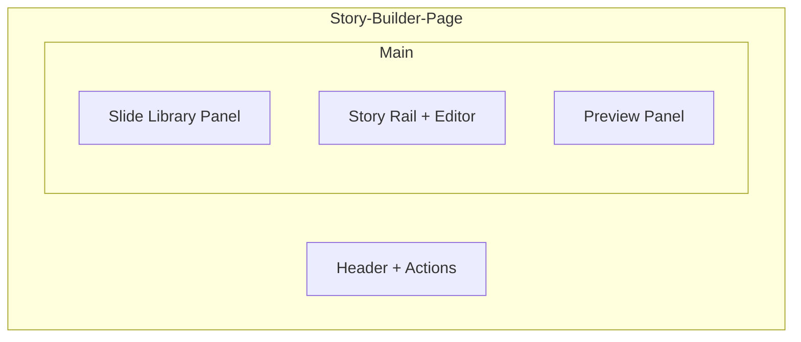

# Design Specification: Visual Drag-and-Drop Story Builder

**Feature**: 013-visual-story-builder
**Global Design System**: .zo/design-system.md v1.0.0
**Created**: 2026-01-06

---

## Overview

This document specifies feature-specific UI/UX design for the Visual Story Builder. The feature leverages the global design system (v1.0.0) with Instagram-inspired visual editing patterns and professional SaaS dashboard organization.

**Design Philosophy**: Creative joy meets structured productivity. Users should feel like they're arranging Instagram stories while having the precision of a design tool.

---

## Layout Architecture

### Page Structure



### Responsive Breakpoints

**Desktop (≥1024px)**
- Three-column layout: Library (280px) | Editor (flex) | Preview (320px)
- Story rail: Horizontal scroll above editor
- Slide library: Collapsible left sidebar

**Tablet (768px - 1023px)**
- Two-column layout: Editor (flex) | Preview (280px)
- Slide library: Bottom sheet (triggered by "Add Slide" button)
- Story rail: Horizontal scroll above editor

**Mobile (<768px)**
- Single-column layout with tabs
- Tab 1: Story Rail + Editor
- Tab 2: Preview (full-width modal)
- Slide library: Full-screen bottom sheet

---

## Component Specifications

### 1. Story Rail (Instagram-Inspired)

Horizontal scrollable thumbnail strip showing all story slides.

**Layout**
- Height: 320px (16px padding + 213px thumbnails + 12px gap)
- Padding: 16px horizontal
- Gap between thumbnails: 12px
- Thumbnail size: 120×213px (9:16 ratio)

**Visual States**

| State | Appearance | Interaction |
|-------|-----------|-------------|
| Default | Gray background, 2px transparent border | Clickable |
| Hover | Scale 1.05, shadow-md | Cursor pointer |
| Active | 2px gradient border (purple→pink→orange), shadow-md | Highlighted |
| Dragging | Scale 1.05, shadow-drag elevation +7 | Cursor grabbing |
| Drag Over | 4px purple indicator at drop position | Visual feedback |

**Component Pattern**
```tsx
<div className="
  flex gap-3 overflow-x-auto
  px-4 py-3
  scroll-smooth
  scrollbar-hide
  min-h-[320px]
">
  {/* Add slide button */}
  <button className="shrink-0 w-[120px] h-[213px] rounded-2xl 
    border-2 border-dashed border-gray-300 dark:border-gray-600
    flex items-center justify-center
    hover:border-purple-500 hover:bg-purple-50 dark:hover:bg-purple-900/20
    transition-all duration-100
    min-w-[44px] min-h-[44px]">
    <PlusIcon />
  </button>
  
  {/* Slide thumbnails */}
  {slides.map(slide => (
    <div className="
      shrink-0
      w-[120px] h-[213px]
      rounded-2xl
      bg-gray-100 dark:bg-gray-800
      border-2 border-transparent
      cursor-grab active:cursor-grabbing
      hover:scale-105 hover:shadow-md
      transition-all duration-200 ease-spring
      data-[active=true]:border-gradient
      data-[dragging=true]:shadow-drag
      group
    ">
      {/* Thumbnail content */}
    </div>
  ))}
</div>
```

**Accessibility**
- Thumbnails: `role="button"`, `tabindex="0"`, `aria-label="Slide {n}: {type}"`
- Keyboard navigation: Arrow keys to navigate, Enter to select
- Focus visible: 2px purple outline with 3:1 contrast

---

### 2. Slide Library Panel

Left sidebar containing draggable slide type cards.

**Layout**
- Width: 280px (desktop), full-width (mobile)
- Background: Surface color (FAFAFA light, 18181B dark)
- Padding: 16px
- Gap between cards: 12px

**Slide Type Cards**

Each card represents a draggable slide type with icon, name, and description.

**Card Dimensions**
- Height: 80px
- Radius: 12px (radius-md from global system)
- Padding: 16px internal
- Shadow: shadow-sm (elevation +1)

**Visual Pattern**
```tsx
<div className="
  bg-white dark:bg-gray-900
  rounded-xl
  shadow-sm
  p-4
  cursor-grab active:cursor-grabbing
  hover:shadow-md
  transition-all duration-200 ease-spring
  data-[dragging=true]:scale-105 data-[dragging=true]:shadow-drag
  flex items-start gap-3
  min-h-[80px]
">
  {/* Icon container */}
  <div className="
    w-10 h-10
    rounded-lg
    bg-linear-to-br from-purple-500 to-pink-500
    flex items-center justify-center
    shrink-0
  ">
    <Icon className="w-5 h-5 text-white" />
  </div>
  
  {/* Content */}
  <div className="flex-1 min-w-0">
    <h3 className="text-sm font-semibold text-text-primary">
      {slideType.name}
    </h3>
    <p className="text-xs text-text-secondary mt-0.5">
      {slideType.description}
    </p>
  </div>
</div>
```

**Slide Types & Icons**

| Type | Icon | Description | Default Color |
|------|------|-------------|---------------|
| Text | Type | Add text content | White |
| Image | Image | Add image from URL | White |
| Teleprompter | AlignLeft | Scrolling text overlay | White |
| Poll | BarChart2 | Interactive poll widget | White |
| Widget | Box | Custom widget embed | White |

**Accessibility**
- Cards: `role="button"`, `draggable="true"`, `aria-label="Add {slideType.name} slide"`
- Drag start: `aria-grabbed="true"`
- Keyboard: Enter to add slide directly without drag

---

### 3. Slide Editor Panel

Dynamic editing panel that changes based on selected slide type.

**Layout**
- Position: Below story rail, takes remaining vertical space
- Padding: 24px
- Background: White (light), Gray 900 (dark)
- Border-top: 1px solid border color

**Common Editor Elements**

All slide types share these common controls:

**Duration Slider**
```tsx
<div className="space-y-2">
  <label className="text-sm font-medium text-text-primary">
    Slide Duration: {duration}s
  </label>
  <input
    type="range"
    min="1"
    max="60"
    value={duration}
    className="
      w-full h-12
      bg-gray-200 dark:bg-gray-700 rounded-full
      appearance-none
      cursor-pointer
      focus:outline-none focus:ring-2 focus:ring-purple-500
      [&::-webkit-slider-thumb]:w-12
      [&::-webkit-slider-thumb]:h-12
      [&::-webkit-slider-thumb]:rounded-full
      [&::-webkit-slider-thumb]:bg-linear-to-r
      [&::-webkit-slider-thumb]:from-purple-500
      [&::-webkit-slider-thumb]:to-pink-500
      [&::-webkit-slider-thumb]:shadow-md
      [&::-webkit-slider-thumb]:transition-transform
      [&::-webkit-slider-thumb]:duration-100
      [&::-webkit-slider-thumb:hover]:scale-110
    "
  />
  <div className="flex justify-between text-xs text-text-tertiary">
    <span>1s</span>
    <span>60s</span>
  </div>
</div>
```

**Background Color Picker**
```tsx
<div className="space-y-2">
  <label className="text-sm font-medium text-text-primary">
    Background Color
  </label>
  <div className="
    w-full p-4
    bg-white dark:bg-gray-900
    rounded-xl
    border border-gray-200 dark:border-gray-700
  ">
    <HexColorPicker
      color={backgroundColor}
      onChange={setBackgroundColor}
      className="w-full"
    />
    <input
      type="text"
      value={backgroundColor}
      onChange={(e) => setBackgroundColor(e.target.value)}
      className="
        mt-4 w-full min-h-[44px] px-4
        bg-gray-100 dark:bg-gray-800
        rounded-lg
        text-center
        font-mono text-sm
        uppercase
        focus:outline-none focus:ring-2 focus:ring-purple-500
      "
    />
  </div>
</div>
```

**Type-Specific Editors**

**Text Slide Editor**
```tsx
<div className="space-y-4">
  {/* Text content */}
  <div className="space-y-2">
    <label className="text-sm font-medium text-text-primary">
      Text Content
    </label>
    <textarea
      value={text}
      onChange={(e) => setText(e.target.value)}
      className="
        w-full min-h-[120px] p-4
        bg-gray-100 dark:bg-gray-800
        rounded-lg
        text-text-primary
        placeholder:text-text-tertiary
        focus:outline-none focus:ring-2 focus:ring-purple-500
        resize-none
      "
      placeholder="Enter your text here..."
    />
  </div>
  
  {/* Formatting toolbar */}
  <div className="
    flex gap-2
    p-2
    bg-gray-100 dark:bg-gray-800
    rounded-lg
  ">
    <button className="
      min-w-[44px] min-h-[44px]
      rounded
      hover:bg-gray-200 dark:hover:bg-gray-700
      font-bold
      aria-pressed={isBold}
    ">B</button>
    <button className="
      min-w-[44px] min-h-[44px]
      rounded
      hover:bg-gray-200 dark:hover:bg-gray-700
      italic
      aria-pressed={isItalic}
    ">I</button>
    <HexColorPicker
      color={textColor}
      onChange={setTextColor}
      className="w-8 h-8 rounded-full"
    />
  </div>
</div>
```

**Teleprompter Slide Editor**
```tsx
<div className="space-y-4">
  {/* Text content (same as Text Slide) */}
  
  {/* Focal point adjustment */}
  <div className="space-y-2">
    <label className="text-sm font-medium text-text-primary">
      Vertical Position: {focalPoint}%
    </label>
    <input
      type="range"
      min="0"
      max="100"
      value={focalPoint}
      onChange={(e) => setFocalPoint(e.target.value)}
      className="[same-as-duration-slider]"
    />
    <div className="flex justify-between text-xs text-text-tertiary">
      <span>Top</span>
      <span>Center</span>
      <span>Bottom</span>
    </div>
  </div>
  
  {/* Preview indicator */}
  <div className="
    p-4
    bg-gray-100 dark:bg-gray-800
    rounded-lg
    text-center
    text-sm text-text-secondary
  ">
    👆 Adjust slider to position text in preview
  </div>
</div>
```

**Image Slide Editor**
```tsx
<div className="space-y-4">
  {/* Image URL input */}
  <div className="space-y-2">
    <label className="text-sm font-medium text-text-primary">
      Image URL
    </label>
    <input
      type="url"
      value={imageUrl}
      onChange={(e) => setImageUrl(e.target.value)}
      placeholder="https://example.com/image.jpg"
      className="
        w-full min-h-[44px] px-4
        bg-gray-100 dark:bg-gray-800
        rounded-lg
        text-text-primary
        placeholder:text-text-tertiary
        focus:outline-none focus:ring-2 focus:ring-purple-500
      "
    />
  </div>
  
  {/* Image preview */}
  {imageUrl && (
    <div className="
      relative
      aspect-video
      bg-gray-100 dark:bg-gray-800
      rounded-lg
      overflow-hidden
    ">
       setImageError(true)}
      />
      {imageError && (
        <div className="
          absolute inset-0
          flex items-center justify-center
          text-error text-sm
        ">
          Failed to load image
        </div>
      )}
    </div>
  )}
  
  {/* Size limit warning */}
  <p className="text-xs text-text-tertiary">
    Images must be under 5MB. Use direct image URLs (not HTML pages).
  </p>
</div>
```

---

### 4. Preview Panel

Right sidebar showing real-time mobile preview of the story.

**Layout**
- Width: 320px (desktop), full-width (mobile)
- Background: Surface-elevated color
- Padding: 16px
- Border-left: 1px solid border color (desktop)

**Preview Container**
```tsx
<div className="
  w-[320px]
  mx-auto
  bg-black
  rounded-2xl
  shadow-2xl
  overflow-hidden
  aspect-9/16
  relative
">
  {/* Story iframe */}
  <iframe
    src={previewUrl}
    className="w-full h-full border-0"
    title="Story Preview"
  />
  
  {/* Slide indicator overlay */}
  <div className="
    absolute top-4 right-4
    px-2 py-1
    bg-black/50
    backdrop-blur-sm
    rounded-full
    text-xs text-white
    font-medium
  ">
    {currentSlideIndex + 1} / {totalSlides}
  </div>
  
  {/* Duration overlay */}
  <div className="
    absolute bottom-4 right-4
    px-2 py-1
    bg-black/50
    backdrop-blur-sm
    rounded-full
    text-xs text-white
    font-medium
  ">
    {currentSlide.duration}s
  </div>
</div>
```

**Loading State**
```tsx
<div className="
  w-[320px]
  mx-auto
  aspect-9/16
  bg-gray-100 dark:bg-gray-800
  rounded-2xl
  flex items-center justify-center
">
  <div className="text-center">
    <LoaderIcon className="w-8 h-8 animate-spin text-purple-500 mx-auto" />
    <p className="text-sm text-text-secondary mt-2">Loading preview...</p>
  </div>
</div>
```

---

### 5. Header + Actions

Top bar containing global actions (save, share, templates).

**Layout**
- Height: 64px
- Padding: 16px horizontal
- Background: White (light), Gray 900 (dark)
- Border-bottom: 1px solid border color
- Flex row, space-between

**Left Section: Title + Auto-save**
```tsx
<div className="flex items-center gap-3">
  <h1 className="text-lg font-semibold text-text-primary">
    Story Builder
  </h1>
  <div className="
    px-2 py-1
    bg-gray-100 dark:bg-gray-800
    rounded-full
    text-xs text-text-secondary
  " aria-live="polite">
    {saveStatus === 'saved' && 'Saved just now'}
    {saveStatus === 'saving' && 'Saving...'}
    {saveStatus === 'unsaved' && 'Unsaved changes'}
  </div>
</div>
```

**Right Section: Actions**
```tsx
<div className="flex items-center gap-2">
  {/* Templates button */}
  <button className="
    inline-flex items-center justify-center
    min-h-[44px] px-4
    bg-surface
    text-text-primary font-medium rounded-lg
    hover:bg-surface-elevated
    active:scale-[0.98]
    transition-all duration-100
    gap-2
  ">
    <LayoutIcon className="w-4 h-4" />
    <span>Templates</span>
  </button>
  
  {/* Copy URL button (primary) */}
  <button className="
    inline-flex items-center justify-center
    min-h-[44px] px-6
    bg-linear-to-r from-purple-500 via-pink-500 to-orange-500
    text-white font-medium rounded-lg
    hover:opacity-90 active:scale-[0.98]
    transition-all duration-100
    gap-2
    disabled:opacity-50 disabled:cursor-not-allowed
  ">
    <ShareIcon className="w-4 h-4" />
    <span>Copy URL</span>
  </button>
</div>
```

---

### 6. Template Gallery Modal

Modal dialog for selecting pre-built story templates.

**Layout**
- Width: 800px (max)
- Max height: 80vh
- Radius: 16px (radius-lg)
- Padding: 24px
- Shadow: shadow-2xl (elevation +6)

**Template Grid**
```tsx
<div className="
  grid
  grid-cols-1
  sm:grid-cols-2
  lg:grid-cols-3
  gap-4
  max-h-[60vh]
  overflow-auto
">
  {templates.map(template => (
    <button
      key={template.id}
      className="
        bg-white dark:bg-gray-900
        rounded-xl
        p-4
        text-left
        border-2 border-transparent
        hover:border-gray-300 dark:hover:border-gray-600
        transition-all duration-100
        cursor-pointer
        group
      "
    >
      {/* Thumbnail */}
      <div className="
        aspect-video
        bg-gray-100 dark:bg-gray-800
        rounded-lg
        mb-3
        overflow-hidden
        relative
      ">
        
        <div className="
          absolute inset-0
          bg-linear-to-t from-black/50 to-transparent
          opacity-0 group-hover:opacity-100
          transition-opacity duration-200
          flex items-end p-2
        ">
          <span className="text-white text-xs font-medium">
            {template.slides.length} slides
          </span>
        </div>
      </div>
      
      {/* Info */}
      <h3 className="text-sm font-semibold text-text-primary">
        {template.name}
      </h3>
      <p className="text-xs text-text-secondary mt-1">
        {template.description}
      </p>
    </button>
  ))}
</div>
```

**Modal Actions**
```tsx
<div className="
  flex justify-end gap-2
  mt-4
  pt-4
  border-t border-gray-200 dark:border-gray-700
">
  <button className="
    inline-flex items-center justify-center
    min-h-[44px] px-6
    bg-transparent
    text-text-secondary font-medium rounded-lg
    hover:bg-gray-100 dark:hover:bg-gray-800
    transition-all duration-100
  ">
    Cancel
  </button>
</div>
```

---

## Drag-and-Drop Interactions

### Visual Feedback States

**1. Drag Start**
- Element scales to 1.05
- Shadow increases to shadow-drag (elevation +7)
- Cursor changes to `grabbing`
- Opacity of original: 0.8
- `aria-grabbed="true"`

**2. Drag Over Valid Drop Zone**
- 4px purple indicator line at drop position
- Drop zone background: purple-50 (light), purple-900/20 (dark)
- Smooth snap animation (200ms spring)

**3. Drag Over Invalid Zone**
- Cursor: `not-allowed`
- Red indicator with shake animation
- Tooltip: "Cannot drop here"

**4. Drop Success**
- Element snaps to position with spring animation
- Shadow returns to shadow-sm
- Scale returns to 1.0
- Success flash: purple glow for 100ms

**5. Drop Cancel**
- Element animates back to original position
- 300ms ease-out transition
- No state change

### Touch Support

Mobile drag-and-drop uses touch events with visual lift:

```tsx
onTouchStart={(e) => {
  const touch = e.touches[0];
  setDragOffset({
    x: touch.clientX - elementRect.left,
    y: touch.clientY - elementRect.top,
  });
  setIsDragging(true);
}}

onTouchMove={(e) => {
  const touch = e.touches[0];
  // Update position with haptic feedback
  if (navigator.vibrate) {
    navigator.vibrate(10);
  }
}}

onTouchEnd={() => {
  setIsDragging(false);
  // Check drop zone
}}
```

**Touch Targets**
- Drag handle: 44×44px minimum
- Drop zones: 60px minimum height
- Visual feedback during drag: 2px purple border

---

## Animations & Transitions

### Slide Reordering

**Snap Animation**
```css
@keyframes snap-in {
  0% { transform: scale(0.95); opacity: 0.5; }
  50% { transform: scale(1.02); }
  100% { transform: scale(1.0); opacity: 1; }
}

.slide-reorder {
  animation: snap-in 200ms cubic-bezier(0.175, 0.885, 0.32, 1.275);
}
```

### Preview Update

**Fade Transition**
```css
.preview-update {
  transition: opacity 100ms ease-out;
}

.preview-updating {
  opacity: 0.8;
}
```

### Toast Notifications

**Slide-in from Top**
```css
@keyframes toast-in {
  0% { transform: translateY(-100%); opacity: 0; }
  100% { transform: translateY(0); opacity: 1; }
}

.toast-enter {
  animation: toast-in 300ms cubic-bezier(0, 0, 0.2, 1);
}
```

---

## Color Usage

### Feature-Specific Colors

All colors reference global design system tokens.

**Drag Indicators**
```css
.drop-indicator {
  background: linear-gradient(
    to right,
    rgb(var(--color-primary-from)),
    rgb(var(--color-primary-via)),
    rgb(var(--color-primary-to))
  );
  height: 4px;
  border-radius: var(--radius-full);
}
```

**Slide Type Icons**
```tsx
<div className="
  w-10 h-10
  rounded-lg
  bg-linear-to-br
  from-purple-500
  to-pink-500
  flex items-center justify-center
">
  <Icon className="w-5 h-5 text-white" />
</div>
```

**Active State Border**
```tsx
<div className="
  border-2
  border-transparent
  data-[active=true]:border-gradient
  /* Global utility from design system */
">
```

---

## Typography

### Feature-Specific Type Scale

Uses global type scale with feature-specific applications.

| Element | Size | Weight | Usage |
|---------|------|--------|-------|
| Slide card title | Small (14px) | 600 (semibold) | Slide type name |
| Slide card description | Caption (12px) | 400 (regular) | Slide type hint |
| Editor label | Small (14px) | 500 (medium) | Form labels |
| Preview overlay | Caption (12px) | 600 (semibold) | Slide counter |
| Toast message | Small (14px) | 400 (regular) | Notifications |

---

## Spacing Patterns

### Component-Specific Spacing

All spacing uses global space tokens.

**Story Rail**
```tsx
<div className="
  px-4   // 16px horizontal padding
  py-3   // 12px vertical padding
  gap-3  // 12px between thumbnails
">
```

**Slide Editor**
```tsx
<div className="
  p-6   // 24px padding
  space-y-4  // 16px vertical rhythm
">
```

**Slide Cards**
```tsx
<div className="
  p-4   // 16px internal padding
  gap-3  // 12px icon-to-text gap
">
```

---

## Accessibility

### Keyboard Navigation

**Tab Order**
1. Skip to main content link
2. Story rail thumbnails (left to right)
3. Add slide button
4. Slide editor panel (top to bottom)
5. Preview panel (if keyboard focusable)
6. Header actions (Templates, Copy URL)

**Shortcuts**
- `Ctrl/Cmd + S`: Force save to localStorage
- `Ctrl/Cmd + Z`: Undo last action
- `Ctrl/Cmd + Shift + Z`: Redo action
- `Escape`: Close template modal
- `Arrow Keys`: Navigate story rail thumbnails
- `Enter`: Select slide or add from library

### Screen Reader Support

**ARIA Labels**
```tsx
<button
  aria-label="Add text slide"
  aria-describedby="slide-type-desc"
>
  <TypeIcon />
  <span className="sr-only">Text</span>
</button>
<p id="slide-type-desc" className="sr-only">
  Add a text slide with customizable content
</p>
```

**Live Regions**
```tsx
<div aria-live="polite" aria-atomic="true" className="sr-only">
  {saveStatus === 'saved' && 'Story saved successfully'}
  {saveStatus === 'error' && 'Failed to save story'}
</div>
```

**Drag Announcements**
```tsx
<div
  role="button"
  aria-label="Text slide card. Press Enter to add, or drag to insert in story rail."
  aria-pressed={isPressed}
  draggable={true}
>
```

---

## Responsive Design

### Desktop (≥1024px)

```tsx
<div className="grid grid-cols-[280px_1fr_320px] gap-4 h-[calc(100vh-64px)]">
  {/* Slide Library */}
  <aside className="border-r border-border overflow-auto">
    {/* Slide type cards */}
  </aside>
  
  {/* Editor */}
  <main className="overflow-auto">
    {/* Story rail */}
    {/* Slide editor */}
  </main>
  
  {/* Preview */}
  <aside className="border-l border-border overflow-auto">
    {/* Preview panel */}
  </aside>
</div>
```

### Tablet (768px - 1023px)

```tsx
<div className="grid grid-cols-[1fr_280px] gap-4 h-[calc(100vh-64px)]">
  {/* Editor */}
  <main className="overflow-auto">
    {/* Story rail */}
    {/* Slide editor */}
    {/* Add slide button triggers library bottom sheet */}
  </main>
  
  {/* Preview */}
  <aside className="border-l border-border overflow-auto">
    {/* Preview panel */}
  </aside>
</div>
```

### Mobile (<768px)

```tsx
<div className="flex flex-col h-[calc(100vh-120px)]">
  {/* Tab navigation */}
  <div className="flex border-b border-border">
    <button className="flex-1 py-3 text-sm font-medium border-b-2 border-purple-500">
      Editor
    </button>
    <button className="flex-1 py-3 text-sm font-medium text-text-secondary">
      Preview
    </button>
  </div>
  
  {/* Tab content */}
  {activeTab === 'editor' && (
    <main className="flex-1 overflow-auto">
      {/* Story rail */}
      {/* Slide editor */}
    </main>
  )}
  
  {activeTab === 'preview' && (
    <div className="flex-1 overflow-auto bg-black flex items-center justify-center">
      {/* Full-width preview */}
    </div>
  )}
</div>
```

---

## Design Extensions

This feature does not require any extensions to the global design system. All colors, typography, spacing, and components use global tokens from design system v1.0.0.

### Why No Extensions?

1. **Colors**: Primary gradient, semantic colors, and surface colors already exist
2. **Typography**: Type scale covers all needed sizes (caption to display)
3. **Spacing**: 4px base unit provides sufficient granularity
4. **Components**: Buttons, cards, inputs, modals are fully specified
5. **Shadows**: Elevation system includes drag shadow (level +7)
6. **Radius**: XLarge (24px) matches Instagram-style thumbnails perfectly

---

## Component Library Usage

### Global Components Used

From `.zo/design-system.md` v1.0.0:

| Component | Source | Usage |
|-----------|--------|-------|
| Primary Button | Section: Component Library | Copy URL action |
| Secondary Button | Section: Component Library | Templates button |
| Text Input | Section: Input Components | Image URL input |
| Slider | Section: Input Components | Duration, focal point |
| Color Picker | Section: Input Components | Background color |
| Modal (Center) | Section: Modals & Sheets | Template gallery |
| Story Rail | Section: Component Library | Slide thumbnails |

### Feature-Specific Components

These components are new to this feature but follow global patterns:

1. **Slide Type Card**: Draggable card variant
2. **Editor Panel**: Dynamic form based on slide type
3. **Preview Container**: Fixed-aspect iframe wrapper
4. **Auto-Save Indicator**: Live region toast

---

## Implementation Notes

### State Management

Use Zustand for global story state:

```typescript
interface StoryBuilderState {
  slides: Slide[];
  activeSlideIndex: number;
  addSlide: (type: SlideType, position: number) => void;
  removeSlide: (index: number) => void;
  reorderSlides: (fromIndex: number, toIndex: number) => void;
  updateSlide: (index: number, updates: Partial<Slide>) => void;
  generateUrl: () => string;
  autoSave: () => void;
}
```

### Drag-and-Drop Library

Use `@dnd-kit` for smooth, accessible drag-and-drop:

```typescript
import { DndContext, closestCenter } from '@dnd-kit/core';
import { SortableContext, arrayMove } from '@dnd-kit/sortable';
import { useSortable } from '@dnd-kit/sortable';
```

### Preview Updates

Use iframe with postMessage for isolated preview:

```typescript
const previewRef = useRef<HTMLIFrameElement>(null);

const updatePreview = useCallback(() => {
  previewRef.current?.contentWindow?.postMessage({
    type: 'UPDATE_STORY',
    slides: currentSlides,
  }, '*');
}, [currentSlides]);
```

---

## Design Assets

### Icons Required

All icons from Lucide React (global system):

| Icon | Usage |
|------|-------|
| `Plus` | Add slide button |
| `Type` | Text slide type |
| `Image` | Image slide type |
| `AlignLeft` | Teleprompter slide type |
| `BarChart2` | Poll slide type |
| `Box` | Widget slide type |
| `Share2` | Copy URL button |
| `Layout` | Templates button |
| `Trash2` | Delete slide |
| `GripVertical` | Drag handle |
| `Loader` | Loading state |

### Templates Thumbnails

Create 3 template thumbnails (320×180px):

1. **Product Announcement**: 4 slides showing product intro
2. **Tutorial**: 5 slides showing step-by-step guide
3. **Q&A**: 3 slides showing question format

Store in: `public/templates/`

---

**End of Design Specification**
