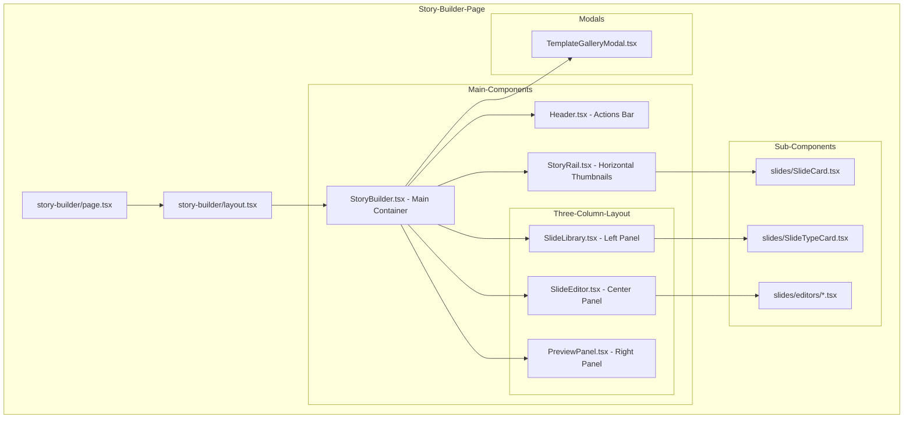
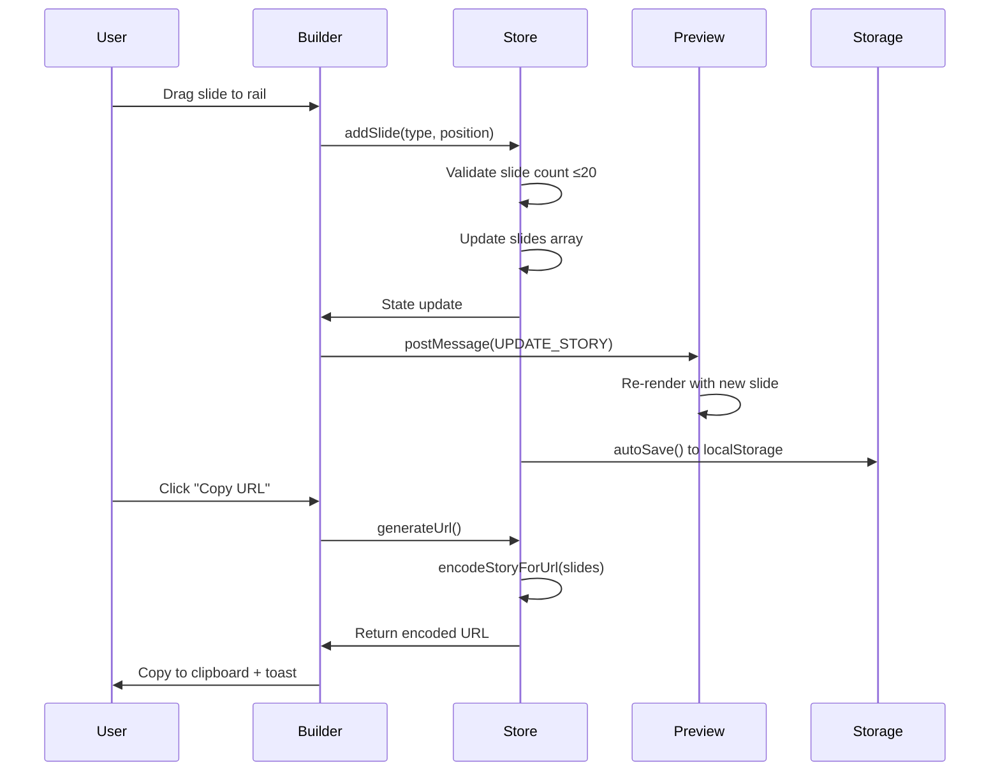
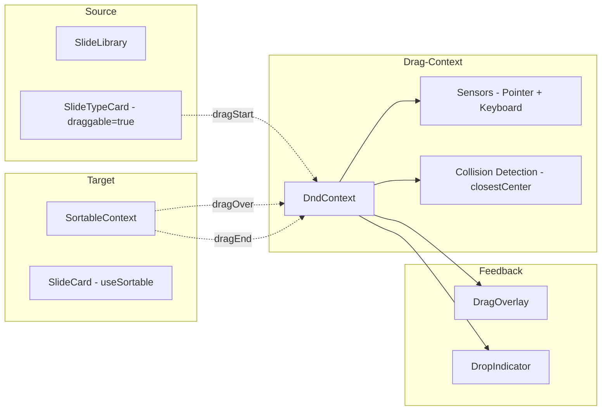
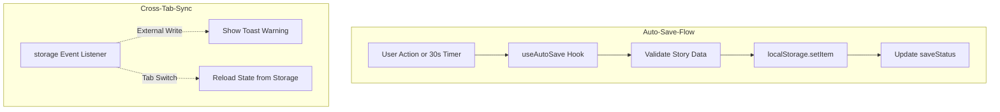

# Implementation Plan: Visual Drag-and-Drop Story Builder

**Branch**: `013-visual-story-builder` | **Date**: 2026-01-06 | **Spec**: [spec.md](./spec.md)
**Input**: Feature specification from `/specs/013-visual-story-builder/spec.md`

## Summary

Build an Instagram-inspired visual story builder that eliminates manual JSON encoding. Users create stories by dragging slide cards into a story rail with real-time mobile preview and one-click URL generation. The feature reduces story creation time from 30+ minutes to 5 minutes through intuitive visual editing using `@dnd-kit` for drag-and-drop, Zustand for state management, and iframe-based preview with postMessage communication.

## Technical Context

**Language/Version**: TypeScript 5.3+ (strict mode) + React 18.2+ + Next.js 14+
**Primary Dependencies**: 
- Existing: Zustand 4.4+, Framer Motion, Sonner (toasts), Supabase 2.39+, Tailwind CSS, shadcn/ui
- New: @dnd-kit/core, @dnd-kit/sortable, @dnd-kit/utilities, dompurify
**Storage**: localStorage (primary draft storage, <1KB), Supabase (optional cloud backup)
**Testing**: Jest 29+, React Testing Library 13+, Node.js 18+
**Target Platform**: Web (desktop ≥1024px, tablet 768-1023px, mobile <768px)
**Project Type**: Single web application (Next.js 14+ App Router)
**Performance Goals**: 
- Preview updates within 100ms of any edit
- Drag-and-drop at 60fps with smooth animations
- URL generation <500ms for 20-slide stories
**Constraints**:
- Maximum 20 slides per story (URL length limit ~32KB)
- Images <5MB (referenced by URL only, no hosting)
- Touch targets minimum 44×44px (WCAG AAA)
**Scale/Scope**: 
- 5 slide types (Text, Image, Teleprompter, Poll, Widget)
- 3 pre-built templates
- Single-page application at `/story-builder`

## Constitution Check

*GATE: Must pass before Phase 0 research. Re-checked after Phase 1 design - all passed.*

### I. User Experience First
✅ **PASSES** - Instagram-inspired drag-and-drop interface with real-time preview. All features accessible on desktop and mobile with touch-optimized controls.

### II. Performance & Reliability
✅ **PASSES** - 100ms preview update requirement, 60fps drag animations, auto-save to localStorage with error handling, proper data validation.

### III. Security & Privacy
✅ **PASSES** - DOMPurify sanitization for all user-generated text (defense-in-depth for URL-based sharing). No user data logged or stored unnecessarily.

### IV. Code Quality & Testing
✅ **PASSES** - TypeScript 5.3+ strict mode, comprehensive unit/integration tests with Jest + React Testing Library, clean architecture with separation of concerns.

### V. Technology Standards
✅ **PASSES** - Next.js 14+ App Router, Supabase for auth/data (existing, no changes), Tailwind CSS + shadcn/ui for styling, all dependencies compatible and up-to-date.

## Project Structure

### Documentation (this feature)

```text
specs/013-visual-story-builder/
├── plan.md              # This file (/zo.plan command output)
├── research.md          # Phase 0 output - Technical decisions
├── data-model.md        # Phase 1 output - Entity definitions
├── quickstart.md        # Phase 1 output - Usage guide
├── contracts/           # Phase 1 output - API contracts (if needed)
└── tasks/               # Phase 2 output (/zo.tasks command - NOT created by /zo.plan)
    ├── README.md        # Task index
    ├── TASK-001.md      # Foundation tasks
    ├── TASK-002.md
    └── ...
```

### Source Code (repository root)

```text
app/
└── story-builder/
    ├── page.tsx                    # Main story builder page
    ├── layout.tsx                  # Layout for builder section
    └── components/
        ├── StoryBuilder.tsx        # Main builder container
        ├── StoryRail.tsx           # Horizontal slide thumbnails
        ├── SlideLibrary.tsx        # Left sidebar with slide types
        ├── SlideEditor.tsx         # Dynamic editor panel
        ├── PreviewPanel.tsx        # Right sidebar with mobile preview
        ├── Header.tsx              # Top bar with actions
        ├── TemplateGalleryModal.tsx # Template selection
        └── slides/
            ├── SlideCard.tsx       # Individual slide thumbnail card
            ├── SlideTypeCard.tsx   # Draggable slide type from library
            └── editors/
                ├── TextSlideEditor.tsx
                ├── ImageSlideEditor.tsx
                ├── TeleprompterSlideEditor.tsx
                ├── PollSlideEditor.tsx
                └── WidgetSlideEditor.tsx

components/
└── story-builder/                  # Shared/reusable components
    ├── DragOverlay.tsx             # @dnd-kit drag overlay
    ├── DropIndicator.tsx           # Visual drop position indicator
    ├── EmptyState.tsx              # Onboarding card for zero slides
    └── AutoSaveIndicator.tsx       # Save status display

lib/
└── story-builder/
    ├── store.ts                    # Zustand store for builder state
    ├── types.ts                    # Builder-specific type definitions
    ├── utils/
    │   ├── dragAndDrop.ts          # @dnd-kit utilities
    │   ├── autoSave.ts             # localStorage auto-save logic
    │   ├── tabSync.ts              # Cross-tab synchronization
    │   └── xssProtection.ts        # DOMPurify wrappers
    ├── templates/
    │   ├── index.ts                # Template registry
    │   ├── data.ts                 # Template definitions
    │   └── thumbnails.ts           # Template thumbnail URLs
    └── hooks/
        ├── useStoryBuilder.ts      # Main builder hook
        ├── useDragAndDrop.ts       # Drag-and-drop logic
        ├── usePreviewSync.ts       # iframe postMessage sync
        └── useAutoSave.ts          # Auto-save with localStorage

public/
└── templates/                      # Template thumbnail images
    ├── product-announcement.jpg
    ├── tutorial.jpg
    └── qa.jpg

tests/
├── unit/
│   └── story-builder/
│       ├── store.test.ts
│       ├── utils/
│       │   ├── autoSave.test.ts
│       │   ├── tabSync.test.ts
│       │   └── xssProtection.test.ts
│       └── templates/
│           └── data.test.ts
├── integration/
│   └── story-builder/
│       ├── dragAndDrop.test.tsx
│       ├── urlGeneration.test.tsx
│       └── autoSave.test.tsx
└── e2e/
    └── story-builder/
        ├── basicFlow.spec.ts
        └── templates.spec.ts
```

**Structure Decision**: Single web application structure (Option 1) using Next.js 14+ App Router. The story builder is a new route at `/story-builder` with client-side state management. All components are organized by feature with clear separation between UI, state, utilities, and tests.

## Architecture

### Component Hierarchy



### State Management (Zustand Store)

```typescript
interface StoryBuilderStore {
  // State
  slides: AnySlide[];
  activeSlideIndex: number;
  saveStatus: 'saved' | 'saving' | 'unsaved' | 'error';
  isTemplateModalOpen: boolean;
  
  // Slide Management
  addSlide: (type: SlideType, position?: number) => void;
  removeSlide: (index: number) => void;
  reorderSlides: (fromIndex: number, toIndex: number) => void;
  updateSlide: (index: number, updates: Partial<AnySlide>) => void;
  setActiveSlide: (index: number) => void;
  
  // Story Operations
  generateUrl: () => string;
  loadTemplate: (templateId: string) => void;
  clearStory: () => void;
  
  // Auto-Save
  autoSave: () => Promise<void>;
  restoreDraft: () => void;
  
  // Cross-Tab Sync
  handleStorageEvent: (event: StorageEvent) => void;
}
```

### Data Flow



### Drag-and-Drop Architecture

**Technology**: `@dnd-kit/core` + `@dnd-kit/sortable`



**Drag Flow**:
1. User drags `SlideTypeCard` from library
2. `onDragStart` → Show `DragOverlay` with lifted card
3. `onDragOver` → Update `DropIndicator` at valid position
4. `onDragEnd` → Call `addSlide()` or `reorderSlides()`

### Preview Communication

**iframe + postMessage pattern**

```typescript
// Editor → Preview
previewRef.current?.contentWindow?.postMessage({
  type: 'UPDATE_STORY',
  payload: { slides: currentSlides, activeIndex }
}, '*')

// Preview → Editor (iframe listener)
window.addEventListener('message', (event) => {
  if (event.data.type === 'SLIDE_CHANGED') {
    setActiveSlide(event.data.index)
  }
})
```

### Auto-Save Architecture



## Implementation Phases

### Phase 0: Research & Technology Decisions

**Output**: `research.md`

Research and document:
1. `@dnd-kit` integration patterns with Next.js 14 App Router
2. iframe postMessage communication for isolated preview
3. localStorage cross-tab synchronization strategies
4. DOMPurify configuration for React applications
5. Instagram Stories drag-and-drop UX patterns

### Phase 1: Foundation & Data Models

**Output**: `data-model.md`, `contracts/`, `quickstart.md`

**Tasks**:
- Define builder-specific types extending [`lib/story/types.ts`](lib/story/types.ts:1)
- Create Zustand store structure with all actions
- Define template data structure and registry
- Create API contracts for iframe communication
- Document quickstart guide for future developers

### Phase 2: Core Drag-and-Drop (P1)

**Priority**: CRITICAL - Core value proposition

**Tasks**:
1. Set up `@dnd-kit` context and sensors
2. Build `SlideLibrary` with draggable `SlideTypeCard` components
3. Build `StoryRail` with sortable `SlideCard` components
4. Implement `DragOverlay` and `DropIndicator` visual feedback
5. Wire up store actions: `addSlide()`, `removeSlide()`, `reorderSlides()`
6. Add empty state onboarding card
7. Keyboard navigation support

### Phase 3: Slide Editing (P1)

**Priority**: CRITICAL - Required for story customization

**Tasks**:
1. Build `SlideEditor` dynamic panel based on slide type
2. Implement `TextSlideEditor` with formatting toolbar
3. Implement `ImageSlideEditor` with URL input and preview
4. Implement `TeleprompterSlideEditor` with focal point slider
5. Implement `PollSlideEditor` with options management
6. Implement `WidgetSlideEditor` with chart configuration
7. Add common controls: duration slider, background color picker
8. Wire up `updateSlide()` store action

### Phase 4: Real-Time Preview (P2)

**Priority**: HIGH - Essential for confidence

**Tasks**:
1. Build `PreviewPanel` with iframe container
2. Create isolated preview route accepting story data
3. Implement postMessage communication layer
4. Add preview update optimization (debounce 100ms)
5. Build slide indicators (current/total, duration)
6. Handle preview loading and error states
7. Test preview sync performance

### Phase 5: URL Generation (P1)

**Priority**: CRITICAL - Primary output

**Tasks**:
1. Integrate existing [`encodeStoryForUrl()`](lib/story/utils/urlEncoder.ts:29)
2. Implement `generateUrl()` store action
3. Build "Copy URL" button with clipboard API
4. Add success/error toast notifications
5. Handle URL length limit (32KB) with user-friendly error
6. Test URL encoding/decoding roundtrip

### Phase 6: Auto-Save System (P1)

**Priority**: CRITICAL - Data safety

**Tasks**:
1. Implement `useAutoSave` hook with 30s timer
2. Create localStorage draft storage layer
3. Add save status indicator in header
4. Implement cross-tab synchronization via `storage` event
5. Handle localStorage disabled/full scenarios
6. Add warning toast for external tab writes
7. Restore draft on page load
8. Test auto-save with rapid edits

### Phase 7: Template Gallery (P3)

**Priority**: MEDIUM - Workflow enhancement

**Tasks**:
1. Define template data structure
2. Create 3 pre-built templates (Product Announcement, Tutorial, Q&A)
3. Build `TemplateGalleryModal` with grid layout
4. Implement template thumbnail images
5. Add `loadTemplate()` store action
6. Test template customization flow

### Phase 8: Responsive Design (P2)

**Priority**: HIGH - Mobile accessibility

**Tasks**:
1. Implement desktop three-column layout (≥1024px)
2. Implement tablet two-column layout (768-1023px)
3. Implement mobile tab-based layout (<768px)
4. Add touch-optimized drag handlers
5. Test on mobile devices
6. Ensure 44×44px touch targets throughout

### Phase 9: Testing (P1)

**Priority**: CRITICAL - Code quality

**Tasks**:
1. Unit tests for store actions and utilities
2. Integration tests for drag-and-drop flow
3. Integration tests for URL generation
4. Integration tests for auto-save system
5. E2E tests for complete story creation flow
6. E2E tests for template selection
7. Accessibility tests (keyboard navigation, screen readers)

### Phase 10: Documentation & Polish (P2)

**Priority**: HIGH - Developer experience

**Tasks**:
1. Write inline code comments
2. Create JSDoc for public APIs
3. Update main README with feature overview
4. Add story builder to navigation
5. Performance optimization review
6. Accessibility audit
7. Browser compatibility testing

## Task List

See `/specs/013-visual-story-builder/tasks/README.md` for detailed task breakdown after running `/zo.tasks` command.

## Testing Strategy

### Unit Tests
- **Tools**: Jest 29+, React Testing Library 13+
- **Coverage**: Store actions, utilities, hooks, template data
- **Mocking**: localStorage, clipboard API, postMessage

### Integration Tests
- **Tools**: React Testing Library
- **Scenarios**:
  - Drag slide from library to rail
  - Reorder slides in rail
  - Edit slide properties
  - Generate and validate URL
  - Auto-save and restore draft
  - Cross-tab synchronization

### E2E Tests
- **Tools**: Playwright
- **Scenarios**:
  - Complete story creation from blank
  - Template-based story creation
  - URL generation and sharing
  - Mobile drag-and-drop
  - Cross-browser compatibility

### Performance Tests
- Preview update latency <100ms
- Drag animations at 60fps
- URL generation <500ms
- localStorage write <50ms

### Accessibility Tests
- Keyboard navigation (Tab, Arrow keys, Enter, Escape)
- Screen reader announcements (ARIA labels, live regions)
- Touch target sizes ≥44×44px
- Color contrast ratios (WCAG AA)
- Focus management in modals

## Migration & Deployment

### Rollout Strategy
1. **Feature Flag**: Add `NEXT_PUBLIC_STORY_BUILDER_ENABLED` environment variable
2. **Beta Testing**: Enable for internal users first
3. **Gradual Rollout**: Enable for 10%, 50%, 100% of users
4. **Monitoring**: Track usage metrics, error rates, performance

### Backward Compatibility
- No breaking changes to existing story viewer
- Existing story URLs continue to work
- New builder generates compatible story format
- Existing manual JSON editing still supported (fallback)

### Data Migration
- No migration required (new feature, no existing data)
- Auto-saved drafts use new localStorage key prefix
- Template data bundled with application (no database)

### Deployment Steps
1. Merge feature branch to main
2. Run all tests and linting
3. Build production bundle
4. Deploy to Vercel (automatic)
5. Enable feature flag
6. Monitor error tracking and analytics

## Open Questions & Risks

### Open Questions
1. **Template Thumbnails**: Should we generate real screenshots or use placeholders?
   - **Decision**: Start with placeholders, add real screenshots in enhancement
2. **Preview Isolation**: Should preview use same route or dedicated route?
   - **Decision**: Use dedicated `/story-preview` route for clean separation
3. **Mobile Drag Performance**: Will `@dnd-kit` perform well on mobile?
   - **Decision**: Prototype early and optimize if needed (consider touch-action CSS)

### Risks & Mitigations

| Risk | Impact | Mitigation |
|------|--------|------------|
| URL length exceeded | HIGH | Enforce 20-slide limit, show clear error message |
| localStorage disabled | MEDIUM | Graceful degradation with warning toast |
| iframe cross-origin issues | LOW | Same-origin deployment, test thoroughly |
| Drag performance on mobile | MEDIUM | Prototype early, optimize with CSS transforms |
| Browser compatibility | LOW | Test on Chrome, Firefox, Safari, Edge |

## Dependencies

### Existing (Already in Project)
- [`lib/story/types.ts`](lib/story/types.ts:1) - StoryScript type definitions
- [`lib/story/utils/urlEncoder.ts`](lib/story/utils/urlEncoder.ts:1) - URL encoding/decoding
- [`lib/story/validation.ts`](lib/story/validation.ts:1) - JSON schema validation
- Zustand 4.4+ - State management
- Framer Motion - Animations
- Sonner - Toast notifications
- Tailwind CSS - Styling
- shadcn/ui - UI components

### New (To Be Added)
```json
{
  "@dnd-kit/core": "^6.1.0",
  "@dnd-kit/sortable": "^8.0.0",
  "@dnd-kit/utilities": "^3.2.2",
  "dompurify": "^3.0.6"
}
```

## Success Criteria

### Measurable Outcomes (from spec)
- **SC-001**: Users can create a 5-slide story in under 5 minutes
- **SC-002**: 90% of users successfully generate a valid story URL on first attempt
- **SC-003**: Preview updates within 100ms for 95% of edit operations
- **SC-004**: Drag-and-drop operations complete with smooth animations (60fps)
- **SC-005**: 80% of users report the visual builder is "easier" or "much easier" than manual JSON editing

### Technical Metrics
- TypeScript strict mode: 100% compliance
- Test coverage: >80% for critical paths
- Bundle size increase: <100KB gzipped
- Performance: Lighthouse score >90
- Accessibility: WCAG AA compliant

## Next Steps

1. **Review this plan** with stakeholders for approval
2. **Run `/zo.tasks`** to generate detailed task breakdown
3. **Begin implementation** starting with Phase 0 (Research)
4. **Track progress** using task checklist in `/specs/013-visual-story-builder/tasks/`

---

**End of Implementation Plan**
