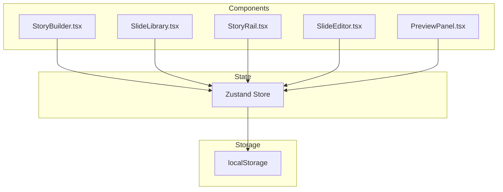

# Quickstart Guide: Visual Drag-and-Drop Story Builder

**Feature**: 013-visual-story-builder
**Branch**: `013-visual-story-builder`
**For**: Developers implementing or extending the story builder
**Related**: [spec.md](./spec.md), [plan.md](./plan.md), [data-model.md](./data-model.md)

---

## Overview

The Visual Story Builder is an Instagram-inspired drag-and-drop interface for creating stories without manual JSON editing. Users arrange slide cards in a horizontal rail, edit properties in a dynamic panel, and see real-time preview updates.

**Key Features**:
- Drag-and-drop slide creation with `@dnd-kit`
- Real-time mobile preview via iframe
- Auto-save to localStorage with cross-tab sync
- One-click URL generation for sharing
- Template-based quick starts

---

## Quick Start

### 1. Access the Builder

Navigate to: `/story-builder`

```typescript
// app/story-builder/page.tsx
export default function StoryBuilderPage() {
  return <StoryBuilder />;
}
```

### 2. Create a Story

**From Scratch**:
1. Drag a slide type from the left library to the story rail
2. Click the slide to edit its properties
3. Adjust duration, background color, and content
4. Click "Copy URL" to generate a shareable link

**From Template**:
1. Click "Templates" button in header
2. Select a template (Product Announcement, Tutorial, Q&A)
3. Customize slides as needed
4. Share your story

### 3. Basic Operations

| Action | Method |
|--------|--------|
| Add slide | Drag from library or click "+" button |
| Reorder | Drag slides in rail to new position |
| Edit | Click slide thumbnail to open editor |
| Delete | Click trash icon on slide thumbnail |
| Preview | View right panel (or Preview tab on mobile) |
| Share | Click "Copy URL" button (gradient) |

---

## Architecture Overview



---

## Working with the Store

### Basic Store Usage

```typescript
import { useStoryBuilderStore } from '@/lib/story-builder/store';

function MyComponent() {
  const { slides, activeSlideIndex, addSlide, updateSlide } = useStoryBuilderStore();
  
  // Add a text slide at the end
  const handleAddText = () => {
    addSlide('text-highlight', slides.length);
  };
  
  // Update current slide
  const handleChange = (field: string, value: any) => {
    updateSlide(activeSlideIndex, { [field]: value });
  };
  
  return (
    <button onClick={handleAddText}>Add Text Slide</button>
  );
}
```

### Store Actions Reference

| Action | Parameters | Description |
|--------|------------|-------------|
| `addSlide()` | `(type, position?)` | Add slide at position (default: end) |
| `removeSlide()` | `(index)` | Remove slide at index |
| `reorderSlides()` | `(fromIndex, toIndex)` | Move slide to new position |
| `updateSlide()` | `(index, updates)` | Update slide properties |
| `setActiveSlide()` | `(index)` | Set active slide for editing |
| `generateUrl()` | `()` | Return encoded story URL |
| `loadTemplate()` | `(templateId)` | Load template into rail |
| `clearStory()` | `()` | Remove all slides |

---

## Creating Custom Slide Types

### 1. Define Slide Type

```typescript
// lib/story-builder/types.ts
export interface CustomSlideContent {
  type: 'custom-type';
  // Your custom fields
  customField: string;
  anotherField: number;
}

export interface CustomSlide extends BuilderSlide {
  type: 'custom-type';
  content: CustomSlideContent;
}
```

### 2. Add to Slide Registry

```typescript
// lib/story-builder/templates/slideTypes.ts
import { SlideTypeDefinition } from '@/lib/story-builder/types';

export const customSlideType: SlideTypeDefinition = {
  id: 'custom-type',
  name: 'Custom Slide',
  icon: 'Star', // Lucide icon name
  description: 'A custom slide type',
  defaultContent: {
    type: 'custom-type',
    customField: 'Default value',
    anotherField: 42,
  },
  defaultDuration: 5,
  defaultBackgroundColor: '#FFFFFF',
  category: 'content',
};
```

### 3. Create Editor Component

```typescript
// app/story-builder/components/slides/editors/CustomSlideEditor.tsx
export function CustomSlideEditor({ slide, onChange }: SlideEditorProps) {
  const content = slide.content as CustomSlideContent;
  
  return (
    <div className="space-y-4">
      <div>
        <label>Custom Field</label>
        <input
          value={content.customField}
          onChange={(e) => onChange('customField', e.target.value)}
        />
      </div>
      <div>
        <label>Another Field</label>
        <input
          type="number"
          value={content.anotherField}
          onChange={(e) => onChange('anotherField', Number(e.target.value))}
        />
      </div>
    </div>
  );
}
```

### 4. Register in Builder

```typescript
// app/story-builder/components/SlideEditor.tsx
const EDITORS: Record<SlideType, React.ComponentType<SlideEditorProps>> = {
  'text-highlight': TextSlideEditor,
  'image': ImageSlideEditor,
  'teleprompter': TeleprompterSlideEditor,
  'poll': PollSlideEditor,
  'widget-chart': WidgetSlideEditor,
  'custom-type': CustomSlideEditor, // Add your editor
};
```

---

## Creating Templates

### Template Structure

```typescript
// lib/story-builder/templates/data.ts
import { Template } from '@/lib/story-builder/types';

export const myCustomTemplate: Template = {
  id: 'my-custom-template',
  name: 'My Custom Template',
  description: 'A template for my use case',
  thumbnail: '/templates/my-custom-template.jpg',
  category: 'business',
  difficulty: 'beginner',
  estimatedTime: 5,
  slides: [
    {
      id: 'will-be-replaced', // Temporary ID
      type: 'text-highlight',
      content: {
        type: 'text-highlight',
        content: 'Welcome to my template!',
        highlights: [],
        textColor: '#000000',
      },
      duration: 5,
      backgroundColor: '#FFFFFF',
    },
    // ... more slides
  ],
};
```

### Register Template

```typescript
// lib/story-builder/templates/index.ts
export const templates = [
  // ... existing templates
  myCustomTemplate,
];
```

---

## Testing

### Unit Tests

```typescript
// tests/unit/story-builder/store.test.ts
import { renderHook, act } from '@testing-library/react';
import { useStoryBuilderStore } from '@/lib/story-builder/store';

describe('StoryBuilderStore', () => {
  it('should add a slide', () => {
    const { result } = renderHook(() => useStoryBuilderStore());
    
    act(() => {
      result.current.addSlide('text-highlight', 0);
    });
    
    expect(result.current.slides).toHaveLength(1);
    expect(result.current.slides[0].type).toBe('text-highlight');
  });
});
```

### Integration Tests

```typescript
// tests/integration/story-builder/dragAndDrop.test.tsx
import { render, screen, fireEvent } from '@testing-library/react';
import { StoryBuilder } from '@/app/story-builder/components/StoryBuilder';

describe('Drag and Drop', () => {
  it('should add slide when dropped on rail', () => {
    render(<StoryBuilder />);
    
    const libraryCard = screen.getByText('Text Slide');
    const storyRail = screen.getByTestId('story-rail');
    
    fireEvent.dragStart(libraryCard);
    fireEvent.dragOver(storyRail);
    fireEvent.drop(storyRail);
    
    expect(screen.getByTestId('slide-0')).toBeInTheDocument();
  });
});
```

---

## Common Patterns

### Auto-Save Integration

```typescript
// hooks/useAutoSave.ts
export function useAutoSave(store: StoryBuilderStore) {
  useEffect(() => {
    const timer = setTimeout(() => {
      store.autoSave();
    }, 30000); // 30 seconds
    
    return () => clearTimeout(timer);
  }, [store]);
}
```

### Preview Synchronization

```typescript
// hooks/usePreviewSync.ts
export function usePreviewSync(slides: AnySlide[], activeIndex: number) {
  const previewRef = useRef<HTMLIFrameElement>(null);
  
  const updatePreview = useMemo(
    () => debounce((data: PreviewData) => {
      previewRef.current?.contentWindow?.postMessage({
        type: 'UPDATE_STORY',
        payload: data,
      }, '*');
    }, 100),
    []
  );
  
  useEffect(() => {
    updatePreview({ slides, activeIndex });
  }, [slides, activeIndex, updatePreview]);
  
  return previewRef;
}
```

### XSS Protection

```typescript
// utils/xssProtection.ts
import DOMPurify from 'dompurify';

export function sanitizeHTML(html: string): string {
  return DOMPurify.sanitize(html, {
    ALLOWED_TAGS: ['b', 'i', 'em', 'strong', 'span', 'br'],
    ALLOWED_ATTR: ['style', 'class'],
  });
}

// Usage
<div dangerouslySetInnerHTML={{ __html: sanitizeHTML(userContent) }} />
```

---

## Styling Guidelines

### Design System Tokens

Use global design system tokens from [`.zo/design-system.md`](../../.zo/design-system.md:1):

```tsx
// Colors
className="bg-linear-to-r from-purple-500 via-pink-500 to-orange-500"
className="text-text-primary"
className="border-border"

// Spacing
className="p-6"  // 24px padding
className="gap-3" // 12px gap

// Radius
className="rounded-xl" // 12px radius
className="rounded-2xl" // 24px radius (Instagram-style)

// Shadows
className="shadow-sm"
className="shadow-drag" // For dragging elements
```

### Responsive Classes

```tsx
// Desktop three-column
<div className="grid grid-cols-[280px_1fr_320px] lg:gap-4">

// Tablet two-column
<div className="grid grid-cols-[1fr_280px] md:gap-4">

// Mobile single column
<div className="flex flex-col gap-4">
```

---

## Troubleshooting

### Common Issues

**Problem**: Drag-and-drop doesn't work on mobile
- **Solution**: Ensure `touch-action: none` is set on draggable elements
- **Check**: Browser console for touch event warnings

**Problem**: Preview not updating
- **Solution**: Check iframe origin, verify postMessage is being sent
- **Debug**: Add `console.log` in message event listener

**Problem**: Auto-save failing silently
- **Solution**: Check localStorage availability, catch QuotaExceededError
- **Debug**: Look for "Auto-save unavailable" toast

**Problem**: URL generation fails
- **Solution**: Verify story has <20 slides, check content size
- **Debug**: Test encodeStoryForUrl() with minimal data

---

## Keyboard Shortcuts

| Shortcut | Action |
|----------|--------|
| `Ctrl/Cmd + S` | Force save to localStorage |
| `Ctrl/Cmd + Z` | Undo last action |
| `Ctrl/Cmd + Shift + Z` | Redo action |
| `Escape` | Close template modal |
| `Arrow Left/Right` | Navigate story rail |
| `Enter` | Add slide from library |
| `Delete` | Remove active slide |

---

## Performance Tips

1. **Memoize Expensive Computations**
   ```typescript
   const thumbnail = useMemo(() => generateThumbnail(slide), [slide]);
   ```

2. **Debounce Event Handlers**
   ```typescript
   const handleChange = debounce((value) => updateSlide(index, { content: value }), 100);
   ```

3. **Lazy Load Preview**
   ```typescript
   const { ref, inView } = useInView({ threshold: 0 });
   return inView ? <Preview /> : <Loading />;
   ```

4. **Virtual Scrolling for Large Stories**
   - Use `react-window` if slide count >15

---

## Related Files

- **Store**: [`lib/story-builder/store.ts`](../../lib/story-builder/store.ts)
- **Types**: [`lib/story-builder/types.ts`](../../lib/story-builder/types.ts)
- **Main Component**: [`app/story-builder/components/StoryBuilder.tsx`](../../app/story-builder/components/StoryBuilder.tsx)
- **Design System**: [`.zo/design-system.md`](../../.zo/design-system.md)

---

## Next Steps

1. **Review Implementation Plan**: See [`plan.md`](./plan.md) for full task breakdown
2. **Read Data Model**: See [`data-model.md`](./data-model.md) for entity definitions
3. **Check Research**: See [`research.md`](./research.md) for technical decisions

---

**End of Quickstart Guide**
