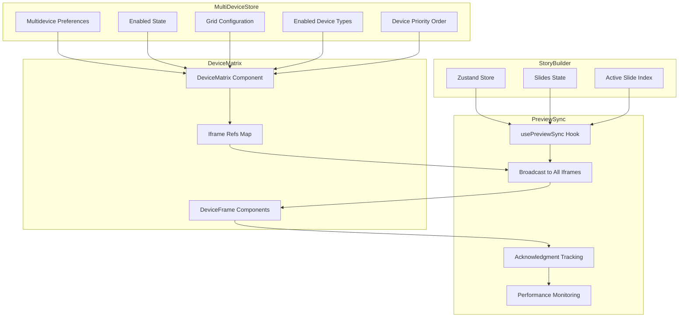

# Implementation Plan: Multi-Device Matrix Preview

**Feature Branch**: `015-multi-device-matrix`
**Created**: 2026-01-07
**Status**: Implementation Plan
**Related Specs**: [spec.md](spec.md), [clarifications.md](clarifications.md)

## Executive Summary

This plan transforms the single-device preview into a responsive grid matrix showing teleprompter content across multiple device types simultaneously. The implementation leverages existing preview infrastructure ([`usePreviewSync`](lib/story-builder/hooks/usePreviewSync.ts), [`PreviewPanel`](app/story-builder/components/preview/PreviewPanel.tsx)) while introducing reusable device frames, grid layouts, and state persistence.

## Architecture Overview

### Component Hierarchy

```
PreviewPanel (existing, modified)
├── MultiDeviceToggle (new button)
├── DeviceMatrix (new container, conditional)
│   ├── GridConfiguration (toolbar for layout/settings)
│   ├── DeviceGrid (CSS Grid container)
│   │   ├── DeviceFrame (reusable component) × N
│   │   │   ├── DeviceChrome (visual frame styling)
│   │   │   ├── iframe (story-preview)
│   │   │   ├── LoadingIndicator
│   │   │   └── ErrorState
│   │   └── EmptySlot (placeholder for disabled devices)
│   └── ViewportWarning (shown when <1024px)
└── SingleDevicePreview (existing PreviewPanel content, conditional)
```

### Data Flow Architecture



### State Management Schema

```typescript
// New Zustand slice for multi-device preview
interface MultiDevicePreviewState {
  // Toggle state
  enabled: boolean;
  
  // Grid configuration
  gridConfig: '1x' | '2x' | '2x2' | '3x2';
  
  // Device selection
  enabledDeviceTypes: string[];  // ['iphone-se', 'iphone-14-pro', 'ipad-air', 'desktop']
  deviceOrder: string[];         // Priority order for display
  
  // UI state
  isDragging: boolean;
  draggedDeviceId: string | null;
  
  // Actions
  setEnabled: (enabled: boolean) => void;
  setGridConfig: (config: GridConfig) => void;
  toggleDeviceType: (deviceTypeId: string) => void;
  reorderDevices: (fromIndex: number, toIndex: number) => void;
  resetToDefaults: () => void;
}

// Device registry (constant)
interface DeviceType {
  id: string;
  name: string;
  width: number;
  height: number;
  scale: number;
  category: 'mobile' | 'tablet' | 'desktop';
}

const DEVICE_REGISTRY: DeviceType[] = [
  { id: 'iphone-se', name: 'iPhone SE', width: 375, height: 667, scale: 1.0, category: 'mobile' },
  { id: 'iphone-14-pro', name: 'iPhone 14 Pro', width: 393, height: 852, scale: 1.0, category: 'mobile' },
  { id: 'ipad-air', name: 'iPad Air', width: 820, height: 1180, scale: 1.0, category: 'tablet' },
  { id: 'desktop', name: 'Desktop', width: 1920, height: 1080, scale: 0.5, category: 'desktop' },
];
```

### localStorage Schema

```typescript
// Storage key: 'teleprompter-multi-device-preview'
interface MultiDevicePreviewPreferences {
  enabled: boolean;
  gridConfig: '1x' | '2x' | '2x2' | '3x2';
  enabledDeviceTypes: string[];
  deviceOrder: string[];
  lastUpdated: number; // Timestamp for migrations
}

// Default preferences
const DEFAULT_PREFERENCES: MultiDevicePreviewPreferences = {
  enabled: false,
  gridConfig: '2x',
  enabledDeviceTypes: ['iphone-se', 'iphone-14-pro'],
  deviceOrder: ['iphone-se', 'iphone-14-pro', 'ipad-air', 'desktop'],
  lastUpdated: Date.now(),
};
```

## Implementation Phases

### Phase 1: Foundation (P1 - Multi-Device View)

**Goal**: Enable users to view content across multiple devices simultaneously.

**Tasks**:
1. Create device registry and type definitions
2. Create `MultiDevicePreviewStore` Zustand slice
3. Create `DeviceFrame` reusable component with chrome styling
4. Create `DeviceMatrix` container with CSS Grid layout
5. Extend `usePreviewSync` hook for multi-iframe broadcast
6. Add toggle button to `PreviewPanel`
7. Implement viewport size detection and warning message
8. Add basic unit tests for components and hooks

**Deliverables**:
- Users can toggle between single/multi-device modes
- Multiple device frames display simultaneously
- Content syncs across all devices
- Viewport warning appears below 1024px

### Phase 2: Customization (P2 - Grid Configuration)

**Goal**: Allow users to configure which devices and grid layouts appear.

**Tasks**:
1. Create `GridConfiguration` toolbar component
2. Implement grid configuration selector (1x, 2x, 2x2, 3x2)
3. Implement device type checklist with memory management
4. Calculate and display memory usage with warnings
5. Implement localStorage persistence for preferences
6. Add empty slot placeholders
7. Handle grid slot vs. enabled device mismatch
8. Add integration tests for persistence and memory management

**Deliverables**:
- Users can select grid layouts
- Users can enable/disable device types
- Memory warnings display at 250MB threshold
- Device checkboxes disable at 350MB hard limit
- Preferences persist across sessions

### Phase 3: Interaction (P3 - Drag-and-Drop)

**Goal**: Enable users to reorganize devices within the grid.

**Tasks**:
1. Integrate @dnd-kit or HTML5 Drag and Drop API
2. Add draggable indicators to device frames
3. Implement drop zone logic in `DeviceGrid`
4. Update device order state on drop
5. Persist new device order to localStorage
6. Add animation transitions for smooth reordering
7. Add E2E tests for drag-and-drop workflows

**Deliverables**:
- Users can drag device frames to reorder
- Grid reorganizes to reflect new arrangement
- Device order persists across sessions
- Drag-and-drop completes within 200ms

## Technical Specifications

### Preview Sync Extension

The existing [`usePreviewSync`](lib/story-builder/hooks/usePreviewSync.ts) hook will be extended to support multiple iframes:

```typescript
// Current: Single iframe sync
export function usePreviewSync(iframeRef: React.RefObject<HTMLIFrameElement | null>)

// Extended: Multi-iframe sync with acknowledgment tracking
export function useMultiDevicePreviewSync(
  iframeRefs: React.RefObject<Map<string, HTMLIFrameElement>>
) {
  const { slides, activeSlideIndex } = useStoryBuilderStore();
  const pendingAcknowledgments = useRef<Set<string>>(new Set());
  
  const broadcastToAll = useCallback((message: PreviewMessage) => {
    const refs = iframeRefs.current;
    if (!refs) return;
    
    // Mark all iframes as pending
    refs.forEach((iframe, deviceId) => {
      pendingAcknowledgments.current.add(deviceId);
      try {
        iframe.contentWindow?.postMessage(message, window.location.origin);
      } catch (error) {
        logger.error(`Failed to send to ${deviceId}:`, error);
      }
    });
    
    // Start performance measurement
    if (typeof performance !== 'undefined') {
      performance.mark('multi-device-broadcast-start');
    }
  }, [iframeRefs]);
  
  // Handle acknowledgments from iframes
  useEffect(() => {
    const handleMessage = (event: MessageEvent) => {
      if (event.data.type === 'PREVIEW_ACK') {
        const deviceId = event.data.deviceId;
        pendingAcknowledgments.current.delete(deviceId);
        
        // All iframes acknowledged
        if (pendingAcknowledgments.current.size === 0) {
          if (typeof performance !== 'undefined') {
            performance.mark('multi-device-broadcast-end');
            performance.measure(
              'multi-device-sync-latency',
              'multi-device-broadcast-start',
              'multi-device-broadcast-end'
            );
          }
        }
      }
    };
    
    window.addEventListener('message', handleMessage);
    return () => window.removeEventListener('message', handleMessage);
  }, []);
  
  // Rest of hook implementation...
}
```

### Memory Management

Memory usage will be calculated per the specification:

```typescript
function calculateMemoryUsage(
  deviceCount: number,
  contentCharacterCount: number
): number {
  const BASE_MEMORY_PER_IFRAME = 50; // MB
  const CONTENT_MEMORY_PER_1000_CHARS = 5; // MB
  
  const iframeMemory = deviceCount * BASE_MEMORY_PER_IFRAME;
  const contentMemory = (contentCharacterCount / 1000) * CONTENT_MEMORY_PER_1000_CHARS;
  
  return iframeMemory + contentMemory;
}

// Usage
const memoryUsage = calculateMemoryUsage(
  enabledDeviceTypes.length,
  JSON.stringify(slides).length
);

if (memoryUsage >= 250 && memoryUsage < 350) {
  toast.warning('High memory usage: Multiple previews may affect performance');
} else if (memoryUsage >= 350) {
  // Disable additional device checkboxes
  toast.error('Memory limit reached: Cannot enable more devices');
}
```

### Responsive CSS Grid

```css
/* Device grid with responsive breakpoints */
.device-grid {
  display: grid;
  gap: 1rem;
  padding: 1rem;
  
  /* Default: 1 column */
  grid-template-columns: repeat(1, 1fr);
}

/* ≥1024px: Up to 2x2 grid (4 devices) */
@media (min-width: 1024px) {
  .device-grid {
    grid-template-columns: repeat(2, 1fr);
  }
}

/* ≥1280px: Up to 3x2 grid (6 devices) */
@media (min-width: 1280px) {
  .device-grid {
    grid-template-columns: repeat(3, 1fr);
  }
}

/* Device frame with chrome styling */
.device-frame {
  position: relative;
  background: #1a1a1a;
  border-radius: 3rem;
  padding: 12px;
  box-shadow: 0 30px 60px -15px rgba(0, 0, 0, 0.5);
}

.device-frame iframe {
  width: 100%;
  height: 100%;
  border-radius: 2.5rem;
  background: black;
}
```

## Risk Analysis

### Technical Risks

| Risk | Impact | Probability | Mitigation |
|------|--------|-------------|------------|
| Memory exhaustion with 6+ iframes | High | Medium | Implement 350MB hard limit; disable additional device selection; show warnings at 250MB |
| Sync latency exceeds 150ms threshold | Medium | Low | Use existing 100ms debounce; implement acknowledgment tracking; test with up to 6 iframes |
| Drag-and-drop performance degradation | Low | Medium | Use @dnd-kit for optimized DnD; limit animations to 200ms; test with 6 devices |
| iframe communication failures | Medium | Low | Implement retry logic (3 attempts with exponential backoff); show error states with manual retry |
| Browser compatibility for CSS Grid | Low | Low | Target modern browsers; provide graceful degradation to single-device view |
| localStorage quota exceeded | Low | Low | Schema is <1KB; handle QuotaExceededError with fallback to defaults |

### Implementation Risks

| Risk | Impact | Probability | Mitigation |
|------|--------|-------------|------------|
| Complexity in extending usePreviewSync | Medium | Medium | Create new hook (useMultiDevicePreviewSync) that wraps existing; maintain backward compatibility |
| Device chrome styling inconsistencies | Low | Medium | Extract device chrome to reusable component; use exact dimensions from spec |
| State synchronization issues | High | Low | Use single source of truth (Zustand); implement proper selectors; test persistence thoroughly |
| Responsive layout edge cases | Medium | Medium | Implement viewport detection; show warning message below 1024px; test on real devices |

## Testing Strategy

### Unit Tests

**Components**:
- `DeviceFrame`: Renders iframe with correct dimensions, handles loading/error states
- `DeviceMatrix`: Renders correct number of slots, applies grid configuration
- `GridConfiguration`: Renders controls, toggles device types, updates grid config
- `MultiDeviceToggle`: Toggles enabled state, updates localStorage

**Hooks**:
- `useMultiDevicePreviewSync`: Broadcasts to all iframes, tracks acknowledgments
- `useMultiDeviceStore`: Updates state, persists to localStorage, handles migrations
- `useMemoryCalculation`: Returns correct memory usage, applies thresholds

**Utilities**:
- `deviceRegistry`: Returns correct device definitions
- `localStorage helpers`: Save/load preferences, handle errors

### Integration Tests

- Preview sync broadcasts to all device frames
- All iframes receive and acknowledge updates
- Content changes propagate within 100ms (≤3 iframes) or 150ms (4-6 iframes)
- Grid configuration changes update layout
- Device type enable/disable updates visible frames
- Preferences persist across page reloads
- Memory warnings display at correct thresholds
- Viewport warning shows below 1024px

### E2E Tests

- User toggles multi-device mode on/off
- User selects different grid configurations
- User enables/disables device types
- User reorders devices via drag-and-drop
- Preferences persist across sessions
- System handles viewport resize gracefully
- Error recovery works (retry failed iframes)

### Performance Tests

- Memory usage stays below 350MB with 6 devices
- Sync latency meets targets (100ms/150ms)
- Drag-and-drop completes within 200ms
- Grid layout changes render within 50ms
- No memory leaks over extended use

### Accessibility Tests

- Toggle button has proper ARIA label
- Device frames are labeled by device type
- Grid is navigable via keyboard
- Drag-and-drop has keyboard alternative
- Error states are announced to screen readers

## Dependencies

### External Packages

- `@dnd-kit/core`: Drag-and-drop functionality (or use HTML5 DnD API)
- `sonner`: Toast notifications for memory warnings
- `framer-motion`: Smooth transitions for drag-and-drop

### Internal Dependencies

- [`lib/story-builder/store.ts`](lib/story-builder/store.ts): Existing Zustand store
- [`lib/story-builder/hooks/usePreviewSync.ts`](lib/story-builder/hooks/usePreviewSync.ts): Preview sync hook to extend
- [`lib/story-builder/types.ts`](lib/story-builder/types.ts): Type definitions
- [`app/story-builder/components/preview/PreviewPanel.tsx`](app/story-builder/components/preview/PreviewPanel.tsx): Container to modify

## Migration Path

### Backward Compatibility

- Single-device preview remains the default
- Existing [`usePreviewSync`](lib/story-builder/hooks/usePreviewSync.ts) hook continues to work
- No breaking changes to existing store or types
- Multi-device mode is opt-in via toggle

### Future Enhancements (Out of Scope)

- Custom device dimensions
- Device-specific content variants
- Landscape orientation for devices
- Additional device types (Android, etc.)
- Device frame theme customization
- Export screenshots from all devices

## Success Criteria Validation

Each success criterion from the spec will be validated:

| SC | Validation Method |
|----|-------------------|
| SC-001: View 3+ devices simultaneously | E2E test verifies 3 device frames visible |
| SC-002: Sync within 100ms/150ms | Performance test with timing assertions |
| SC-003: Toggle on/off with single click | E2E test for toggle button interaction |
| SC-004: Grid layout persists | Integration test for localStorage persistence |
| SC-005: No degradation up to 6 devices | Performance test with 6 device frames |
| SC-006: Accurate device dimensions | Visual regression tests per device type |
| SC-007: Drag-and-drop within 200ms | Performance test for drag operations |

## Open Questions

None at this time. All clarifications from [`clarifications.md`](clarifications.md) have been incorporated.

---

**Next Steps**: Review this plan, then proceed to [tasks.md](tasks.md) for detailed implementation breakdown.
